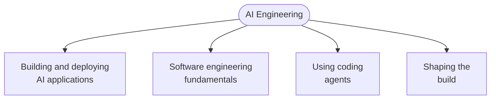

# The AI Engineering Skills Map

AI has changed how software gets built, but the hype around it makes it hard to tell which skills actually matter. Andrew Ng and his team at DeepLearning.AI tried to answer that empirically — analysing over 10,000 job postings, running dozens of structured interviews with AI experts, hiring managers, and recruiters, and gathering survey data — then clustering the result into the skills that matter most now and in the near future.

Four came out of it.

## Skills, Not a Job Title

The framing is deliberate: these are *AI engineering skills*, not the "AI Engineer" role. The analogy Ng draws is the cloud — every developer needs cloud skills today, while only a small number carry "Cloud Engineer" on their badge. The same is becoming true here. Full-stack, data, DevOps, ML, and AI engineers will all need these.

That matters for how you read the list. It isn't a job description to qualify for; it's four competencies to grow regardless of what your title says.

## 1. Building and Deploying AI Applications

The defining difference between an AI application and a traditional one is that **the output is unpredictable**. Prompt an LLM and you don't know what comes back. Train a model and you don't know what it will predict on an example it hasn't seen. Traditional software behaves far more predictably than either.

So the skill has two halves:

| Half | What it covers |
|---|---|
| **The building blocks** | LLMs, context engineering, RAG, agentic workflows, machine learning and deep learning |
| **The statistical discipline** | Measuring, steering, and governing the system so its behavior becomes predictable enough to ship |

The second half is the one people skip. The core practice is a **disciplined evals and error-analysis loop**: define what good looks like, measure it, look at the failures individually, and let what you find drive the next change. Without it you are guessing, and an AI app you can't evaluate is an AI app you can't safely change.

**In this handbook:** [AI Concepts](concepts.md) covers the building blocks; [The LLM Landscape](landscape.md) covers the layers you assemble them from, including the observability and evaluation tools this loop depends on.

## 2. Software Engineering Fundamentals

Engineering is the business of making tradeoffs — cost against scalability, reliability against speed, with security and privacy layered on top. Understanding the fundamentals is what lets you **see that a tradeoff is even being made**.

This is the argument against vibe coding as a terminal skill. An inexperienced developer who has an agent generate a solution isn't avoiding the tradeoffs; the agent is making them, usually badly, because it wasn't given the context to make them well. The developer can't supply that context because they don't know it exists.

Fundamentals turn that around. They give you the precise vocabulary of software engineering — coupling, idempotency, cache invalidation, backpressure, consistency — which is exactly the language you steer a coding agent with. The clearer the language, the better the steering.

**In this handbook:** [Fundamentals](../../software/basics/fundamentals.md), [Design Principles](../../software/basics/principles.md), [Architecture](../../software/basics/architecture.md), and [Tech Stacks](../../software/basics/tech_stacks.md).

## 3. Using Coding Agents

Agentic coding is now a baseline skill. Having it means holding a good **mental model of how agents work** — where they're strong, where they fail, and how much to intervene versus leave alone, so you get robust software without burning time or tokens.

Concretely, that means knowing how to:

- **Manage context.** What the agent can see determines what it can do.
- **Trade planning against execution.** Some tasks want a plan first; some want you to start and correct.
- **Let the agent close its own loops.** Give it verifiers, tests, or evals so it can check its own work instead of returning to you.
- **Work with a spec — and know when not to bother.** Not every change earns one.
- **Orchestrate multiple agents** that work together.
- **Avoid the sharp edges,** like an agent reaching a production database.

There's a meta-skill layered on top: agentic coding is moving fast, so being good at it means not only knowing today's practices but having a **routine for trying new tools and revising your workflow** as best practice shifts.

**In this handbook:** [Claude Code](../tool_tip/claude_code.md) and [Codex](../tool_tip/codex.md) each work through all six of these in one tool — reading them side by side shows which knowledge transfers and which is tool-shaped; [Spec-Driven Development](../tool_tip/spec_driven_development.md), [AI Tools](../tool_tip/tools.md), and [Tips → Pair-Coding with AI](../../software/tool_tip/tips.md) cover the rest.

## 4. Shaping the Build

Agents are getting rapidly better at delivering against a clear spec. That moves the engineer's work upstream — toward **deciding what belongs in the spec at all**.

The expectation that you'll be handed a pixel-perfect design and asked only to implement it is going away. What replaces it is product sense: understanding business context and customer goals well enough to participate in shaping what gets built.

Ng frames this as an opportunity rather than a loss. AI lets you take on more ownership and agency than before — spotting a problem worth solving and executing on it responsibly. That requires knowing how to drive a project: when to build a quick MVP and put it in front of users, and when to slow down and build carefully instead.

**In this handbook:** [Becoming Senior](../../software/basics/becoming_senior.md) covers thinking in business capabilities rather than frameworks; [Lifecycle](../../software/basics/lifecycle.md) covers the delivery machinery around it.

## The Skill Underneath

All four rest on **continuous learning**. AI keeps changing, so the practices above have a shelf life; the habit of revising them doesn't.

**In this handbook:** [Study Guide](../../software/basics/study_guide.md) and [The Senior Curriculum](../../software/basics/senior_curriculum.md).

## Rule of Thumb

Two of these four are not about AI at all. Software fundamentals and product sense are the skills that decide whether the other two produce something worth shipping — which is a useful corrective when the pull is to spend all your learning time on the newest model or framework.

---

**Source:** Andrew Ng, *The AI Engineering Skills Map* — [DeepLearning.AI](https://www.deeplearning.ai/the-batch/). The four-skill breakdown and the research behind it are his; the summary and cross-links above are mine. He has said more detailed posts on each skill are coming.
