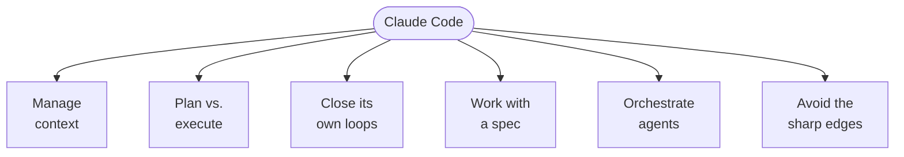
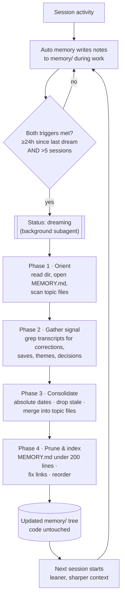
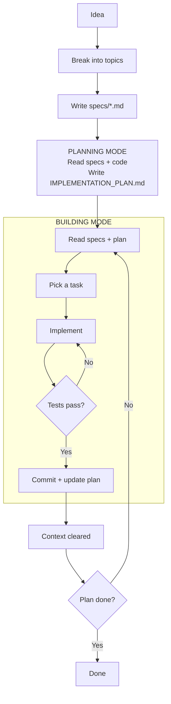
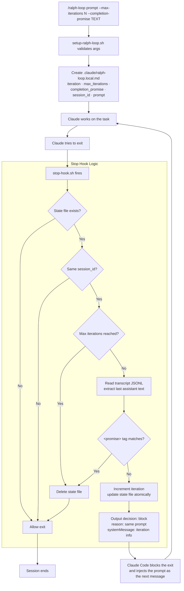
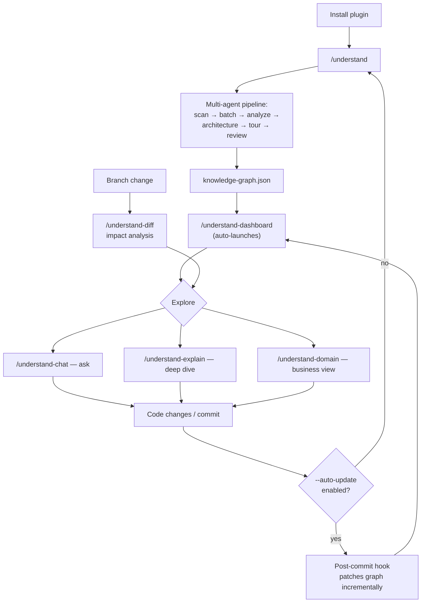
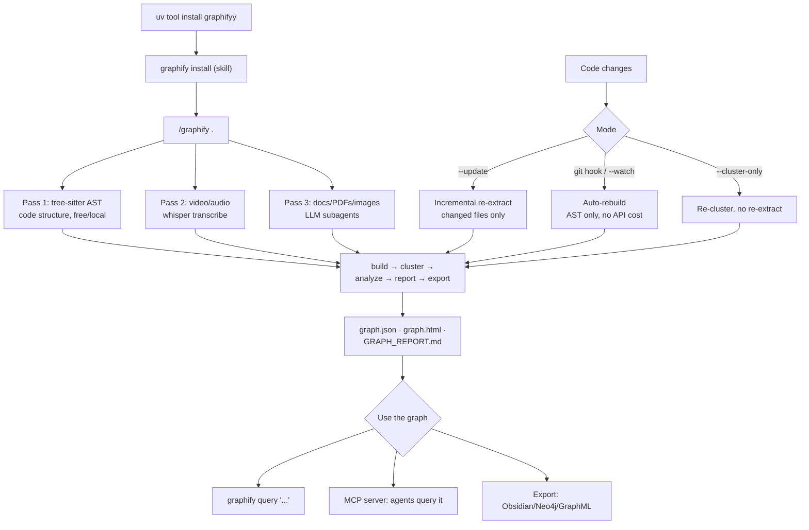

# Claude Code

[The AI Engineering Skills Map](../basics/skills_map.md) lists *using coding agents* as one of the four skills worth growing, and breaks it into six habits: manage context, trade planning against execution, let the agent close its own loops, work with a spec, orchestrate multiple agents, and avoid the sharp edges.

Those six are tool-independent. This page is what they look like in one tool. Claude Code is a CLI agent with an unusually large surface — memory files, rules, skills, subagents, teams, hooks, plugins, MCP servers, worktrees, workflows — and the surface is only worth learning because each piece maps onto one of those habits. A companion page, [Codex](codex.md), maps the same six habits onto OpenAI's agent; reading the two side by side is the fastest way to see which knowledge transfers and which is tool-shaped.



The tool moves fast, so treat specific flags, paths, and defaults here as accurate **as of 30 May 2026** rather than permanent. The habits outlive the release notes.

**Official docs:** [Quick Start](https://code.claude.com/docs/en/quickstart) → [Common Workflows](https://code.claude.com/docs/en/common-workflows) → [Best Practices](https://code.claude.com/docs/en/best-practices) → [Reference](https://code.claude.com/docs/en/cli-reference)

---

## The Harness

Before the habits, the parts. Everything below is either a file Claude reads, a process Claude spawns, or a script that fires on an event.

### What Lives in `.claude/`

```text
.claude/
├── CLAUDE.md              # project instructions, loaded at startup
├── settings.json          # permissions, hooks, env vars, enabled plugins
├── settings.local.json    # personal, gitignored
├── rules/                 # modular instructions, optionally path-scoped
│   ├── code-style.md
│   └── security.md
├── commands/              # user-invoked slash commands (legacy of skills)
│   └── review.md
├── skills/                # model- and user-invocable capabilities
│   └── testing-patterns/
│       ├── SKILL.md
│       └── helpers.py
└── agents/                # subagent definitions
    └── reviewer.md
```

- **`CLAUDE.md`** — persistent project context: codebase, conventions, workflows. Loaded every session.
- **`rules/`** — `.md` files auto-loaded as project memory. Organise by topic; scope to file paths with a `paths:` frontmatter field. Subdirectories are discovered too.
- **`settings.json`** — structured config: permission allow/ask/deny rules, hooks, environment variables, MCP config, enabled plugins.
- **`settings.local.json`** — personal project settings, gitignored. Good for keys and experiments you don't want to commit.
- **`commands/`** — custom slash commands invoked with `/<name>`.
- **`skills/`** — model-invoked capabilities. Each is a folder with a `SKILL.md` plus optional scripts and resources. Unlike commands, Claude discovers and loads them from context.
- **`agents/`** — subagents: specialised instances with their own context window and persona, defined in markdown with frontmatter.

### The Extension Points

Seven mechanisms, each solving a different problem. The first table is *what and when*; the second is *what it costs you in context*.

| # | Feature | What it does | When to use it | Example |
|---|---|---|---|---|
| 1 | [CLAUDE.md](https://code.claude.com/docs/en/memory) | Persistent context loaded every conversation | Project conventions, "always do X" rules | "Use pnpm, not npm. Run tests before committing." |
| 2 | [Skills](https://code.claude.com/docs/en/skills) | Instructions, knowledge, and workflows Claude can use | Reusable content, reference docs, repeatable tasks | `/review` runs your code-review checklist; an API-docs skill with endpoint patterns |
| 3 | [Subagents](https://code.claude.com/docs/en/subagents) | Isolated execution context that returns summarised results | Context isolation, parallel tasks, specialised workers | A research task that reads many files but returns only key findings |
| 4 | [Agent teams](https://code.claude.com/docs/en/agent-teams) | Coordinate multiple independent Claude Code sessions | Parallel research, new features, competing debugging hypotheses | Spawn reviewers checking security, performance, and tests simultaneously |
| 5 | [MCP](https://code.claude.com/docs/en/mcp) | Connect to external services | External data or actions | Query your database, post to Slack, control a browser |
| 6 | [Hooks](https://code.claude.com/docs/en/hooks-guide) | Deterministic script that runs on events | Predictable automation, no LLM involved | Run ESLint after every file edit |
| 7 | [Plugins](https://code.claude.com/docs/en/plugins) | Bundle skills, hooks, subagents, and MCP servers into one installable unit | Reuse across repositories, or distribute via marketplace | `/my-plugin:review` uses a namespaced skill from a plugin |

| # | Feature | Precedence | When it loads | What loads | Context cost |
|---|---|---|---|---|---|
| 1 | CLAUDE.md | Additive — all levels contribute | Session start | Full content | Every request |
| 2 | Skills | managed > user > project | Session start, then when used | Descriptions at start; full content on use | Low — descriptions only, every request |
| 3 | Subagents | managed > CLI flag > project > user > plugin | When spawned | Fresh context with specified skills | Isolated from the main session |
| 4 | Agent teams | N/A | When launched | Independent context per session | Separate context per teammate |
| 5 | MCP | local > project > user | Session start | All tool definitions and schemas | Every request |
| 6 | Hooks | Merge — all hooks fire | On trigger | Nothing; runs externally | Zero, unless the hook returns context |
| 7 | Plugins | Namespaced, so no conflicts | Session start | All bundled components | Depends on what's bundled |

[Features overview](https://code.claude.com/docs/en/features-overview)

### The Tools It Runs With

| Tool | Description | Permission required |
|---|---|---|
| AskUserQuestion | Asks multiple-choice questions to gather requirements or clarify ambiguity | No |
| Bash | Executes shell commands in your environment | Yes |
| TaskOutput | Retrieves output from a background task (bash shell or subagent) | No |
| Edit | Makes targeted edits to specific files | Yes |
| ExitPlanMode | Prompts you to exit plan mode and start coding | Yes |
| Glob | Finds files by pattern matching | No |
| Grep | Searches for patterns in file contents | No |
| KillShell | Kills a running background bash shell by ID | No |
| MCPSearch | Searches for and loads MCP tools when tool search is enabled | No |
| NotebookEdit | Modifies Jupyter notebook cells | Yes |
| Read | Reads file contents | No |
| Skill | Executes a skill within the main conversation | Yes |
| Task | Runs a subagent for complex, multi-step tasks | No |
| TaskCreate / TaskGet / TaskList / TaskUpdate | Create, read, list, and update items in the task list | No |
| WebFetch | Fetches content from a URL | Yes |
| WebSearch | Performs web searches with domain filtering | Yes |
| Write | Creates or overwrites files | Yes |
| LSP | Code intelligence via language servers — type errors and warnings after edits, plus jump-to-definition, find references, type info, symbol lists, implementations, call hierarchies. Requires a code-intelligence plugin and its language server binary | No |

[Tools available to Claude](https://code.claude.com/docs/en/settings#tools-available-to-claude)

### Where Configuration Lives

Claude Code uses a scope system to decide where a configuration applies and who it's shared with.

| Scope | Location | Who it affects | Shared with team? |
|---|---|---|---|
| Managed | System-level `managed-settings.json` | All users on the machine | Yes — deployed by IT |
| User | `~/.claude/` | You, across all projects | No |
| Project | `.claude/` in the repository | All collaborators on the repository | Yes — committed to git |
| Local | `.claude/*.local.*` | You, in this repository only | No — gitignored |

The same scopes apply across features:

| Feature | User | Project | Local |
|---|---|---|---|
| Settings | `~/.claude/settings.json` | `.claude/settings.json` | `.claude/settings.local.json` |
| Subagents | `~/.claude/agents/` | `.claude/agents/` | — |
| Skills | `~/.claude/skills/` | `.claude/skills/` | — |
| MCP servers | `~/.claude.json` | `.mcp.json` | `~/.claude.json` (per-project) |
| Plugins | `~/.claude/settings.json` | `.claude/settings.json` | `.claude/settings.local.json` |
| CLAUDE.md | `~/.claude/CLAUDE.md` | `CLAUDE.md` or `.claude/CLAUDE.md` | `CLAUDE.local.md` |

### Telling Similar Features Apart

Four pairs are easy to confuse. The distinctions matter because picking wrong costs you context or money.

**Skill vs. subagent.** Skills are reusable *content* you can load into any context; subagents are isolated *workers* that run separately from the main conversation.

| Aspect | Skill | Subagent |
|---|---|---|
| What it is | Reusable instructions, knowledge, or workflows | Isolated worker with its own context |
| Key benefit | Share content across contexts | Context isolation — work happens separately, only a summary returns |
| Best for | Reference material, invocable workflows | Tasks that read many files, parallel work, specialised workers |

Skills come in two flavours: **reference** skills provide knowledge Claude uses throughout the session (your API style guide), **action** skills tell Claude to do something specific (`/deploy` running your deployment workflow). Reach for a subagent when you need context isolation, or when the context window is filling up — the subagent may read dozens of files, but your main conversation only receives the summary. The two combine: a subagent can preload specific skills via its `skills:` field, and a skill can run in an isolated context with `context: fork`.

**CLAUDE.md vs. skill.** Both store instructions; they load differently.

| Aspect | CLAUDE.md | Skill |
|---|---|---|
| Loads | Every session, automatically | On demand |
| Can include files | Yes, with `@path` imports | Yes, with `@path` imports |
| Can trigger workflows | No | Yes, with `/<name>` |
| Best for | "Always do X" rules | Reference material, invocable workflows |

Put it in CLAUDE.md if Claude should *always* know it: coding conventions, build commands, project structure, "never do X". Put it in a skill if it's reference material needed sometimes (API docs, style guides) or a workflow you trigger by name (deploy, review, release).

**Subagent vs. agent team.** Both parallelise, but architecturally differ: subagents run inside your session and report back; teams are independent sessions that talk to each other.

| Aspect | Subagent | Agent team |
|---|---|---|
| Context | Own context window; results return to the caller | Own context window; fully independent |
| Communication | Reports back to the main agent only | Teammates message each other directly |
| Coordination | Main agent manages all work | Shared task list with self-coordination |
| Best for | Focused tasks where only the result matters | Complex work requiring discussion and collaboration |
| Token cost | Lower — results summarised back to the main context | Higher — each teammate is a separate Claude instance |

Use a subagent for a quick, focused worker: research a question, verify a claim, review a file. Use a team when teammates need to share findings, challenge each other, and coordinate independently. The transition point is concrete: if you're running parallel subagents and hitting context limits, or your subagents need to talk to each other, teams are the next step.

**MCP vs. skill.** MCP connects Claude to external services; skills extend what Claude *knows*, including how to use those services well.

| Aspect | MCP | Skill |
|---|---|---|
| What it is | Protocol for connecting to external services | Knowledge, workflows, and reference material |
| Provides | Tools and data access | Knowledge, workflows, reference material |
| Examples | Slack integration, database queries, browser control | Code-review checklist, deploy workflow, API style guide |

Without MCP, Claude can't query your database or post to Slack. Without the skill, it can — but badly. An MCP server connects Claude to your database; a skill teaches it your data model, common query patterns, and which tables to use for what.

**Combining them.** Each extension solves a different problem, so real setups mix them.

| Pattern | How it works | Example |
|---|---|---|
| Skill + MCP | MCP provides the connection; the skill teaches Claude to use it well | MCP connects to your database; a skill documents schema and query patterns |
| Skill + subagent | A skill spawns subagents for parallel work | `/review` kicks off security, performance, and style subagents in isolated contexts |
| CLAUDE.md + skills | CLAUDE.md holds always-on rules; skills hold reference loaded on demand | CLAUDE.md says "follow our API conventions"; a skill holds the full style guide |
| Hook + MCP | A hook triggers external actions through MCP | A post-edit hook posts to Slack when Claude modifies critical files |

There are really only four composability primitives — skills, slash commands, MCP servers, and subagents. Knowing how they fit together is most of what separates casual use from fluent use.

---

## 1. Manage Context

What the agent can see determines what it can do. Everything in this section is about deciding what's in the window and what isn't.

The two failure modes are symmetrical. Too little context and the agent invents conventions you don't use. Too much and it drowns: a bloated instruction file eats the window and degrades adherence to the instructions it contains. **Context is best served fresh and condensed** — quality over quantity.

### CLAUDE.md

The single highest-leverage file. Treat it as an onboarding guide written for an agent rather than a person: not what the code *is* (it can read that) but what it couldn't infer.

Run `/init` in your project root the first time — it generates a starter file from the codebase. That's a starting point, not a finished artifact. Review it, refine it, make it yours. Run Claude from the project root generally, so it can see the whole structure.

#### Where the Files Live and How They Load

Claude walks **up** the directory tree from the working directory, concatenating every `CLAUDE.md` and `CLAUDE.local.md` it finds. Root-to-cwd order means nearer files are read last, so the most specific one wins.

| Scope | Location | Shared with |
|---|---|---|
| Managed policy | macOS `/Library/Application Support/ClaudeCode/CLAUDE.md`<br/>Linux/WSL `/etc/claude-code/CLAUDE.md`<br/>Windows `C:\Program Files\ClaudeCode\CLAUDE.md`<br/>(or the `claudeMd` key in managed settings) | The whole organisation — can't be excluded |
| User | `~/.claude/CLAUDE.md` | Just you, all projects |
| Project | `./CLAUDE.md` or `./.claude/CLAUDE.md` | Your team, via git |
| Local | `./CLAUDE.local.md` — gitignore it | Just you, this project |

- **Monorepos:** parent directories load automatically, so `root/CLAUDE.md` and `root/foo/CLAUDE.md` both apply. Use `claudeMdExcludes` to skip irrelevant ancestors.
- **Subdirectories:** child `CLAUDE.md` files load *on demand*, when Claude reads files in that directory.
- **Imports:** `@path/to/file` pulls another file in at launch — relative to the importing file, up to four hops deep. `@AGENTS.md` lets one repo serve multiple agent tools.
- **Commit it.** The team gets instant access and contributes back. Shared knowledge compounds; a personal file doesn't.

#### What Goes In It

A useful structure covers what the project is, what each part does, and how work is validated. Ten sections cover almost everything worth saying:

| # | Section | What it prevents |
|---|---|---|
| 01 | **Project overview** | The agent optimising for the wrong thing. Plain language: what the product is, who it's for, what it optimises for, the important business or UX constraints. |
| 02 | **Tech stack** | Bad assumptions. Without it, Claude introduces libraries that are technically valid but wrong here. State the actual frameworks, language, styling system. |
| 03 | **Architecture** | Code landing in the wrong place. Major directories, responsibilities of each area, data flow, separation of concerns, where new code goes. |
| 04 | **Coding conventions** | Unreadable output. With the overview, this has the most direct impact on code quality — anything that affects day-to-day generation belongs here. |
| 05 | **UI and design system rules** | Visual drift on front-end work. Visual style, spacing philosophy, typography, interaction patterns, responsiveness, accessibility, component usage. |
| 06 | **Content and copy guidance** | Off-brand copy. Concise or detailed, technical or plain, aspirational or practical, sentence length, headline style, forbidden patterns. |
| 07 | **Testing and quality bar** | "Done" meaning different things. What tests to add, when they're required, lint and typecheck expectations. |
| 08 | **File placement rules** | Repo drift and duplicate components. Where to create new files, when to edit existing ones, when to abstract, naming patterns. |
| 09 | **Safe-change rules** | Technically smart but operationally risky edits. Say what shouldn't be changed casually. |
| 10 | **Specific commands** | Guesswork. The actual install, dev, build, lint, test, format commands — only ones that are real and current. |

A minimal file looks like this:

```markdown
## Project Overview

Short explanation of what the project is.

## Tech Stack

- TypeScript
- Next.js
- Tailwind
- ShadCN

## Architecture

Explain folders and patterns.
```

Two additions that pay for themselves:

- **A Critical Rules section** — "never do X", "always do Y". Document mistakes here as they happen. Whenever Claude does something you don't want repeated, add it.
- **Workflow triggers** — "when the user says deploy, run the deploy script". This turns the file into a small workflow engine.

You don't have to edit it by hand. Say *"add this to my rules"* and Claude updates the file. Over time it stops being documentation and becomes a description of how you actually work.

#### Keeping It Small

The file is prepended to every prompt, so its cost is permanent. Target **under 200 lines** per file; treat ~500 as a hard ceiling. When it starts growing, move reference content into skills or rules and keep the index at the root — **lazy loading beats preloading**. An index at the root pointing to subdirectory docs lets Claude pull detail only when it needs it.

### Rules

Rules split project instructions into topic files that can load conditionally. A rule *without* `paths:` frontmatter loads at session start, like CLAUDE.md. A rule *with* `paths:` loads only when Claude reads a matching file.

Like CLAUDE.md, rules are guidance Claude reads — not configuration Claude Code enforces. For hard enforcement you need a `PreToolUse` hook.

```markdown
---
paths:
  - "**/*.test.ts"
  - "**/*.test.tsx"
---

# Testing Rules

- Use descriptive test names: "should [expected] when [condition]"
- Mock external dependencies, not internal modules
- Clean up side effects in afterEach
```

- Use glob `paths:` to scope rules to directories or file types.
- Subdirectories work — `.claude/rules/frontend/react.md` is discovered automatically.
- `~/.claude/rules/` holds personal rules that apply to every project.
- When CLAUDE.md approaches 200 lines, start splitting into rules.

### Auto Memory

Each session starts with a fresh context window. Auto memory is how knowledge crosses that boundary without you writing it down. Claude takes its own notes as it works — but not every session, and only what it judges useful in a *future* conversation: a missed build flag, a debugging insight, the fact that you prefer pnpm.

- **Where:** `~/.claude/projects/<project>/memory/`. `<project>` derives from the git repo, so **all worktrees and subdirectories of one repo share a memory directory**. Outside git, the project root is used. It's machine-local and never synced. Relocate it with `autoMemoryDirectory` (absolute path or `~/…`, honoured only after workspace trust).
- **Structure:** a `MEMORY.md` index plus optional topic files that Claude creates and cross-references from the index.

  ```text
  ~/.claude/projects/<project>/memory/
  ├── MEMORY.md          # concise index — loaded every session
  ├── debugging.md       # topic file — read on demand
  └── api-conventions.md
  ```

- **What loads when:** only the first **200 lines or 25 KB of `MEMORY.md`**, whichever comes first, is injected at session start. Topic files are *not* preloaded — Claude opens them with normal file tools when relevant. That just-in-time retrieval is what keeps the context lean; Claude prunes `MEMORY.md` by moving detail into topic files.
- **Watch the UI:** "Writing memory" means it's saving, "Recalled memory" means it's reading.
- **Toggle:** the `/memory` panel, `"autoMemoryEnabled": false` in settings, or `CLAUDE_CODE_DISABLE_AUTO_MEMORY=1`. The files are plain markdown — edit or delete them freely.

Requires v2.1.59 or later; on by default.

### Auto Dream

The cleanup half of auto memory. Where auto memory *writes*, Auto Dream *consolidates* — sleep for the memory directory. It runs in the background, reviews what accumulated, then merges and prunes so `MEMORY.md` stays sharp instead of bloating by session 20. The status line shows **"dreaming"** while it runs.

It operates on the same `~/.claude/projects/<project>/memory/` tree, **only writes memory `.md` files** — never code, config, tests, or scripts — and a `.consolidate-lock` blocks concurrent runs.

**Four phases:**

1. **Orient** — read the directory, open `MEMORY.md`, scan topic files.
2. **Gather signal** — targeted grep-style searches over recent transcripts for corrections, explicit saves, recurring themes, and decisions. Not exhaustive reads, even across hundreds of sessions.
3. **Consolidate** — convert relative dates to absolute, delete contradicted or stale facts, merge overlaps into existing topic files.
4. **Prune and index** — keep `MEMORY.md` under 200 lines, drop dead pointers, link new topic files, reorder by relevance.

**Triggers — both required:** at least 24 hours since the last consolidation **and** more than 5 sessions since the last one. The dual gate stops light projects churning and keeps active ones clean.

**Check or run:** `/memory` shows `Auto-dream: on/off` and the last-run time. Trigger it manually with `/dream`, or in plain language — "dream", "run your auto dream", "consolidate my memory files".

Memory expands during work and contracts during sleep, so each new session starts lean:



Three layers, each feeding the one below:

```text
Surface layer: Normal sessions
            | captures
            v
Middle layer: Auto memory (records, decisions, patterns)
            | organizes
            v
Background layer: Auto dream (cleans & indexes memory)
```

### Subagent Memory

A subagent can keep its *own* persistent memory via a `memory:` frontmatter field — so a `code-reviewer` accumulates patterns across reviews. The scope picks the path:

| `memory:` | Directory | Use when |
|---|---|---|
| `user` | `~/.claude/agent-memory/<name>/` | Learnings apply across all projects |
| `project` | `.claude/agent-memory/<name>/` | Project-specific, shareable via git |
| `local` | `.claude/agent-memory-local/<name>/` | Project-specific, not committed |

When enabled, the subagent's system prompt gets memory-curation instructions plus the first 200 lines / 25 KB of its own `MEMORY.md`, and Read/Write/Edit are auto-enabled so it can manage its files. Subagents also load the full CLAUDE.md hierarchy through the normal message flow. [Docs](https://code.claude.com/docs/en/sub-agents#enable-persistent-memory)

### The `/memory` Command

Lists every `CLAUDE.md`, `CLAUDE.local.md`, and rules file loaded this session, shows auto-memory entries, toggles auto memory, and links the auto-memory folder. Select any file to open it in your editor.

Where your intent routes:

- *"Remember that API tests need a local Redis"* → **auto memory**.
- *"Add this to CLAUDE.md"*, or editing via `/memory` → **CLAUDE.md**.
- A line starting with **`#`** in your prompt is the quick-add shortcut for jotting a memory inline.

All three stores are loaded as *context*, not enforced config:

| | Who writes it | What it holds | Where it lives |
|---|---|---|---|
| **CLAUDE.md** | You | Instructions, standards, project layout, "always do X" | Committed or user files |
| **Auto memory** | Claude | Learnings it discovers — build commands, debugging insights, your preferences | `~/.claude/projects/<project>/memory/` |
| **Subagent memory** | The subagent | That agent's own accumulated patterns | `agent-memory/<name>/`, scope-dependent |

### Session Hygiene

- **`/clear`** resets context. Use it when you've switched directions and the old context would confuse the new work. Fresh context beats bloated context — when a session is full of dead ends, start a new one.
- **`/context`** visualises current usage as a coloured grid, broken down by system prompt, memory files, skills, MCP tools, and messages. Audit it: is it clean and relevant, or full of dead-end exploration?
- **Let auto-compaction work.** Claude Code compacts automatically as you approach the limit, preserving important code and decisions. Reaching for `/compact` by hand is usually the wrong instinct; create context documents Claude can reference on demand instead. When you do want control, `/compact <instructions>` focuses it — `/compact Focus on the API changes`.
- **`Esc`** stops Claude mid-action. If the thinking block is going off-rails, stop it early rather than waiting for the mistake to finish.
- **`Esc Esc`** on a non-empty input clears it. On an empty input it opens the rewind menu — same as `/rewind`. Every action creates a checkpoint, so you can restore conversation, code, or both to any earlier point, or summarise from a selected message. *"Undo that"* also works.
- **`/resume`** recovers sessions; work is saved for 30 days. `claude --continue` picks up the most recent conversation in the directory. This is your escape hatch for unrecoverable errors and accidental quits.
- **`/rename`** gives sessions descriptive names — "oauth-migration", "debugging-memory-leak". Treat sessions like branches: different workstreams get separate, persistent contexts.
- **Persist before ending.** Sessions are temporary; files are not. CLAUDE.md, a `TODO.md`, and commits are all durable. Decide what should survive before you close the terminal.
- **Delegate research.** *"Use subagents to investigate X"* keeps exploration in a separate context and your main conversation clean for implementation.
- **`/usage`** shows plan limits; **`/model`** switches models. If cost matters, drop to a cheaper model for mechanical work. If it doesn't, use the best model for everything — Opus needs less steering, is better at tool use, and is usually faster end-to-end on multi-step tasks even when it's slower per token.
- **`@file#line-range`** references specific lines, and you can combine several: `@src/auth.js#10-20 and @src/models/User.ts#5-15`.

---

## 2. Trade Planning Against Execution

Some tasks want a plan first; some want you to start and correct. Permission modes are how you tell Claude which one this is.

### Permission Modes

Each mode makes a different trade between convenience and oversight.

| # | Mode | What Claude can do without asking | Best for |
|---|---|---|---|
| 01 | `default` | Read files | Getting started, sensitive work |
| 02 | `plan` | Read files | Exploring a codebase, planning a refactor |
| 03 | `acceptEdits` | Read and edit files | Iterating on code you're reviewing |
| 04 | `dontAsk` | Only pre-approved tools | Locked-down environments |
| 05 | `auto` | All actions, with background safety checks | Long-running tasks, reducing prompt fatigue |
| 06 | `bypassPermissions` | All actions, no checks | Isolated containers and VMs only |

```bash
claude --permission-mode plan
```

`Shift+Tab` cycles through the modes, and the current one shows in the status bar — memorise this shortcut, you'll use it constantly. Two modes sit outside the cycle: `dontAsk` never appears, and `bypassPermissions` only appears if you started the session with `--permission-mode bypassPermissions`, `--dangerously-skip-permissions`, or `--allow-dangerously-skip-permissions`. `auto` only joins the cycle after `--enable-auto-mode`. The `--permission-mode` flag also accepts `delegate`.

### Plan Mode and Extended Thinking

**Start features in plan mode.** `Shift+Tab` twice. Claude can read but not execute, so it explores the problem without side effects — this is the cheapest place to catch a wrong approach. `Ctrl+G` opens the plan in your editor to view and revise it.

**Extended thinking** goes deeper on a single turn. Say *"think hard"* to force it; `Ctrl+O` (`Cmd+O` on macOS) toggles verbose output so you can see the reasoning. `Option+T` / `Alt+T` toggles extended thinking directly.

**Read the thinking blocks.** Phrases like "I assume…" or "I'm not sure…" are your cue to course-correct *before* Claude commits to the wrong path. Interrupting at that moment costs a sentence; interrupting after costs a rollback.

### Auto Mode

Auto mode lets Claude execute without permission prompts, using a separate classifier model — Claude Sonnet 4.6 — that reviews the conversation before each action. It blocks actions that escalate beyond the task scope, target infrastructure it doesn't recognise as trusted, or look driven by hostile content encountered in a file or web page. [Blog](https://claude.com/blog/auto-mode) · [Docs](https://code.claude.com/docs/en/permission-modes#eliminate-prompts-with-auto-mode)

```bash
claude --enable-auto-mode
```

Each action goes through a fixed decision order, first match wins:

1. Actions matching your allow or deny rules resolve immediately.
2. Read-only actions and file edits in your working directory are auto-approved.
3. Everything else goes to the classifier.
4. If the classifier blocks, Claude receives the reason and attempts an alternative approach.

### Permission Rules

`/permissions` lists every permission rule and the `settings.json` file it came from. Three kinds:

1. **Allow** — Claude uses the tool without manual approval.
2. **Ask** — Claude prompts for confirmation each time.
3. **Deny** — Claude can't use the tool at all.

```json
{
  "$schema": "https://json.schemastore.org/claude-code-settings.json",
  "permissions": {
    "allow": [
      "Bash(npm run lint)",
      "Bash(npm run test *)",
      "Read(~/.zshrc)"
    ],
    "deny": [
      "Bash(curl *)",
      "Read(./.env)",
      "Read(./.env.*)",
      "Read(./secrets/**)"
    ]
  }
}
```

---

## 3. Let the Agent Close Its Own Loops

Give the agent verifiers — tests, linters, type checks, builds — and it checks its own work instead of returning to you. This is the single highest-return investment in the list, and the mechanism for it is hooks.

### Hooks

[Hooks](https://code.claude.com/docs/en/hooks) are shell commands or LLM prompts that execute automatically at points in Claude Code's lifecycle. `PreToolUse` fires before an action and can block it; `PostToolUse` fires after. Run `/hooks` for the interactive menu — the fastest way to create one — or edit `.claude/settings.json` directly.

The distinction that matters: **CLAUDE.md is guidance, hooks are enforcement.** A rule Claude reads can be forgotten under context pressure. A hook cannot.

#### Hook Events

| Event | When it fires |
|---|---|
| `SessionStart` | A session begins or resumes |
| `UserPromptSubmit` | You submit a prompt, before Claude processes it |
| `PreToolUse` | Before a tool call executes — can block it |
| `PermissionRequest` | A permission dialog appears |
| `PostToolUse` | After a tool call succeeds |
| `PostToolUseFailure` | After a tool call fails |
| `Notification` | Claude Code sends a notification |
| `SubagentStart` / `SubagentStop` | A subagent is spawned / finishes |
| `Stop` | Claude finishes responding |
| `TeammateIdle` | An agent-team teammate goes idle |
| `TaskCompleted` | A task is marked completed |
| `ConfigChange` | A configuration file changes during a session |
| `WorktreeCreate` / `WorktreeRemove` | A worktree is created / removed |
| `PreCompact` | Before context compaction |
| `SessionEnd` | A session terminates |

#### Hook Types

| Type | Description |
|---|---|
| `command` | Run a shell command |
| `prompt` | A single LLM call to evaluate a condition — returns `{"ok": true/false, "reason": "..."}`. Uses Haiku by default |
| `agent` | A subagent with tool access for multi-step verification, up to 50 turns |

Fields common to all three:

| Field | Required | Description |
|---|---|---|
| `type` | Yes | `"command"`, `"prompt"`, or `"agent"` |
| `timeout` | No | Seconds before cancelling. Defaults: 600 for command, 30 for prompt, 60 for agent |
| `statusMessage` | No | Custom spinner message while the hook runs |
| `once` | No | If true, runs once per session then is removed. Skills only, not agents |

#### How a Hook Signals

Claude Code passes event data as JSON on stdin. Your script reads it, acts, then signals via exit code:

- **Exit 0** — proceed. For `UserPromptSubmit` and `SessionStart`, stdout is added to Claude's context.
- **Exit 2** — block the action. Write a reason to stderr; Claude receives it as feedback.
- **Other codes** — proceed; stderr is logged only.

For structured control, exit 0 and print JSON to stdout:

```json
{
  "hookSpecificOutput": {
    "hookEventName": "PreToolUse",
    "permissionDecision": "deny",
    "permissionDecisionReason": "Use rg instead of grep"
  }
}
```

`permissionDecision` accepts `"allow"`, `"deny"`, or `"ask"`.

#### Matchers

Without a matcher a hook fires on every occurrence of its event. Matchers are regex patterns that narrow it:

| Event | Matches on |
|---|---|
| `PreToolUse`, `PostToolUse`, `PermissionRequest` | Tool name — `Bash`, `Edit\|Write`, `mcp__.*` |
| `SessionStart` | How the session started: `startup`, `resume`, `clear`, `compact` |
| `SessionEnd` | Reason: `clear`, `logout`, `prompt_input_exit`, `other` |
| `Notification` | Type: `permission_prompt`, `idle_prompt`, `auth_success` |
| `PreCompact` | Trigger: `manual`, `auto` |
| `ConfigChange` | Source: `user_settings`, `project_settings`, `skills` |

MCP tools follow the `mcp__<server>__<tool>` naming, so they're matchable too:

```json
{
  "hooks": {
    "PreToolUse": [
      {
        "matcher": "mcp__memory__.*",
        "hooks": [
          {
            "type": "command",
            "command": "echo 'Memory operation initiated' >> ~/mcp-operations.log"
          }
        ]
      },
      {
        "matcher": "mcp__.*__write.*",
        "hooks": [
          {
            "type": "command",
            "command": "/home/user/scripts/validate-mcp-write.py"
          }
        ]
      }
    ]
  }
}
```

#### Where Hooks Live

| Location | Scope | Shareable |
|---|---|---|
| `~/.claude/settings.json` | All your projects | No — local to your machine |
| `.claude/settings.json` | A single project | Yes — commit it |
| `.claude/settings.local.json` | A single project | No — gitignored |
| Managed policy settings | Organisation-wide | Yes — admin-controlled |
| Plugin `hooks/hooks.json` | When the plugin is enabled | Yes — bundled with the plugin |
| Skill or agent frontmatter | While the component is active | Yes — defined in the component file |

#### Worked Examples

**Desktop notification when Claude needs input** — so you can context-switch while it works instead of watching the terminal. Add to `~/.claude/settings.json`:

```json
{
  "hooks": {
    "Notification": [
      {
        "matcher": "",
        "hooks": [
          {
            "type": "command",
            "command": "notify-send 'Claude Code' 'Claude Code needs your attention'"
          }
        ]
      }
    ]
  }
}
```

**Auto-format after every edit** — catches the CI edge cases, so ugly code never gets committed. Add to `.claude/settings.json`:

```json
{
  "hooks": {
    "PostToolUse": [
      {
        "matcher": "Edit|Write",
        "hooks": [
          {
            "type": "command",
            "command": "jq -r '.tool_input.file_path' | xargs npx prettier --write"
          }
        ]
      }
    ]
  }
}
```

**Log every Bash command** — a cheap audit trail:

```json
{
  "hooks": {
    "PostToolUse": [
      {
        "matcher": "Bash",
        "hooks": [
          {
            "type": "command",
            "command": "jq -r '.tool_input.command' >> ~/.claude/command-log.txt"
          }
        ]
      }
    ]
  }
}
```

**Block edits to protected files** — a `PreToolUse` guardrail for destructive operations. Create `.claude/hooks/protect-files.sh`:

```bash
#!/bin/bash
INPUT=$(cat)
FILE_PATH=$(echo "$INPUT" | jq -r '.tool_input.file_path // empty')

PROTECTED_PATTERNS=(".env" "package-lock.json" ".git/")

for pattern in "${PROTECTED_PATTERNS[@]}"; do
  if [[ "$FILE_PATH" == *"$pattern"* ]]; then
    echo "Blocked: $FILE_PATH matches protected pattern '$pattern'" >&2
    exit 2
  fi
done

exit 0
```

Make it executable with `chmod +x .claude/hooks/protect-files.sh`, then register it:

```json
{
  "hooks": {
    "PreToolUse": [
      {
        "matcher": "Edit|Write",
        "hooks": [
          {
            "type": "command",
            "command": "\"$CLAUDE_PROJECT_DIR\"/.claude/hooks/protect-files.sh"
          }
        ]
      }
    ]
  }
}
```

**Re-inject context after compaction** — runs after `/compact`, so the rules that got summarised away come back:

```json
{
  "hooks": {
    "SessionStart": [
      {
        "matcher": "compact",
        "hooks": [
          {
            "type": "command",
            "command": "echo 'Reminder: use Bun, not npm. Run bun test before committing. Current sprint: auth refactor.'"
          }
        ]
      }
    ]
  }
}
```

**Audit configuration changes:**

```json
{
  "hooks": {
    "ConfigChange": [
      {
        "matcher": "",
        "hooks": [
          {
            "type": "command",
            "command": "jq -c '{timestamp: now | todate, source: .source, file: .file_path}' >> ~/claude-config-audit.log"
          }
        ]
      }
    ]
  }
}
```

**Judgment instead of rules** — for decisions a regex can't make, a `prompt` hook asks a model:

```json
{
  "hooks": {
    "Stop": [
      {
        "hooks": [
          {
            "type": "prompt",
            "prompt": "Check if all tasks are complete. If not, respond with {\"ok\": false, \"reason\": \"what remains to be done\"}."
          }
        ]
      }
    ]
  }
}
```

**Verification that needs tools** — an `agent` hook spawns a subagent that can read files and run commands:

```json
{
  "hooks": {
    "Stop": [
      {
        "hooks": [
          {
            "type": "agent",
            "prompt": "Verify that all unit tests pass. Run the test suite and check the results. $ARGUMENTS",
            "timeout": 120
          }
        ]
      }
    ]
  }
}
```

#### Hook Tips

- Use `jq` to parse the JSON input — `brew install jq` / `apt-get install jq`.
- Make hook scripts executable: `chmod +x .claude/hooks/my-hook.sh`.
- Toggle verbose mode with `Ctrl+O` to see hook output in the transcript.
- Avoid unconditional `echo` in `~/.zshrc` or `~/.bashrc` — it contaminates hook JSON. Guard it: `if [[ $- == *i* ]]; then echo "..."; fi`.
- To prevent infinite loops in `Stop` hooks, check `stop_hook_active` in the input and exit 0 if it's `true`.

### Verification as Backpressure

Hooks are the trigger; the checks they run are the substance. Putting the real test, lint, and typecheck commands in CLAUDE.md is reported to be worth a **2–3× improvement in output quality** on its own, because it converts "looks right" into "passes".

The framing worth keeping is *backpressure*: downstream checks that reject invalid output push back on the generator. Tests, linters, type checks, and builds are all backpressure. So are static analysers and security scanners, which catch a different class of problem than a test suite:

| Tool | Focus |
|---|---|
| [Ruff](https://github.com/astral-sh/ruff) | Fast Python linting and formatting |
| [mypy](https://mypy.readthedocs.io/en/stable/) | Python static type checking |
| [PMD](https://github.com/pmd/pmd) | Multi-language static analysis for common flaws |
| [Semgrep](https://github.com/semgrep/semgrep) | Pattern-based static analysis, easy custom rules |
| [CodeQL](https://codeql.github.com/) | Query-based semantic code analysis |
| [SonarQube](https://www.sonarqube.org/) | Continuous code quality and security inspection |
| [Veracode](https://www.veracode.com/) | Application security testing platform |
| [Coverity](https://www.blackduck.com/static-analysis-tools-sast/coverity.html) | Static analysis for defects and security issues |
| [Black Duck](https://www.blackduck.com/) | Open-source composition and licence analysis |

**In this handbook:** [Tools → Code Quality](../../software/tool_tip/tools.md) and [Code Review](../../software/basics/code_review.md).

### `/goal`

`/goal` registers a session-level **completion condition**. After each turn, a small fast model checks whether the condition holds; if it doesn't, the agent takes another turn instead of returning to you. It's implemented through the hooks system, so it needs workspace trust and is unavailable if `disableAllHooks` or `allowManagedHooksOnly` is set. The active goal appears in the status line. Requires v2.1.139 or later. [Docs](https://code.claude.com/docs/en/goal)

```
/goal all tests in test/auth pass and lint is clean
```

Use it for long-horizon tasks with a clear definition of done — "all tests green", "the endpoint returns 200" — where you'd otherwise babysit each step.

---

## 4. Work With a Spec

Not every change earns a spec. But repeatable work earns *some* durable artifact, and Claude Code gives you three grades of it: a skill for a workflow you repeat, a plugin for one you share, and a full specification for work whose requirements are the hard part.

### Skills

A skill is a folder with a `SKILL.md`, placed at project scope in `.claude/skills/` or user scope in `~/.claude/skills/`. Invoke it directly with `/skill-name`, or let Claude load it when the description matches what you're doing. Skills are lazy-loaded — only their descriptions cost context until they're used.

Skills follow the [Agent Skills](https://agentskills.io) open standard, so they work across multiple AI tools.

**How to write one:** pair with Claude on the task first, then when the session ends, ask Claude to create a skill from what just happened. Don't hand-author the file structure — describe what you want and let Claude manage it. The [`skill-creator`](https://github.com/anthropics/skills/blob/main/skills/skill-creator/SKILL.md) skill now also helps you write evals, run benchmarks, and keep skills working as models change. [Blog](https://claude.com/blog/improving-skill-creator-test-measure-and-refine-agent-skills)

#### File Structure

```text
my-skill/
├── SKILL.md           # Main instructions (required)
├── reference.md       # Detailed docs — loaded only when needed
├── examples/
│   └── sample.md      # Example output
└── scripts/
    └── helper.sh      # Script Claude can execute
```

Keep `SKILL.md` under 500 lines; move detailed reference material into separate files.

#### Where Skills Live

| Location | Path | Scope |
|---|---|---|
| Enterprise | Managed settings | All users in your organisation |
| Personal | `~/.claude/skills/<skill-name>/SKILL.md` | All your projects |
| Project | `.claude/skills/<skill-name>/SKILL.md` | This project only |
| Plugin | `<plugin>/skills/<skill-name>/SKILL.md` | Wherever the plugin is installed |

Plugin skills use a `plugin-name:skill-name` namespace, so they never collide with the other levels.

#### Frontmatter

```yaml
---
name: my-skill                    # Becomes the /slash-command
description: What this skill does # Claude uses this to decide when to load it
argument-hint: "[issue-number]"   # Shown in autocomplete
disable-model-invocation: true    # Only you can invoke it
user-invocable: false             # Only Claude can invoke it
allowed-tools: Read, Grep, Glob   # Tools allowed without per-use approval
context: fork                     # Run in an isolated subagent context
agent: Explore                    # Subagent type when context: fork
---
```

| Field | Default | Description |
|---|---|---|
| `name` | Directory name | Lowercase, hyphens, max 64 characters |
| `description` | First paragraph | Helps Claude decide when to auto-load |
| `disable-model-invocation` | `false` | Prevent Claude triggering it automatically |
| `user-invocable` | `true` | Set `false` to hide it from the `/` menu |
| `allowed-tools` | — | Comma-separated tool names |
| `context` | — | `fork` to run in a subagent |
| `agent` | `general-purpose` | `Explore`, `Plan`, or a custom agent name |

#### Invocation Control

| Frontmatter | You invoke | Claude invokes | Context loaded |
|---|---|---|---|
| (default) | Yes | Yes | Description always; full skill on invocation |
| `disable-model-invocation: true` | Yes | No | Not in context |
| `user-invocable: false` | No | Yes | Description always; full skill on invocation |

#### Arguments

Skills support string substitution for dynamic values:

| Variable | Description |
|---|---|
| `$ARGUMENTS` | All arguments passed at invocation. If it isn't present in the content, arguments are appended as `ARGUMENTS: <value>` |
| `$ARGUMENTS[N]` | A specific argument by 0-based index — `$ARGUMENTS[0]` is the first |
| `$N` | Shorthand for `$ARGUMENTS[N]` — `$0`, `$1`, and so on |
| `${CLAUDE_SESSION_ID}` | The current session ID. Useful for logging, session-specific files, or correlating output with sessions |

```yaml
---
name: fix-issue
disable-model-invocation: true
---
Fix GitHub issue $ARGUMENTS following our coding standards.
```

```yaml
---
name: migrate-component
---
Migrate the $0 component from $1 to $2.
```

```yaml
---
name: session-logger
---

Log the following to logs/${CLAUDE_SESSION_ID}.log:
$ARGUMENTS
```

#### Dynamic Context Injection

Use `` !`command` `` to run a shell command before the skill is sent to Claude — the output replaces the placeholder:

```yaml
---
name: pr-summary
context: fork
agent: Explore
allowed-tools: Bash(gh *)
---

- PR diff: !`gh pr diff`
- PR comments: !`gh pr view --comments`

Summarize this pull request.
```

#### Running a Skill in a Subagent

Skills and subagents connect in two directions:

| Approach | System prompt | Task | Also loads |
|---|---|---|---|
| Skill with `context: fork` | From the agent type (Explore, Plan, …) | `SKILL.md` content | CLAUDE.md |
| Subagent with a `skills:` field | The subagent's markdown body | Claude's delegation message | Preloaded skills + CLAUDE.md |

Adding `context: fork` isolates a skill from your conversation history; the skill content becomes the subagent's prompt:

```yaml
---
name: deep-research
context: fork
agent: Explore
---

Research $ARGUMENTS thoroughly:
1. Find relevant files using Glob and Grep
2. Read and analyze the code
3. Summarize findings with file references
```

#### Restricting Skill Access

By default Claude can invoke any skill without `disable-model-invocation: true`. Skills that define `allowed-tools` grant those tools without per-use approval while the skill is active. Three levers:

**Disable all skills** by denying the `Skill` tool in `/permissions`:

```text
# Add to deny rules:
Skill
```

**Allow or deny specific skills** with permission rules:

```text
# Allow only specific skills
Skill(commit)
Skill(review-pr *)

# Deny specific skills
Skill(deploy *)
```

**Hide individual skills** with `disable-model-invocation: true` in their frontmatter — this removes the skill from Claude's context entirely.

### Custom Slash Commands

Custom slash commands have merged into skills. A file at `.claude/commands/review.md` and a skill at `.claude/skills/review/SKILL.md` both create `/review` and behave the same way. Existing `.claude/commands/` files keep working and support the same frontmatter.

Skills are the recommended form because they add a directory for supporting files, frontmatter to control who invokes them, and automatic loading when relevant.

Your own skills show up in the `/` menu alongside the built-ins, so a project skill named `generate-tests` becomes `/generate-tests` with no registration step.

Commands are worth building for anything you type more than a few times a week — `/commit-push-pr` gets run dozens of times a day by people who have one.

### Plugins

Plugins extend Claude Code with skills, agents, hooks, and MCP servers, packaged for sharing across projects and teams. Run `/plugin` to browse and install from marketplaces.

| Approach | Skill names | Best for |
|---|---|---|
| **Standalone** (`.claude/` directory) | `/hello` | Personal workflows, single project, quick experiments |
| **Plugin** (`.claude-plugin/plugin.json`) | `/my-plugin:hello` | Sharing with a team, distributing, reuse across projects |

Start standalone while you iterate, then convert when you're ready to share.

#### Plugin Structure

```text
my-plugin/
├── .claude-plugin/
│   └── plugin.json       # manifest (name, description, version)
├── skills/               # agent skills (SKILL.md files)
├── agents/               # custom agent definitions
├── commands/             # slash commands (Markdown files)
├── hooks/
│   └── hooks.json        # event hooks
├── .mcp.json             # MCP server configs
├── .lsp.json             # LSP server configs
└── settings.json         # default settings when the plugin is enabled
```

The common mistake: only `plugin.json` goes inside `.claude-plugin/`. Every other directory — `skills/`, `agents/`, `hooks/` — must sit at the plugin root.

#### Creating One

**1. Create the manifest** at `my-plugin/.claude-plugin/plugin.json`:

```json
{
  "name": "my-plugin",
  "description": "My custom plugin",
  "version": "1.0.0",
  "author": { "name": "Your Name" }
}
```

The `name` field becomes the skill namespace, so skills appear as `/my-plugin:hello`.

**2. Add a skill** at `my-plugin/skills/hello/SKILL.md`:

```markdown
---
description: Greet the user with a friendly message
---

Greet the user named "$ARGUMENTS" warmly and ask how you can help them today.
```

**3. Test locally** with `--plugin-dir`:

```bash
claude --plugin-dir ./my-plugin
# Then try: /my-plugin:hello Alex

# Load several at once
claude --plugin-dir ./plugin-one --plugin-dir ./plugin-two
```

#### Shipping Default Settings

A `settings.json` at the plugin root applies configuration when the plugin is enabled. Only the `agent` key is supported so far — it activates one of the plugin's agents as the main thread:

```json
{ "agent": "security-reviewer" }
```

#### Converting Standalone to Plugin

```bash
mkdir -p my-plugin/.claude-plugin
# Create the manifest at my-plugin/.claude-plugin/plugin.json
cp -r .claude/commands my-plugin/
cp -r .claude/agents my-plugin/
cp -r .claude/skills my-plugin/
# Create my-plugin/hooks/hooks.json and copy the hooks object
# out of .claude/settings.json or settings.local.json
```

Remove the originals from `.claude/` afterwards to avoid duplicates.

| Feature | Standalone (`.claude/`) | Plugin |
|---|---|---|
| Availability | One project only | Shareable via marketplaces |
| Commands location | `.claude/commands/` | `my-plugin/commands/` |
| Hooks configuration | In `settings.json` | In `hooks/hooks.json` |
| Sharing method | Manual copy | `/plugin install` |

### Spec-Driven Development

When the hard part is *what to build* rather than how, the artifact you want is a specification: outcome, scope, constraints, behaviour, interfaces, verification, open questions. A useful spec is proportional to the risk and uncertainty of the change — "write a large document first" is not the point.

**In this handbook:** [Spec-Driven Development](spec_driven_development.md) covers the four tooling approaches (GSD Core, BMad Method, Spec Kit, Agent OS), a tool-independent loop, and the failure modes.

### The Ralph Loop

The Ralph technique, from [Geoffrey Huntley](https://ghuntley.com/ralph/), is naive persistence as a design principle: feed the *same* prompt to the agent over and over, and let it improve by seeing its own previous work in the files and git history.

The philosophy that makes it click:

> The technique is "deterministically bad in an undeterministic world" — failures are predictable, which enables systematic improvement through prompt tuning.

With the same prompt, the model fails for roughly deterministic reasons. So you can improve the prompt and help it succeed — which is more understandable, and more durable, than a lucky one-shot success you can't reproduce next time.

#### Vocabulary

| Term | Definition |
|---|---|
| *Job to be Done (JTBD)* | A high-level user need or outcome |
| *Topic of Concern* | A distinct aspect or component within a JTBD |
| *Spec* | A requirements doc for one topic of concern (`specs/FILENAME.md`) |
| *Task* | A unit of work derived from comparing specs to code |

One JTBD has many topics of concern; one topic gets one spec; one spec yields many tasks — specs are larger than tasks. For example: JTBD "help designers create mood boards" → topics image collection, colour extraction, layout, sharing → one spec file each → many tasks in the implementation plan.

#### Project Structure

```text
project-root/
├── loop.sh                         # Ralph loop script
├── PROMPT_build.md                 # Build mode instructions
├── PROMPT_plan.md                  # Plan mode instructions
├── AGENTS.md                       # Operational guide loaded each iteration
├── IMPLEMENTATION_PLAN.md          # Prioritized task list (generated by Ralph)
├── specs/                          # Requirement specs (one per JTBD topic)
│   ├── [jtbd-topic-a].md
│   └── [jtbd-topic-b].md
├── src/                            # Application source code
└── src/lib/                        # Shared utilities & components
```

- **`loop.sh`** — the outer script orchestrating iterations.
- **`PROMPT_build.md` / `PROMPT_plan.md`** — the instruction set for each iteration in each mode.
- **`AGENTS.md`** — the single canonical "heart of the loop": a concise, operational how-to-run/build guide.
- **`IMPLEMENTATION_PLAN.md`** — a prioritised bullet list derived from gap analysis (specs vs. code), generated by Ralph.
- **`specs/`** — one markdown file per topic of concern; the source of truth for what should be built.

See the [how-to-ralph-wiggum](https://github.com/ghuntley/how-to-ralph-wiggum) repository for the full templates.

#### The Workflow



**Phase 1 — define requirements** in an LLM conversation. Brainstorming mode: discuss ideas, identify JTBDs, break each into topics of concern, use subagents to load information from URLs into context, then have a subagent write `specs/FILENAME.md` for each topic.

**Phase 2 — planning mode loop.** Subagents study `specs/*` and existing `/src`, compare specs against code (gap analysis), and create or update `IMPLEMENTATION_PLAN.md` with prioritised tasks. No implementation happens.

**Phase 3 — building mode loop.** Orient (subagents study `specs/*`) → read `IMPLEMENTATION_PLAN.md` → select the most important task → investigate relevant `/src` with subagents, on the principle "don't assume it isn't implemented" → implement with N subagents doing file operations → validate with one subagent running build and tests, as backpressure → mark the task done in the plan and note discoveries or bugs → update `AGENTS.md` if there were operational learnings → commit. The loop ends, context is cleared, and the next iteration starts fresh.

#### The Simple Loop

```bash
while :; do cat PROMPT.md | claude --dangerously-skip-permissions; done
```

The mechanism:

1. The bash loop feeds `PROMPT.md` to Claude.
2. `PROMPT.md` instructs: "Study `specs/`, `src/`, and `IMPLEMENTATION_PLAN.md`, choose the most important thing, do it, and update `IMPLEMENTATION_PLAN.md`."
3. The agent completes one task, updates the plan on disk, commits, exits.
4. The loop restarts immediately with a fresh context window.
5. The agent reads the updated plan and picks the next most important thing.

**The key insight:** `IMPLEMENTATION_PLAN.md` persists on disk between iterations and acts as shared state between otherwise isolated executions. Each iteration deterministically loads the same files — `PROMPT.md`, `AGENTS.md`, `specs/*` — and reads current state from disk.

#### The Enhanced Loop

Wraps the core loop with mode selection, a max-iterations cap, and a git push after each pass:

```bash
#!/bin/bash
# Usage: ./loop.sh [plan] [max_iterations]
# Examples:
#   ./loop.sh              # Build mode, unlimited iterations
#   ./loop.sh 20           # Build mode, max 20 iterations
#   ./loop.sh plan         # Plan mode, unlimited iterations
#   ./loop.sh plan 5       # Plan mode, max 5 iterations

# Parse arguments
if [ "$1" = "plan" ]; then
    MODE="plan"
    PROMPT_FILE="PROMPT_plan.md"
    MAX_ITERATIONS=${2:-0}
elif [[ "$1" =~ ^[0-9]+$ ]]; then
    MODE="build"
    PROMPT_FILE="PROMPT_build.md"
    MAX_ITERATIONS=$1
else
    MODE="build"
    PROMPT_FILE="PROMPT_build.md"
    MAX_ITERATIONS=0
fi

ITERATION=0
CURRENT_BRANCH=$(git branch --show-current)

echo "━━━━━━━━━━━━━━━━━━━━━━━━━━━━━━━━━━━━━━━━"
echo "Mode:   $MODE"
echo "Prompt: $PROMPT_FILE"
echo "Branch: $CURRENT_BRANCH"
[ $MAX_ITERATIONS -gt 0 ] && echo "Max:    $MAX_ITERATIONS iterations"
echo "━━━━━━━━━━━━━━━━━━━━━━━━━━━━━━━━━━━━━━━━"

if [ ! -f "$PROMPT_FILE" ]; then
    echo "Error: $PROMPT_FILE not found"
    exit 1
fi

while true; do
    if [ $MAX_ITERATIONS -gt 0 ] && [ $ITERATION -ge $MAX_ITERATIONS ]; then
        echo "Reached max iterations: $MAX_ITERATIONS"
        break
    fi

    # -p                             headless mode (non-interactive, reads stdin)
    # --dangerously-skip-permissions auto-approve all tool calls
    # --output-format=stream-json    structured output for logging/monitoring
    # --model opus                   complex reasoning for task selection;
    #                                'sonnet' works in build mode when the plan is clear
    # --verbose                      detailed execution logging
    cat "$PROMPT_FILE" | claude -p \
        --dangerously-skip-permissions \
        --output-format=stream-json \
        --model opus \
        --verbose

    git push origin "$CURRENT_BRANCH" || {
        echo "Failed to push. Creating remote branch..."
        git push -u origin "$CURRENT_BRANCH"
    }

    ITERATION=$((ITERATION + 1))
    echo -e "\n\n======================== LOOP $ITERATION ========================\n"
done
```

#### Key Principles

**Context is everything.** Roughly 176K usable tokens, with optimal usage at 40–60% — the "smart zone". Spawn subagents to offload work and preserve the main context for coordination; each gets around 156 KB of isolated context that's garbage-collected after use. Keep specs concise, because verbose inputs degrade determinism, and markdown beats JSON for token efficiency.

**Steer with patterns and backpressure.** Upstream, load the same files (`PROMPT.md` + `AGENTS.md`) every iteration — about 5K tokens for specs. Downstream, use tests, lints, type checks, and builds to reject invalid output. `AGENTS.md` carries the project-specific commands so the prompt itself stays generic.

**Let Ralph ralph.** Trust the agent to self-correct through iteration instead of over-prescribing. Embrace eventual consistency and let the plan and priorities emerge across loops.

**Move outside the loop.** Your role is *environment engineer*, not participant. Observe patterns, identify friction, add guardrails and signals that help future iterations succeed. The plan is disposable — regenerate it when it's wrong rather than forcing a flawed strategy through.

#### The Ralph Loop Plugin

The [official plugin](https://github.com/anthropics/claude-plugins-official/tree/main/plugins/ralph-loop) brings the technique into your *current* session using a `Stop` hook instead of an external bash loop — so context isn't thrown away each turn.

```bash
claude       # open interactive mode
/plugin      # open the plugin menu, choose "Ralph Loop"
```

Each iteration: Claude receives the same prompt → works on the task, modifying files → tries to exit → the stop hook intercepts and feeds the prompt again → Claude sees its previous work in the files → it iterates toward completion.

| File | Purpose |
|---|---|
| `scripts/setup-ralph-loop.sh` | Parses CLI args, creates the state file, outputs the initial prompt |
| `hooks/stop-hook.sh` | The core engine — intercepts session exit and feeds the prompt back |
| `hooks/hooks.json` | Registers the stop hook on the `Stop` event |
| `commands/ralph-loop.md` | The `/ralph-loop` command — runs setup, then hands off to Claude |
| `commands/cancel-ralph.md` | The `/cancel-ralph` command — removes the state file to cancel |
| `commands/help.md` | Explains the plugin |

**Startup.** `/ralph-loop "prompt" --max-iterations N --completion-promise "TEXT"` runs `setup-ralph-loop.sh`, which validates the arguments and creates `.claude/ralph-loop.local.md`:

```yaml
---
active: true
iteration: 1
session_id: <session_id>
max_iterations: 20
completion_promise: "DONE"
started_at: "2026-03-17T..."
---
<the user's prompt>
```

**The loop.** When Claude tries to exit, the `Stop` hook fires and:

1. Checks whether `.claude/ralph-loop.local.md` exists — if not, allows the exit.
2. **Session isolation** — compares `session_id` in the state file with `$HOOK_INPUT.session_id`; if a different session started the loop, allows the exit. This prevents the hook hijacking other Claude sessions in the same project.
3. Validates that `iteration` and `max_iterations` are numeric, guarding against corrupted state.
4. Checks **max iterations** — if `iteration >= max_iterations`, deletes the state file and allows the exit.
5. Reads the JSONL **transcript** and extracts the last assistant text block.
6. Checks the **completion promise** — a Perl regex looks for `<promise>TEXT</promise>` in that output. On a match, exits cleanly.
7. Otherwise **continues**: increments the iteration, updates the state file atomically via a temp file plus `mv`, and outputs:

```json
{
  "decision": "block",
  "reason": "<the original prompt>",
  "systemMessage": "🔄 Ralph iteration 2 | To stop: output <promise>DONE</promise>"
}
```

`"decision": "block"` prevents Claude from exiting, and `"reason"` becomes the prompt fed back as its next task.



**Key design decisions:**

- **The same prompt every iteration.** Improvement comes from Claude seeing its own modified files and git history, not from the prompt changing.
- **State in a project-scoped file** — `.claude/ralph-loop.local.md`, where the `.local.md` suffix signals it's gitignored.
- **Session isolation** via the `session_id` field.
- **Atomic state updates** — temp file plus `mv` prevents corruption while incrementing the counter.
- **Completion via `<promise>` tags** — Claude must output `<promise>DONE</promise>`, and only when it's genuinely true. Exact string matching with `=` rather than `==` avoids glob-expansion problems with special characters.
- **Safety** — `--max-iterations` is the escape hatch. Without it *or* a completion promise, the loop runs forever.

**Commands:**

```bash
/ralph-loop "your task description" [OPTIONS]
#   --max-iterations <n>          stop after N iterations
#   --completion-promise <text>   stop when Claude outputs this in a <promise> tag

/cancel-ralph                     # cancel the loop
```

```text
# Run a task exactly N times
/ralph-loop:ralph-loop SAY HELLO --max-iterations 3

# Stop on a signal when you don't know how many iterations it will take
/ralph-loop:ralph-loop SAY HELLO --completion-promise "DONE"

# Both: stop on the signal, but never run forever
/ralph-loop:ralph-loop SAY HELLO --completion-promise "DONE" --max-iterations 3
```

**When it fits:**

| Good for | Not good for |
|---|---|
| Well-defined tasks with clear success criteria | Tasks needing human judgment |
| Iterative refinement and self-correction | One-shot operations |
| Greenfield projects | Unclear success criteria |

**Philosophy:** iteration beats perfection — don't aim to be right first try, let the loop refine. Failures are data — "deterministically bad" means they're predictable and informative, so use them to tune the prompt. Operator skill matters — success depends on writing good prompts, not only on having a good model. Persistence wins — the loop handles retry logic for you.

**Best practices:** clear completion criteria, incremental goals, self-correction, and escape hatches. Always set `--max-iterations` as a safety net against impossible tasks.

#### Variants

- **[ralphmad](https://github.com/hieutrtr/ralphmad)** — `ralph-loop` plus the BMAD SDLC on top. Same stop-hook mechanism, but the prompt is a template populated from project artifacts at runtime. Fourteen phase-gated workflows, from product brief through PRD, architecture, and epics to implementation, with a human triggering each phase. Claude Code only.
- **[Ralph](https://github.com/snarktank/ralph)** — a generic variant. External bash loop, fresh context each iteration, task list in `prd.json` with pass/fail flags. Supports both Amp and Claude Code, with a React flowchart visualiser as documentation.
- **[Bmalph](https://github.com/LarsCowe/bmalph)** — a full production tool. npm CLI (`bmalph run`) with a Node.js TUI dashboard, external bash loop, multi-platform (Claude Code, Codex, Cursor, Windsurf, Copilot, Aider). Bundles BMAD plus Ralph: humans plan interactively, then implementation is fully automated. Circuit breaker, rate limiting, detach support.

### Four Ways to Keep It Going

Ralph is one of four ways to make the agent keep working without babysitting every turn. They differ in *what makes them stop* and *whether each iteration is a fresh process or the same session*.

| | What stops it | Context per iteration | Best for |
|---|---|---|---|
| **Original Ralph** | Nothing, unless the prompt says so | Fresh process, no carried context | Long unattended builds where a clean context each pass is a feature |
| **`/ralph-loop`** | `--max-iterations` or a `<promise>` tag | Same session, context accumulates | Iterative self-correction you want to watch |
| **`/goal`** | The condition being met | Same session | Long-horizon tasks with a clear definition of done |
| **`/loop`** | You, or Claude deciding the work is done | Same session | Recurring or periodic work, polling |

**Original Ralph** — Geoffrey Huntley's naive-persistence technique, a shell loop around the CLI: `while :; do cat PROMPT.md | claude-code ; done`. A fresh process every iteration means the agent rediscovers state from files and git history. No install; it's just a loop, and you own the script. Maximum control, no context rot.

**`/ralph-loop`** — the plugin above. A `Stop` hook intercepts exit and re-feeds the same prompt, with the iteration count tracked in `.claude/ralph-loop.local.md`. Use it for "keep refining until tests pass" when you want to watch progress and keep accumulated context.

**`/goal`** — a session-level completion condition, checked by a small fast model after each turn. See [above](#goal).

**`/loop`** — re-runs a prompt or slash command when a time interval elapses, rather than after each turn. Omit the interval and the model self-paces. It stops when you stop it, or when Claude decides the work is done. Good for polling and recurring chores — "check the deploy every 5 minutes", "keep running `/babysit-prs`" — not for a single converging task. [Docs](https://code.claude.com/docs/en/scheduled-tasks#schedule-a-recurring-prompt-with-/loop)

```bash
/loop 5m /my-command    # fixed cadence
/loop <prompt>          # self-paced
```

---

## 5. Orchestrate Multiple Agents

Four mechanisms, in ascending order of independence: subagents report to you, teammates talk to each other, workflows fan out and merge, worktrees keep files from colliding.

### Subagents

Define specialised assistants at project scope in `.claude/agents/` or user scope in `~/.claude/agents/` for Claude to delegate isolated tasks to. Use `/agents` to generate them with Claude, or write the markdown files by hand.

The point is context isolation: `Task()` spawns a clone with a fresh context window. It may read dozens of files and run extensive searches, but your main conversation only receives the summary.

When creating one with Claude, you only need a clean description of what the subagent does and which tools it gets — Claude generates the rest. Tool access can be scoped to read-only tools, edit tools, execution tools, MCP tools, other tools, or everything.

### Agent Teams

Agent teams coordinate multiple Claude Code instances. One session is the team lead, coordinating work, assigning tasks, and synthesising results. Teammates work independently, each in its own context window, and communicate directly with each other. Unlike subagents, you can also interact with individual teammates directly, without going through the lead.

**When to use them:**

- **Research and review** — several teammates investigate different aspects simultaneously.
- **New modules or features** — each teammate owns a separate piece without conflicts.
- **Debugging with competing hypotheses** — test different theories in parallel.
- **Cross-layer coordination** — frontend, backend, and tests owned by different teammates.

A team consists of:

| Component | Role |
|---|---|
| **Team lead** | The main session that creates the team, spawns teammates, and coordinates. Config at `~/.claude/teams/{team-name}/config.json` |
| **Teammates** | Separate Claude Code instances, each working on assigned tasks |
| **Task list** | Shared work items teammates claim and complete, at `~/.claude/tasks/{team-name}/` |
| **Mailbox** | The messaging system between agents |

Display is either **in-process** (all teammates in the same session) or **split panes** (each in its own pane).

**Step 1 — enable teams and split panes:**

```bash
cat > ~/.claude/settings.json <<EOF
{
  "env": {
    "CLAUDE_CODE_EXPERIMENTAL_AGENT_TEAMS": "1"
  },
  "preference": {
    "tmuxSplitPanes": true
  }
}
EOF
```

Split-pane mode needs [tmux](https://github.com/tmux/tmux/wiki), or iTerm2 with the [it2](https://github.com/mkusaka/it2) CLI:

```bash
sudo apt install -y tmux
tmux --help
# it2 is iTerm2-on-macOS only; on Linux, tmux is sufficient
```

**Step 2 — start a tmux session:**

```bash
tmux new-session -s <session_name>
```

**Step 3 — launch Claude Code.** Teammates start with the lead's permission settings; if the lead runs with `--dangerously-skip-permissions`, so do all teammates. You can change an individual teammate's mode after spawning, but not set per-teammate modes at spawn time.

**Step 4 — create the team.** Describe the task and the team structure in natural language:

```text
I'm designing a CLI tool that helps developers track TODO comments across
their codebase. Create an agent team to explore this from different angles: one
teammate on UX, one on technical architecture, one playing devil's advocate.
Use model Haiku for each teammate.
```

That example works because the three roles are independent and can explore without waiting on each other. Claude creates the team with a shared task list, spawns a teammate per perspective, has them explore, synthesises findings, and attempts to clean up when finished.

Each teammate has its own context window. On spawn it loads the same project context as a regular session — CLAUDE.md, MCP servers, skills — plus the lead's spawn prompt. **The lead's conversation history does not carry over.**

Messaging comes in two forms: **message** sends to one specific teammate, **broadcast** sends to all at once. Use broadcast sparingly, since cost scales with team size. Tasks are either assigned by the lead explicitly, or self-claimed — after finishing, a teammate picks up the next unassigned, unblocked task on its own.

**Step 5 — clean up.** Ask in plain language:

```text
Ask the researcher teammate to shut down
Clean up the team
```

Then kill the tmux session:

```bash
tmux ls
tmux kill-session -t <session-name>
```

Agent teams are experimental and disabled by default. Two lighter alternatives: **subagents** for parallel work that doesn't need inter-agent coordination, and **manual parallel sessions** in git worktrees when you'd rather coordinate yourself.

**In this handbook:** [tmux](../../software/tool_tip/tmux.md).

### Dynamic Workflows and `ultracode`

A **dynamic workflow** is Claude writing a JavaScript orchestration script that a runtime executes, fanning out tens to hundreds of parallel subagents that verify and refute each other before results reach you. The script — its loops, fan-out, dependencies — is generated per task but runs deterministically once approved. Shipped with Opus 4.8 as a research preview; needs Claude Code v2.1.154 or later. [Blog](https://claude.com/blog/introducing-dynamic-workflows-in-claude-code)

Where it sits among the neighbours it's easy to confuse it with:

| | What it is | How many agents | Do they talk? |
|---|---|---|---|
| **Skill** | A saved recipe Claude follows | 0 extra — the same agent reads it | — |
| **Subagent** | One helper sent off for a side task | 1 | Reports back once, then done |
| **Agent team** | A small crew with named roles | A few | Yes — they message each other |
| **Workflow** | Claude writes code that runs many agents | Up to 1,000 | No — they work alone, results merge at the end |

A skill is a recipe, so it can run inside any of the others.

**`ultracode` is not a synonym for workflows.** Workflows are the *capability* — the orchestration engine. `ultracode` is a *session setting* that sets effort to `xhigh` and lets Claude decide on its own when to spin up a workflow. That's why the two ways to start using workflows are: ask Claude to create one (manual), or turn on `ultracode` (automatic). You can run workflows without `ultracode`. It is not an effort level itself — those are `low / medium / high / xhigh / max`, with `high` the 4.8 default — and it's distinct from `ultrathink`, which deepens reasoning for one turn with no orchestration.

| Trigger | Workflow? | Effort |
|---|---|---|
| `workflow` keyword / "create a workflow…" | Manual | Unchanged |
| `/effort xhigh` | No | xhigh |
| `/effort ultracode` | **Automatic, when Claude judges it useful** | xhigh |
| `ultrathink` keyword | No | Deeper, one turn |

**The flow:** Claude plans → shows the script for approval (view raw / once / always / deny) → fans out, up to 16 concurrent and 1,000 per run → independent agents verify → validated results merge.

**`/workflows`** is the live monitor: phases, agent counts, tokens, elapsed time. Keys: `p` pause/resume, `x` stop, `r` restart an agent, `s` save the run's script as a reusable command.

**Watch out.** One run spawns many agents, so token use spikes. Scope tightly, run on a throwaway branch, and use a two-stage read-only-then-apply pattern for risky edits. On by default for Max and Team plans; off for Pro and Enterprise.

#### `/deep-research`

The built-in dynamic workflow that ships with the feature — the ready-made example of the engine.

```text
/deep-research What changed in the Node.js permission model between v20 and v22?
```

Its stages: **fan out** into parallel web searches across several angles of the question, not one query; **fetch** the sources each search surfaces; **adversarially verify**, with independent agents cross-checking and trying to refute each claim so a plausible-but-wrong source doesn't survive; **synthesize** the verified findings into one cited report.

It's the right starting point because it's bounded and read-only — web only, no file edits — so you can watch how workflows behave and gauge token burn before pointing the engine at a codebase. Best for questions specific enough to research directly; if the ask is vague, narrow it first.

### Worktrees

Git worktrees let you check out multiple branches of one repository at the same time, in different folders. That's what makes parallel Claude sessions safe: each gets its own copy of the files, while sharing repository history and remotes.

| Topic | `git checkout` | `git worktree` |
|---|---|---|
| HEADs | One | Multiple |
| Parallel branches | ❌ | ✅ |
| Stash needed | Often | Rare |
| Context switching | High | Low |
| Disk usage | Low | Low — objects are shared |
| Mental load | Higher | Lower |

The plain-git commands:

```bash
# Existing branch: git worktree add <folder> <branch>
git worktree add ../main-fix main

# New branch: git worktree add -b <branch> <folder>
git worktree add -b feature-payment ../feature-payment

cd ../feature-payment
# edit files
git add .
git commit -m "implement feature payment"

cd ../myapp
git merge feature-payment

git worktree list
git worktree remove ../main-fix
```

Claude Code wraps this:

```bash
# Start Claude in a worktree named "feature-auth"
claude --worktree feature-auth

# Another session in a separate worktree
claude --worktree bugfix-123

# Omit the name and Claude generates a random one
claude --worktree
```

`claude --worktree feature-auth` is equivalent to `git worktree add -b feature-auth ../feature-auth main`, or `git worktree add ../feature-auth feature-auth` if the branch already exists. Worktrees are created at `<repo>/.claude/worktrees/<name>`, branching from the default remote branch, and the branch is named `worktree-<name>`. (Other tools pick other homes — Windsurf uses `~/.windsurf/worktrees/<repo_name>`; plain git keeps its bookkeeping in `.git/worktrees/<name>` while the checkout lives wherever you point it.)

Subagents can use worktree isolation too, so they work in parallel without conflicts:

```text
Spawn 5 agents in parallel, each in its own isolated worktree, to handle these features
```

Worktree isolation works with git by default. For SVN, Perforce, or Mercurial, configure [`WorktreeCreate` and `WorktreeRemove` hooks](https://code.claude.com/docs/en/hooks#worktreecreate) with custom creation and cleanup logic — they replace the default git behaviour when you use `--worktree`.

Before the built-in support, the manual equivalent was:

```bash
git worktree add -b feature-x ../feature-x
cd ../feature-x
claude
# implement feature x
cd ../myapp
git merge feature-x
```

**In this handbook:** [Git](../../software/basics/git.md).

---

## 6. Reach Outside the Repo

### MCP

MCP servers connect Claude to external systems. The useful reframe: they aren't only API connections, they're **structured documentation for databases, browsers, and systems** — a machine-readable description of what's out there and how to touch it.

```bash
claude mcp add [options] <name> <commandOrUrl> [args...]
```

```bash
# HTTP server
claude mcp add --transport http sentry https://mcp.sentry.dev/mcp

# HTTP server with headers
claude mcp add --transport http corridor https://app.corridor.dev/api/mcp \
    --header "Authorization: Bearer ..."

# stdio server with environment variables
claude mcp add -e API_KEY=xxx my-server -- npx my-mcp-server
```

Other subcommands:

| Command | Description |
|---|---|
| `add-from-claude-desktop [options]` | Import servers from Claude Desktop (macOS and WSL only) |
| `add-json [options] <name> <json>` | Add a server (stdio or SSE) from a JSON string |
| `get <name>` | Details about a server |
| `list` | List configured servers |
| `remove [options] <name>` | Remove a server |
| `reset-project-choices` | Reset approved and rejected project-scoped (`.mcp.json`) servers |
| `serve [options]` | Start the Claude Code MCP server |
| `help [command]` | Display help |

`add-json` is useful when you have a full config to paste in one shot rather than building it from flags:

```bash
# stdio server (e.g. filesystem MCP)
claude mcp add-json filesystem '{"type":"stdio","command":"npx","args":["-y","@modelcontextprotocol/server-filesystem","/tmp"]}'

# SSE server
claude mcp add-json my-sse-server '{"type":"sse","url":"https://example.com/sse"}'

# With scope (user = all projects)
claude mcp add-json -s user my-server '{"type":"stdio","command":"npx","args":["-y","my-mcp-server"],"env":{"API_KEY":"xxx"}}'
```

The JSON schema:

```json
{
  "type": "stdio",           // or "sse"
  "command": "npx",          // stdio only: executable
  "args": ["-y", "pkg"],     // stdio only: arguments
  "env": { "KEY": "val" },   // optional env vars
  "url": "https://..."       // sse only: endpoint URL
}
```

**Three scopes:**

| Scope | Flag | Location |
|---|---|---|
| local (default) | (none) | `~/.claude.json`, per-project |
| user | `-s user` | `~/.claude.json`, global |
| project | `-s project` | `.mcp.json`, committed to the repo |

`local` and `user` both live in `~/.claude.json` but differ:

| | local (default) | user |
|---|---|---|
| Availability | Current project only | All projects globally |
| Tied to | The current working directory | Your user account |
| File entry | `~/.claude.json` with a project path key | `~/.claude.json` global entry |
| Read it as | "Only when I'm working in this project directory" | "Available everywhere, in every project" |

```bash
# Available in every project
claude mcp add --transport http -s user context7 https://mcp.context7.com/mcp \
    --header "CONTEXT7_API_KEY: ctx7sk-..."

# A local stdio server
claude mcp add -s user search-papers -- uv --directory /path/to/mcp-server-papers run mcp_server_papers
```

After adding, `claude mcp serve` starts the server and `claude mcp list` shows what's configured. In interactive mode, `/mcp`.

**Be selective.** Every MCP server loads all its tool definitions and schemas into context on every request. They're one of the largest recurring context costs you control, so prefer project scope over global, and check `/mcp` and `/context` when the window feels tight. You don't have to configure them by hand — asking Claude to install an MCP server works fine.

### GitHub

Three GitHub-related commands:

- **`/install-github-app`** — set up Claude GitHub Actions for a repository. Requires the `gh` CLI with `workflow` scope. Claude creates a workflow file for each option you select: *@Claude Code* (tag `@claude` in issues and PR comments) and *Claude Code Review* (automated review on new PRs). [Marketplace action](https://github.com/marketplace/actions/claude-code-action-official)
- **`/fix-issue`** — fix a GitHub issue (project-scoped).
- **`/pr-comments`** — pull comments from a GitHub pull request.
- **`/review`** — review a pull request. `/security-review` covers pending changes on the current branch.

For the surrounding GitHub Actions workflow, runner, secrets, and deployment model, see [CI/CD Platforms](../../software/tool_tip/cicd.md).

### IDE and Browser

**IDE.** Install the Claude Code extension in your IDE, then run `/ide` from an external terminal to connect. The plugin shares the currently open file path, selected text, cursor position, and IDE diagnostics (lint errors, type errors). Once connected, Claude queries the IDE through MCP tools like `getDiagnostics`.

`/ide` is only needed when running Claude Code in an **external** terminal. In the IDE's built-in terminal, context is shared automatically.

**Browser.** `/chrome` connects Claude to your browser — it sees and interacts with web pages using your authenticated session, with no API keys. It's especially good for debugging: navigate, click, fill forms, read the console, and fix what's there in one flow. *"Fix the error in the console"* becomes a single instruction instead of a copy-paste loop.

### Session Power-Ups

Toggles that change *how* a session runs — its quality, speed, reach, and what happens in the background — rather than what task it does.

**`/advisor`** consults a stronger reviewer model that automatically sees your full transcript: the task, every tool call, every result. Use it for a second opinion *before* committing to an approach and *before* declaring something done — it guards against confidently-wrong work. After drafting a migration plan, `/advisor` pressure-tests it before you edit any files. [Docs](https://platform.claude.com/docs/en/agents-and-tools/tool-use/advisor-tool)

**`/background`** moves a long-running command off the main thread so the agent keeps working while it runs — `npm install`, `pytest`, `docker build`. Output is captured to a file and completion is injected back into the conversation. Press `Ctrl+B` to background a running Bash command (twice under tmux); `Ctrl+T` toggles the task list. Disable with `CLAUDE_CODE_DISABLE_BACKGROUND_TASKS=1`. [Docs](https://code.claude.com/docs/en/interactive-mode)

**`/fast`** is fast mode: the same Opus model and quality, up to ~2.5× faster output at a higher cost per token. Opus-class models only (4.6 and later) — not Sonnet or Haiku. Worth it for interactive work like rapid iteration and live debugging; turn it off when cost matters more than latency. A **↯** icon shows by the prompt when it's active. [Docs](https://code.claude.com/docs/en/fast-mode)

**`/mobile`** shows a QR code to download the Claude mobile app. That only installs the app — the feature that actually lets you drive a session from your phone is **`/remote-control`** (alias `/rc`), which keeps the session running locally while you steer it from the app or claude.ai/code. Start a task at your desk, `/remote-control`, finish it from the couch. [Docs](https://code.claude.com/docs/en/remote-control)

### Routing Across Accounts

[ccflare](https://ccflare.com/) (or the [better-ccflare](https://github.com/tombii/better-ccflare/) fork) is a local proxy that rotates requests across multiple Claude accounts.

```bash
# 1. Install
git clone https://github.com/snipeship/ccflare
cd ccflare
bun install
# or: bunx ccflare
# or: bun install -g ccflare

# 2. Start the server (server on port 8080 + TUI dashboard)
bun run ccflare

# 3. Add accounts (new terminal)
bun run apps/tui/src/main.ts --add-account account1 --mode max --tier 5    # Pro
bun run apps/tui/src/main.ts --add-account account2 --mode max --tier 20   # Max/Team
# Or add accounts in the UI. Repeat for as many as you want.

# 4. Point Claude Code at ccflare
export ANTHROPIC_BASE_URL=http://localhost:8080
# Permanently: echo 'export ANTHROPIC_BASE_URL=http://localhost:8080' >> ~/.zshrc

# 5. Run Claude Code normally — requests now rotate across accounts
claude

# Monitor: http://localhost:8080/dashboard, or the TUI from step 2
bun run apps/tui/src/main.ts --list
bun run apps/tui/src/main.ts --pause account1
bun run apps/tui/src/main.ts --remove account1
bun run apps/tui/src/main.ts --stats

# Stop
ps aux | grep ccflare    # or: lsof -i :8080
kill <PID>
```

---

## 7. Avoid the Sharp Edges

The failure modes worth designing against, in rough order of how expensive they are.

**Git is the safety net.** Commit often, and think about commits before coding — atomic and narrative. Commit before big changes and before risky ones. Revert when needed; `/rewind` restores code, conversation, or both. Everything else in this section is a smaller version of this one point: make the bad outcome cheap to undo.

**`--dangerously-skip-permissions` is for throwaway environments.** A Docker container, an unpushed branch — anywhere you can blow the whole thing away. The rule of thumb is simple: if you can't destroy it and start over, don't let the agent run unattended in it.

**Combine skip with allowlists.** Even under `--dangerously-skip-permissions`, `/permissions` still defines what's allowed. Bypassing prompts doesn't have to mean bypassing rules.

**Keep production out of reach.** The canonical sharp edge is an agent reaching a production database. Deny rules and `PreToolUse` hooks are the enforcement; CLAUDE.md alone is not, because guidance can be forgotten under context pressure.

**Protect the files that shouldn't move.** `.env`, lockfiles, `.git/` — a `PreToolUse` hook that exits 2 on a protected path is a few lines and stops a whole class of accident. See the [worked example](#worked-examples).

**Watch the token bill.** MCP servers cost context on every request. Agent teams cost a full Claude instance per teammate. Workflows can spawn up to a thousand agents in one run. All three are worth it sometimes and wasteful by default — scope tight, and check `/context` and `/usage`.

**Don't over-instruct.** Instruction overload is a real failure mode: a bloated CLAUDE.md degrades adherence to its own contents. Quality over quantity.

---

## Keeping Up

Agentic coding moves fast enough that today's practice has a shelf life. The meta-skill is having a routine for trying new tools and revising your workflow — which mostly means knowing where new things show up.

### Marketplaces and Collections

- **[Superpowers](https://github.com/obra/superpowers)** — a collection of skills for Claude Code.
- **[Awesome Claude Skills](https://github.com/BehiSecc/awesome-claude-skills)** — a curated list of Claude skills.
- **[awesome-claude-code](https://github.com/hesreallyhim/awesome-claude-code)** — curated skills, hooks, slash commands, agent orchestrators, applications, and plugins.
- **[SkillsMP](https://skillsmp.com/)** — a skills marketplace.
- **[Claude Marketplaces](https://claudemarketplaces.com/)** — browse and share Claude plugins.
- **[Clean Coder](https://blog.cleancoder.com/)** — not Claude-specific, but the source of a lot of the thinking about what "done" and "reviewed" mean.

### Claude Code Templates

[Claude Code Templates](https://www.aitmpl.com/) ships pre-built components that install and run immediately. [Docs](https://docs.aitmpl.com/introduction)

```bash
npx claude-code-templates@latest     # run once
npm install -g claude-code-templates # or install globally
```

Six component types:

| Type | Count | Examples |
|---|---|---|
| **Agents** | 400+ | Frontend/backend/fullstack developers, security auditors and penetration testers, infrastructure architects and deployment specialists, ML engineers and data scientists, technical writers and API documentation experts |
| **Commands** | 225+ | `/generate-tests`, `/optimize-bundle`, `/check-security`, `/setup-ci` |
| **MCPs** | 65+ | GitHub, GitLab, Bitbucket; PostgreSQL, MySQL, MongoDB; Stripe, AWS, OpenAI; Docker, Kubernetes, Terraform |
| **Settings** | 60+ | Performance optimisation, memory management, timeout configuration, output formatting |
| **Hooks** | 45+ | Pre-commit validation, post-completion actions, error handling, custom notifications |
| **Skills** | 2700+ | PDF processing and generation, Excel automation, scientific computing, custom workflow templates |

**In this handbook:** [AI Tools](tools.md) and [The LLM Landscape](../basics/landscape.md).

### Codebase Exploration: Understand-Anything vs. Graphify

Both [Understand-Anything](https://github.com/Lum1104/Understand-Anything) and [Graphify](https://github.com/safishamsi/graphify/tree/v8) turn a codebase or corpus into an interactive **knowledge graph**, so people and agents can understand a large project without reading every file. Both ship as plugins/skills for AI coding assistants, and both combine **tree-sitter static analysis with LLM semantic enrichment**. They differ in stack and focus.

**Understand-Anything** — TypeScript monorepo, plugin-first, polished React dashboard.

- **Purpose:** a visual knowledge graph focused on onboarding and persona-adaptive exploration (Junior / PM / Expert views).
- **Stack:** TypeScript, pnpm monorepo, React 19 + React Flow + Zustand + TailwindCSS, Vite, `web-tree-sitter` (WASM), Zod, Fuse.js.
- **Structure:** `packages/core` (analysis engine), `packages/dashboard` (React UI), `skills/` (`/understand*` commands), `agents/` (markdown agent prompts).
- **How it runs:** `/understand` orchestrates a seven-phase multi-agent pipeline — scan → batch → analyse (up to 5 parallel agents) → assemble → architecture/layers → guided tour → review → save `knowledge-graph.json` — then launches the dashboard.
- **Distinctive:** guided learning tours, architectural layer detection, persona-adaptive UI, fingerprint-based incremental updates, multi-language localisation.

**Graphify** — Python, CLI-first, breadth of formats and integrations.

- **Purpose:** convert any folder — code, docs, papers, images, video/audio — into a queryable NetworkX graph with community detection and a confidence-audit trail, where every edge is tagged EXTRACTED / INFERRED / AMBIGUOUS.
- **Stack:** Python 3.10+, NetworkX (Louvain/Leiden clustering), tree-sitter (30+ languages), datasketch + rapidfuzz for dedup, optional faster-whisper for video, MCP, Neo4j, and multi-backend LLM support (Claude, Gemini, OpenAI, Kimi, DeepSeek, Bedrock, Ollama).
- **Structure:** a flat module set in `/graphify` — `detect → extract → build → cluster → analyze → report → export` — plus `serve.py` (MCP server), `prs.py` (GitHub PR dashboard), `watch.py`, `hooks.py` (git auto-rebuild), `llm.py`, `cache.py`.
- **How it runs:** `graphify .` (or the `/graphify` skill) runs a three-pass pipeline (code AST → video/audio → docs/images via LLM subagents), then clusters, analyses god nodes and surprises, and exports `graph.json`, `graph.html`, `GRAPH_REPORT.md`, plus GraphML / Cypher / Obsidian vault / wiki.
- **Distinctive:** community detection, confidence scoring, multimodal ingest (PDF/image/video/URL), many LLM backends, an MCP query server, Neo4j/Obsidian/Gephi exports, GitHub PR-impact analysis.

| | Understand-Anything | Graphify |
|---|---|---|
| **Language** | TypeScript (pnpm monorepo) | Python |
| **Primary interface** | Plugin + React dashboard | CLI + skill + MCP server |
| **Input types** | Code + docs/wikis | Code + docs + papers + images + video |
| **Graph engine** | Custom (Graphology / React Flow) | NetworkX |
| **Clustering** | Layer detection | Louvain/Leiden communities |
| **LLM backends** | Claude (agent-based) | 7+ pluggable backends |
| **Standout feature** | Guided tours, persona UI, dashboard | Confidence audit, multimodal, exports, MCP |
| **Incremental** | Fingerprint diff | SHA256 cache + git hooks |

In short: Understand-Anything is the more polished **visual onboarding tool**; Graphify is the broader **graph-extraction engine**.

#### How They Use Tree-sitter

Both use tree-sitter for the deterministic, structural parse — functions, classes, imports, call relationships — paired with an LLM for the semantic layer. They bind to it differently:

| | Understand-Anything | Graphify |
|---|---|---|
| **Binding** | `web-tree-sitter` (WASM, runs in Node/browser) | Native Python tree-sitter bindings |
| **Why** | WASM avoids native-compilation pain on arm64/Node 24 | Native parsers, standard CPython |
| **Coverage** | ~12+ languages plus custom parsers for config/infra (YAML, Dockerfile, SQL…) | 30+ language grammars |
| **Per-language logic** | AST "extractors" → GraphNode/GraphEdge | Language extractors in `extract.py` |
| **Role** | Structure, import resolution, fingerprinting for incremental diffs | Structure and the initial call graph (EXTRACTED edges, confidence 1.0) |

The shared design idea: tree-sitter handles what must be exact and reproducible; the LLM handles interpretation — summaries, layers, domains, semantic relationships. Graphify makes the split explicit, tagging tree-sitter edges `EXTRACTED` (confidence 1.0, free and local) and LLM-derived edges `INFERRED` or `AMBIGUOUS` with a confidence score.

#### Installation

**Understand-Anything** is plugin-first. In Claude Code: `/plugin marketplace add Lum1104/Understand-Anything`, then `/plugin install understand-anything`. For other agents there's a one-line installer — `curl -fsSL https://raw.githubusercontent.com/Lum1104/Understand-Anything/main/install.sh | bash` — with a platform name appended (`codex`, `gemini`, `opencode`); Windows uses `install.ps1` via `iwr ... | iex`. The installer clones to `~/.understand-anything/repo` and symlinks for the platform. Cursor and VS Code + Copilot auto-discover by cloning the repo; Copilot CLI uses `copilot plugin install Lum1104/Understand-Anything:understand-anything-plugin`. Update with `./install.sh --update`.

**Graphify** is a Python package. Install the CLI with `uv tool install graphifyy` (recommended) or `pipx install graphifyy` — the PyPI package is `graphifyy` with a double y, but the command stays `graphify`. Then `graphify install` drops the `/graphify` skill into your assistant; add `--platform codex|gemini|opencode|copilot|…`, or `--project` to scope it to the current repo. On PowerShell use `graphify .` rather than `/graphify .`. Avoid plain `pip install` on macOS and Windows to dodge PATH and environment mismatches.

#### Commands

| Understand-Anything | Graphify |
|---|---|
| `/understand` — build graph + launch dashboard | `/graphify .` — build a graph for a folder |
| `/understand --language zh` — localised output | `graphify query "..."` — query the graph |
| `/understand --auto-update` — post-commit incremental | `graphify . --update` — incremental rebuild |
| `/understand src/frontend` — scope to a path | `graphify . --cluster-only` — re-cluster only |
| `/understand-dashboard` — open the dashboard | `graphify <github-url>` — clone and build |
| `/understand-chat <question>` — ask about the code | `graphify export callflow-html` — export views |
| `/understand-diff` — impact of current changes | `graphify install` — install the skill |
| `/understand-explain <path>` — deep dive | `python -m graphify.serve graph.json` — MCP server |
| `/understand-onboard` — onboarding guide | `--watch` — auto-rebuild on file changes |
| `/understand-domain` — business domains and flows | `--wiki` — emit a crawlable wiki |
| `/understand-knowledge <wiki>` — analyse a wiki | |

#### Usage Cycles

**Understand-Anything:**



**Graphify:**



---

## Everyday Ergonomics

Small things that compound over a working day.

**Screenshots.** On macOS, `Cmd+Shift+4` captures a region, then drag and drop the image into Claude — it sees them. `Ctrl+V` pastes an image from the clipboard. Always add context: *"this button is broken on Safari"* beats dropping an image on its own, because the picture tells Claude what it looks like and you have to tell it what's wrong.

**Notifications.** A `Notification` hook with a custom sound or desktop alert lets you context-switch while Claude works instead of watching the terminal. See the [worked example](#worked-examples).

**Multiple instances.** Different terminals, different tasks. No shared context is a feature, not a bug — it's the cheapest form of parallelism, with git worktrees keeping the files apart. In iTerm2, `Cmd+D` splits, `Cmd+[` / `Cmd+]` navigates, `Cmd+1-9` jumps. tmux does the same on Linux.

**`/btw`** asks a quick side question without derailing the main conversation. [Docs](https://code.claude.com/docs/en/interactive-mode#side-questions-with-/btw)

**Editing.** `Ctrl+G` opens the current input in `$EDITOR`. `/vim` toggles Vim keybindings for prompt editing. `/terminal-setup` installs the `Shift+Enter` binding for newlines.

### Status Line

The status line is a script that renders whatever you want under the prompt. Prerequisite: `jq`.

Point `~/.claude/settings.json` at a script:

```json
{
  "statusLine": {
    "type": "command",
    "command": "bash ~/.claude/statusline-command.sh"
  }
}
```

Then write `~/.claude/statusline-command.sh` — this one shows context usage, session cost, git branch, folder, and model:

```bash
#!/usr/bin/env bash
input=$(cat)

# Context window usage
ctx_used=$(echo "$input" | jq -r '.context_window.current_usage.input_tokens // 0')
ctx_total=$(echo "$input" | jq -r '.context_window.context_window_size // 0')
ctx_pct=$(echo "$input" | jq -r '.context_window.used_percentage // empty' 2>/dev/null)

if [ -n "$ctx_pct" ] && [ "$ctx_pct" != "null" ]; then
  ctx_pct_fmt=$(printf "%.0f" "$ctx_pct" 2>/dev/null || echo "$ctx_pct")
  ctx_str="${ctx_used}/${ctx_total} (${ctx_pct_fmt}%)"
else
  ctx_str="${ctx_used}/${ctx_total}"
fi

# Session cost
cost=$(echo "$input" | jq -r '.cost.total_cost_usd // 0' | awk '{printf "%.4f", $1}')

# Git branch
cwd=$(echo "$input" | jq -r '.workspace.current_dir // .cwd // ""')
if [ -n "$cwd" ] && [ "$cwd" != "null" ]; then
  git_branch=$(GIT_OPTIONAL_LOCKS=0 git -C "$cwd" rev-parse --abbrev-ref HEAD 2>/dev/null)
fi
[ -z "$git_branch" ] && git_branch="no-git"

# Current folder basename
if [ -n "$cwd" ] && [ "$cwd" != "null" ]; then
  folder=$(basename "$cwd")
else
  folder=$(basename "$PWD")
fi

# Model name
model=$(echo "$input" | jq -r '.model.display_name // .model.id // "unknown"')

printf "\033[0;36mctx:\033[0m %s  \033[0;33mcost:\033[0m \$%s  \033[0;35mbranch:\033[0m %s  \033[0;34mdir:\033[0m %s  \033[0;32mmodel:\033[0m %s" \
  "$ctx_str" "$cost" "$git_branch" "$folder" "$model"
```

Make it executable: `chmod +x ~/.claude/statusline-command.sh`. [Docs](https://code.claude.com/docs/en/statusline)

---

## Reference

### CLI Commands

| Command | Description |
|---|---|
| `claude` | Start the interactive REPL |
| `claude "query"` | Start the REPL with an initial prompt |
| `claude -p "query"` | Print the response and exit — useful for pipes |
| `cat file \| claude -p "query"` | Process piped content |
| `claude -c` | Continue the most recent conversation in this directory |
| `claude -c -p "query"` | Continue in print mode |
| `claude -r [value]` | Resume by session ID, or open an interactive picker |
| `claude auth` | Manage authentication |
| `claude doctor` | Check the health of the auto-updater |
| `claude install [target]` | Install the native build (`stable`, `latest`, or a version) |
| `claude mcp` | Configure and manage MCP servers |
| `claude plugin` | Manage plugins |
| `claude setup-token` | Set up a long-lived auth token (requires a Claude subscription) |
| `claude update` / `claude upgrade` | Check for updates and install |

### CLI Flags

**Core execution**

| Flag | Description |
|---|---|
| `-p`, `--print` | Print the response and exit. Skips the workspace trust dialog |
| `-c`, `--continue` | Continue the most recent conversation in the current directory |
| `-r`, `--resume [value]` | Resume by session ID, or open an interactive picker with an optional search term |
| `--session-id <uuid>` | Use a specific session ID (must be a valid UUID) |
| `--fork-session` | When resuming, create a new session ID instead of reusing the original |

**Model and tools**

| Flag | Description |
|---|---|
| `--model <model>` | Model for this session — an alias (`sonnet`, `opus`) or a full name |
| `--effort <level>` | Effort level for this session (`low`, `medium`, `high`) |
| `--fallback-model <model>` | Fall back automatically when the default is overloaded (`--print` only) |
| `--tools <tools...>` | Available built-in tools. `""` disables all, `"default"` enables all, or name them: `"Bash,Edit,Read"` |
| `--allowedTools <tools...>` | Tool names to allow, comma- or space-separated — `"Bash(git:*) Edit"` |
| `--disallowedTools <tools...>` | Tool names to deny |
| `--disable-slash-commands` | Disable all skills |

**System prompt**

| Flag | Description |
|---|---|
| `--system-prompt <prompt>` | System prompt for the session |
| `--append-system-prompt <prompt>` | Append to the default system prompt |

**Permissions and security**

| Flag | Description |
|---|---|
| `--permission-mode <mode>` | `acceptEdits`, `bypassPermissions`, `default`, `delegate`, `dontAsk`, `plan` |
| `--enable-auto-mode` | Enable `auto` mode and add it to the `Shift+Tab` cycle |
| `--dangerously-skip-permissions` | Bypass all permission checks. Recommended only for sandboxes with no internet access |
| `--allow-dangerously-skip-permissions` | Make bypassing available as an option without enabling it by default |

**Configuration and context**

| Flag | Description |
|---|---|
| `--settings <file-or-json>` | Path to a settings JSON file, or a JSON string |
| `--setting-sources <sources>` | Comma-separated sources to load: `user`, `project`, `local` |
| `--add-dir <directories...>` | Additional directories to allow tool access to |
| `--mcp-config <configs...>` | Load MCP servers from JSON files or strings, space-separated |
| `--strict-mcp-config` | Use only servers from `--mcp-config`, ignoring all other MCP configuration |
| `--file <specs...>` | File resources to download at startup, as `file_id:relative_path` |

**Agents and worktrees**

| Flag | Description |
|---|---|
| `--agent <agent>` | Agent for this session; overrides the `agent` setting |
| `--agents <json>` | JSON defining custom agents — `'{"reviewer": {"description": "...", "prompt": "..."}}'` |
| `--worktree [name]` | Run in an isolated git worktree; omit the name for a generated one |
| `--from-pr [value]` | Resume a session linked to a PR by number or URL, or open a picker |

**Output and format**

| Flag | Description |
|---|---|
| `--output-format <format>` | `--print` only: `text` (default), `json`, `stream-json` |
| `--input-format <format>` | `--print` only: `text` (default), `stream-json` |
| `--include-partial-messages` | Include partial message chunks (`--print` + `--output-format=stream-json`) |
| `--replay-user-messages` | Re-emit stdin user messages on stdout (stream-json in and out) |
| `--json-schema <schema>` | JSON Schema for structured output validation (`--print` only) |
| `--verbose` | Override the verbose-mode setting from config |

**Budget and limits**

| Flag | Description |
|---|---|
| `--max-budget-usd <amount>` | Maximum dollars to spend on API calls (`--print` only) |
| `--no-session-persistence` | Don't save the session to disk; it can't be resumed (`--print` only) |

**Plugins and integrations**

| Flag | Description |
|---|---|
| `--plugin-dir <paths...>` | Load plugins from directories for this session only; repeatable |
| `--ide` | Connect to the IDE on startup if exactly one valid IDE is available |
| `--chrome` / `--no-chrome` | Enable or disable the Claude in Chrome integration |

**Debugging and info**

| Flag | Description |
|---|---|
| `-d`, `--debug [filter]` | Debug mode with optional category filtering — `"api,hooks"` or `"!1p,!file"` |
| `--debug-file <path>` | Write debug logs to a path; implicitly enables debug mode |
| `--betas <betas...>` | Beta headers to include in API requests (API-key users only) |
| `-h`, `--help` | Display help |
| `-v`, `--version` | Output the version number |

### Slash Commands

**Session management**

| Command | Description |
|---|---|
| `/clear` | Clear conversation history and free context |
| `/exit` | Exit the REPL |
| `/fork` | Fork the current conversation at this point |
| `/rename <name>` | Rename the current conversation |
| `/resume [session]` | Resume a previous conversation |
| `/rewind` | Restore code and/or conversation to a previous point |

**Settings and config**

| Command | Description |
|---|---|
| `/config` | Open the config panel |
| `/extra-usage` | Configure extra usage to keep working when limits are hit |
| `/fast` | Toggle fast mode |
| `/hooks` | Manage hook configurations for tool events |
| `/model` | Set the model |
| `/output-style` | Set the output style directly or from a menu |
| `/permissions` | Manage allow and deny tool permission rules |
| `/privacy-settings` | View and update privacy settings |
| `/sandbox` | Configure sandbox settings |
| `/status` | Version, model, account, API connectivity, tool statuses |
| `/statusline` | Set up the status line UI |
| `/terminal-setup` | Install the `Shift+Enter` binding for newlines |
| `/theme` | Change the theme |
| `/vim` | Toggle between Vim and normal editing modes |
| `/keybindings` | Customise keybindings |

**Context and memory**

| Command | Description |
|---|---|
| `/compact [instructions]` | Clear history but keep a summary; optional focus instructions |
| `/context` | Visualise context usage as a coloured grid |
| `/init` | Initialise a `CLAUDE.md` from the codebase |
| `/memory` | View and edit memory files, toggle auto memory |
| `/dream` | Run auto dream consolidation |

**Analysis and debugging**

| Command | Description |
|---|---|
| `/debug [description]` | Debug the current session by reading the session debug log |
| `/doctor` | Diagnose and verify the installation and settings |
| `/insights` | Generate a report analysing your sessions |
| `/stats` | Usage statistics and activity |
| `/usage` | Plan usage limits |

**Tools and integration**

| Command | Description |
|---|---|
| `/add-dir` | Add a working directory |
| `/agents` | Manage agent configurations |
| `/btw` | Ask a quick side question without interrupting the main thread |
| `/chrome` | Claude in Chrome (beta) settings |
| `/copy` | Copy the last response to the clipboard as markdown |
| `/desktop` | Continue the session in Claude Desktop |
| `/export [filename]` | Export the conversation to a file or clipboard |
| `/goal` | Set a session completion condition |
| `/help` | Show help and available commands |
| `/ide` | Manage IDE integrations and show status |
| `/loop` | Run a prompt or command on a recurring interval |
| `/mcp` | Manage MCP servers |
| `/mobile` | QR code to download the Claude mobile app |
| `/plan` | Enable plan mode or view the current session plan |
| `/plugin` | Manage plugins |
| `/remote-control` (`/rc`) | Drive this session from the mobile app or claude.ai/code |
| `/remote-env` | Configure the default remote environment for teleport sessions |
| `/skills` | List available skills |
| `/tasks` | List and manage background tasks |
| `/todos` | List current todo items |
| `/workflows` | Monitor running dynamic workflows |

**GitHub and code review**

| Command | Description |
|---|---|
| `/install-github-app` | Set up Claude GitHub Actions for a repository |
| `/install-slack-app` | Install the Claude Slack app |
| `/pr-comments` | Get comments from a GitHub pull request |
| `/review` | Review a pull request |
| `/security-review` | Security review of pending changes on the current branch |

**Account**

| Command | Description |
|---|---|
| `/feedback` | Submit feedback about Claude Code |
| `/login` / `/logout` | Sign in or out of your Anthropic account |
| `/release-notes` | View release notes |
| `/stickers` | Order Claude Code stickers |
| `/upgrade` | Upgrade to Max for higher rate limits and more Opus |

**Special prefixes**

| Prefix | Description |
|---|---|
| `!command` | Run a bash command directly and add the output to context |
| `@path` | File path autocomplete and mention |
| `#text` | Quick-add a memory inline |
| `/mcp__<server>__<prompt>` | Use an MCP server prompt |

### Keyboard Shortcuts

**Input modes**

| Key | Action |
|---|---|
| `!` | Bash mode |
| `/` | Commands mode |
| `@` | File paths mode |
| `&` | Background mode |

**Navigation and control**

| Key | Action |
|---|---|
| `Shift+Tab` / `Alt+M` | Cycle permission modes; double-tap for auto-accept edits |
| `Ctrl+C` | Cancel current input or generation |
| `Ctrl+D` | Exit the session |
| `Ctrl+L` | Clear the terminal screen |
| `Ctrl+R` | Reverse-search history |
| `Ctrl+O` | Toggle verbose output |
| `Ctrl+T` | Toggle the tasks view |
| `Ctrl+B` | Background a running task |
| `Ctrl+G` | Edit in `$EDITOR` |
| `Ctrl+V` | Paste an image from the clipboard |
| `Ctrl+Z` | Suspend |
| `Ctrl+S` | Stash the prompt |
| `Ctrl+Shift+-` | Undo |
| `Shift+Enter` / `\` + `Enter` | Insert a newline |
| `Esc` | Interrupt Claude mid-action |
| `Esc Esc` | Clear input; on empty input, rewind or summarise |
| `Option+P` / `Alt+P` / `Meta+P` | Switch model |
| `Option+T` / `Alt+T` | Toggle extended thinking |

---

## Rule of Thumb

Every mechanism on this page is a way of answering one of two questions: *what can the agent see?* and *what happens when it's wrong?*

Spend your setup effort accordingly. The highest-return investments are a short, accurate CLAUDE.md and a working set of verification commands — context in, backpressure out. Everything else (teams, workflows, loops, marketplaces) is amplification, and amplification is only worth having once those two are right.

---

**Sources:** the [official Claude Code documentation](https://code.claude.com/docs/en/overview), Geoffrey Huntley's [Ralph technique](https://ghuntley.com/ralph/), and the linked projects. Specific flags, paths, and defaults reflect the tool as of **30 May 2026** and will drift; the habits in [The AI Engineering Skills Map](../basics/skills_map.md) are what stay put.

---

## Appendix: Documentation Site Generators

Not Claude Code, but it travels with these notes: where the output of all this eventually gets published. The handbook you're reading runs on MkDocs Material.

| Tool | Auto nav from folder | llms.txt auto | Heading anchors | MDX | Mermaid | PlantUML | Self-host | Search built-in | Build ~100 files | Build ~5000 files | Price |
|---|---|---|---|---|---|---|---|---|---|---|---|
| [MkDocs Material](https://squidfunk.github.io/mkdocs-material/) | ✓ plugin | ✓ plugin | ✓ | ✗ (macros) | ✓ built-in | ✓ plugin | ✓ | ✓ built-in | ~2s | ~60–120s | free |
| [Astro Starlight](https://starlight.astro.build/) | ✓ built-in | ✓ plugin | ✓ | ✓ | ~ plugin | ~ plugin | ✓ | ✓ Pagefind | ~10s | ~8–15min | free |
| [Docusaurus](https://docusaurus.io/) | ~ plugin | ✗ manual | ✓ | ✓ | ~ plugin | ~ plugin | ✓ | ~ Algolia/local | ~15s | ~10–20min | free |
| [VitePress](https://vitepress.dev/) | ✗ manual | ✗ manual | ✓ | ✗ (Vue) | ~ plugin | ~ plugin | ✓ | ✓ built-in | ~5s | ~3–6min | free |
| [Nextra](https://nextra.site/) | ✓ file-based | ✗ manual | ✓ | ✓ | ~ plugin | ~ plugin | ✓ | ✓ Flexsearch | ~10s | ~8–15min | free |
| [Mintlify](https://mintlify.com/) | ✓ built-in | ✓ built-in | ✓ | ✓ | ✓ built-in | ✗ | ✗ hosted only | ✓ built-in | instant | instant | paid |
| [GitBook](https://www.gitbook.com/) | ✓ built-in | ✗ | ✓ | ✗ | ✓ built-in | ✗ | ✗ hosted only | ✓ built-in | instant | instant | paid |

**Legend:** ✓ native support · ✗ not supported · ~ needs a plugin or extra config

- **Best overall self-hosted:** MkDocs Material — fastest build, most complete auto-indexing.
- **Best if you need MDX:** Astro Starlight — close second, good plugin ecosystem.
- **Best if budget is available:** Mintlify — zero config, everything built-in, but no self-hosting.
