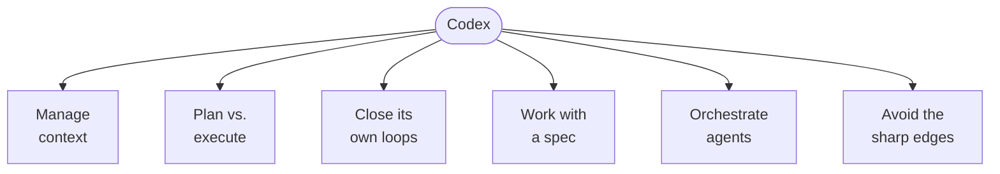
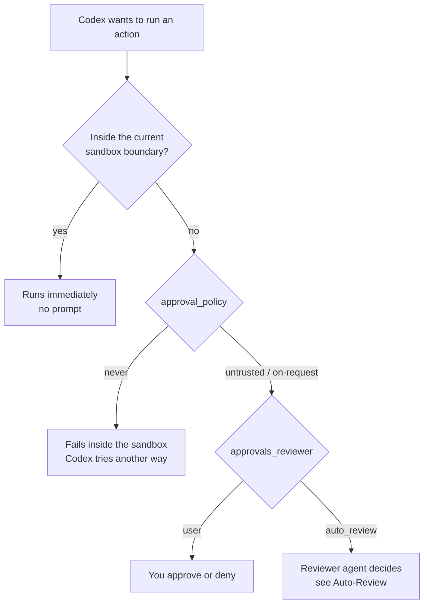
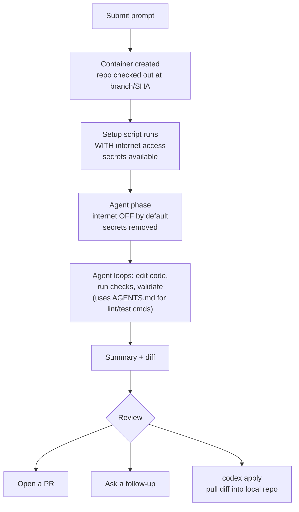

# Codex

[The AI Engineering Skills Map](../basics/skills_map.md) lists *using coding agents* as one of the four skills worth growing, and [Claude Code](claude_code.md) shows what its six habits look like in one tool. This page does the same for the other major CLI agent: OpenAI's Codex.

Reading the two pages side by side is the point. The habits — manage context, trade planning against execution, close loops, work with a spec, orchestrate agents, avoid the sharp edges — transfer completely. What changes is the vocabulary and the mechanism: where Claude Code has one permission mode dial, Codex has two (sandbox × approvals); where Claude Code's rules are guidance, Codex's rules are enforcement; where Claude Code loops with a stop hook, Codex ships the same trick as a first-class hook contract.



Codex moves as fast as its competitor, so treat specific flags, paths, and defaults here as accurate **as of 15 August 2026** rather than permanent. Several pieces are explicitly marked experimental (rules, memories) or beta (permission profiles) in the official docs.

**Official docs:** [Codex CLI](https://learn.chatgpt.com/docs/codex/cli) → [Commands reference](https://learn.chatgpt.com/docs/developer-commands?surface=cli) → [Configuration](https://learn.chatgpt.com/docs/config-file/config-basic) → [Customization](https://learn.chatgpt.com/docs/customization/overview). The docs serve an `llms.txt` index at [learn.chatgpt.com/llms.txt](https://learn.chatgpt.com/llms.txt), and every page has a Markdown twin — append `.md` to the URL.

---

## Coming from Claude Code

The fastest way in. Same concepts, different names — plus a few places where the mapping genuinely breaks.

| Claude Code | Codex | Same thing? |
|---|---|---|
| `CLAUDE.md` | `AGENTS.md` | Yes — Codex reads the open [AGENTS.md](https://agents.md) format natively |
| `~/.claude/` | `~/.codex/` (`CODEX_HOME`) | Yes |
| `settings.json` | `config.toml` | Yes — JSON vs. TOML |
| `.claude/rules/*.md` | `.codex/rules/*.rules` | **No** — Claude Code rules are markdown *guidance*; Codex rules are Starlark *enforcement* of what commands may run |
| `.claude/skills/` | `.agents/skills/` | Yes — both implement the [Agent Skills](https://agentskills.io) open standard |
| `/skill-name` | `$skill-name` | Yes — mention syntax differs |
| Subagents (`.claude/agents/*.md`) | Custom agents (`.codex/agents/*.toml`) | Yes — markdown-with-frontmatter vs. TOML |
| Hooks in `settings.json` | `hooks.json` / `[hooks]` in `config.toml` | Yes — near-identical event schema; Codex even sets `CLAUDE_PLUGIN_ROOT` for plugin-hook compatibility |
| `.mcp.json` / `claude mcp add` | `[mcp_servers]` / `codex mcp add` | Yes |
| `.claude-plugin/plugin.json` | `.codex-plugin/plugin.json` | Yes |
| Permission modes (one dial) | `sandbox_mode` × `approval_policy` (two dials) | **No** — Codex separates *what's technically possible* from *when to ask* |
| Auto mode (classifier model) | Auto-review (reviewer agent) | Similar idea, different placement — see [Auto-Review](#auto-review) |
| Auto memory (on by default) | Memories (off by default) | Same idea, opposite default |
| `/goal` | `/goal` | Yes |
| `claude -p` | `codex exec` | Yes |
| `--dangerously-skip-permissions` | `--dangerously-bypass-approvals-and-sandbox` (`--yolo`) | Yes |
| `claude --worktree` | Worktree chats (desktop app only) | Partially — Codex worktrees live in the ChatGPT desktop app, not the CLI |
| Agent teams | — | No direct equivalent; the [Agents SDK + `codex mcp-server`](#codex-as-an-mcp-server-multi-agent-workflows) fills the role |
| Checkpoints + `/rewind` | — | **No** — Codex has no code rewind; `Esc Esc` edits a previous message and forks the *conversation*, but git is the only undo for files |

Codex will do the migration for you: run `/import`, choose **Claude Code** (or **Cursor**), and it converts `CLAUDE.md` → `AGENTS.md`, `settings.json` → `config.toml`, slash commands → skills, plus MCP config, hooks, subagents, project memories, and up to 50 chats from the last 30 days. Importing doesn't change the original setup. [Docs](https://learn.chatgpt.com/docs/import)

---

## The Harness

### Surfaces, One Configuration

Codex is one agent behind several fronts: the **CLI** (`codex` in a terminal), the **IDE extension**, **Codex in the ChatGPT desktop app**, **Codex cloud** (isolated containers), and integrations (GitHub, Slack, Linear, the phone). The CLI, IDE extension, and desktop app share the same local configuration — configure an MCP server once and every local surface sees it. This page centers on the CLI and notes where a feature lives elsewhere (worktrees and local environments are desktop-app-only; plugins don't reach the IDE extension).

### What Lives in `~/.codex/` and `.codex/`

```text
~/.codex/                     # CODEX_HOME — user scope
├── config.toml               # settings: model, sandbox, approvals, MCP, features
├── AGENTS.md                 # global instructions (AGENTS.override.md wins if present)
├── rules/
│   └── default.rules         # execpolicy command rules (Starlark)
├── hooks.json                # lifecycle hooks (or inline [hooks] in config.toml)
├── agents/
│   └── reviewer.toml         # custom agent definitions
├── memories/                 # generated memory files (when enabled)
├── sessions/                 # transcripts, including auto-review sessions
├── worktrees/                # desktop-app managed worktrees
├── themes/                   # custom .tmTheme syntax themes
└── <name>.config.toml        # profiles, selected with --profile <name>

~/.agents/skills/             # user-scope skills (note: .agents, not .codex)

<repo>/.codex/                # project scope — loads only when the project is trusted
├── config.toml
├── rules/
├── hooks.json
└── agents/

<repo>/.agents/skills/        # repo skills, checked in for the team
<repo>/AGENTS.md              # project instructions, per directory
```

Set `CODEX_HOME` to point at a different home entirely — useful for a project-specific automation profile: `CODEX_HOME=$(pwd)/.codex codex exec "..."`.

### Configuration Precedence

Codex resolves every setting in this order, highest first:

1. CLI flags and `-c`/`--config` one-off overrides (`codex -c log_dir=./.codex-log`)
2. Project `.codex/config.toml` files, root down to cwd — closest wins, trusted projects only
3. Profile file selected with `--profile <name>` (`~/.codex/<name>.config.toml`)
4. User config `~/.codex/config.toml`
5. System config `/etc/codex/config.toml`
6. Built-in defaults

Untrusted projects skip *all* project-scoped layers — config, hooks, and rules — while user and system layers still load. On managed machines, admins can enforce constraints via `requirements.toml` (for example, disallowing `approval_policy = "never"`). Debug precedence questions with `/debug-config`, which prints layer order and policy sources.

A starter `config.toml`:

```toml
model = "gpt-5.6"
model_reasoning_effort = "high"
approval_policy = "on-request"
sandbox_mode = "workspace-write"
personality = "pragmatic"          # or "friendly" or "none"
web_search = "cached"              # cached | indexed | live | disabled

[features]
memories = true                    # experimental, off by default
```

Feature flags live under `[features]` (`hooks`, `goals`, `multi_agent`, `fast_mode`, `memories`, `shell_snapshot`, `unified_exec`, …) and can be flipped from the CLI with `codex --enable <feature>` or persisted with `codex features enable <feature>`.

### The Extension Points

| Extension | What it does | Where it lives | Loads |
|---|---|---|---|
| **AGENTS.md** | Persistent instructions, layered global → project → subdirectory | `~/.codex/`, repo root, nested dirs | Every session, merged root-down, ~32 KiB cap |
| **Skills** | Reusable workflows and expertise, open standard | `.agents/skills/`, `~/.agents/skills/`, `/etc/codex/skills` | Names + descriptions up front; full `SKILL.md` on use |
| **Plugins** | Installable bundles: skills + connectors + MCP servers + hooks | Universal directory shared with ChatGPT; `/plugins` browser | Bundled parts on new sessions after install |
| **Subagents** | Parallel isolated workers; custom agents with own model/sandbox | Built-in + `~/.codex/agents/*.toml`, `.codex/agents/*.toml` | When spawned |
| **MCP** | External tools and context | `[mcp_servers]` in `config.toml`, shared across local surfaces | Session start |
| **Hooks** | Deterministic scripts on lifecycle events | `hooks.json` or `[hooks]` next to any config layer | On trigger, after trust review |
| **Rules** | Enforced allow/prompt/forbid policy for commands outside the sandbox | `rules/*.rules` next to any config layer | Session start |

The docs' recommended adoption order is worth keeping: **AGENTS.md first** (plus linters and pre-commit hooks to enforce what it says), **then a plugin** if one already covers the workflow — otherwise write a skill and package it later, **then MCP** when work needs external systems, **then subagents** when you're ready to delegate noisy work.

---

## 1. Manage Context

### AGENTS.md

Codex reads `AGENTS.md` files before doing any work — the same onboarding-guide-for-an-agent role CLAUDE.md plays, in an [open format](https://agents.md) other tools also honor. Run `/init` to generate a scaffold from the current directory.

#### How Discovery Works

Codex builds one instruction chain per run (in the TUI, per launched session):

1. **Global scope:** in `CODEX_HOME`, read `AGENTS.override.md` if present, else `AGENTS.md` — first non-empty file only. The override file is for temporary global changes; delete it to restore the base.
2. **Project scope:** from the project root (typically the git root) *down* to the current working directory, checking each directory for `AGENTS.override.md`, then `AGENTS.md`, then any names in `project_doc_fallback_filenames`. At most one file per directory.
3. **Merge:** concatenated root-down, so files closer to your working directory appear later in the prompt and override earlier guidance.

Empty files are skipped, and discovery stops adding files once the combined size hits `project_doc_max_bytes` — **32 KiB by default**. Raise the limit or split guidance across nested directories when you hit it.

Two knobs worth knowing:

```toml
# ~/.codex/config.toml
project_doc_fallback_filenames = ["TEAM_GUIDE.md", ".agents.md"]
project_doc_max_bytes = 65536
```

If your repo already has a `TEAM_GUIDE.md`, the fallback list makes Codex treat it as instructions without a rename.

#### What Goes In It

Keep it small, and split by audience: the **global** file shapes how Codex communicates with *you* (review style, verbosity, defaults); **repo** files carry team and codebase rules — build and test commands, review expectations, conventions, directory-specific instructions.

The docs frame maintenance as a feedback loop, and it's the best single habit on this page:

- **Repeated mistakes** → add a rule.
- **Right files, too much reading** → add routing guidance: which directories and files to prioritize.
- **Recurring PR feedback** → codify it once instead of typing it again.
- **When you correct Codex**, tell it to update `AGENTS.md` itself so the fix persists — in a GitHub PR comment, `@codex add this to AGENTS.md` delegates the update to a cloud chat.

Pair the file with infrastructure that *enforces* what it says — pre-commit hooks, linters, type checkers — so the system prevents recurring mistakes rather than just describing them.

A `## Code Review Rules` section in the `AGENTS.md` closest to the governed code customizes [GitHub PR reviews](#github-codex-review); see that section for rule-writing guidance.

#### Verify and Debug

- `codex --ask-for-approval never "Summarize the current instructions."` — Codex should quote your files in precedence order.
- `codex --cd subdir --ask-for-approval never "Show which instruction files are active."` — confirms nested overrides.
- For an audit trail, `codex -c log_dir=./.codex-log` enables a plaintext TUI log listing loaded instruction files.
- There's no cache to clear: the chain is rebuilt on every run. If guidance looks wrong, hunt for an `AGENTS.override.md` higher in the tree.

### Memories

The counterpart to Claude Code's auto memory, with the opposite default: **off**. Enable it in the desktop app under **Settings > Personalization**, or in config:

```toml
[features]
memories = true
```

Once enabled, Codex turns useful context from eligible prior chats into local memory files under `~/.codex/memories/` — summaries, durable entries, recent inputs, and supporting evidence. It skips active or short-lived sessions, redacts secrets from generated fields, and updates in the background after a chat has been idle, not immediately at chat end. It even skips a pass when your remaining rate limit is below a threshold, so memory generation never spends quota you're about to need.

- `/memories` in a session controls the current chat: whether it can *use* existing memories and whether it can *feed* future ones. Chat-level choices don't change global settings.
- Config keys: `memories.generate_memories`, `memories.use_memories`, `memories.disable_on_external_context` (keep chats that used MCP/web search out of memory generation), `memories.min_rate_limit_remaining_percent`, and model overrides `memories.extract_model` / `memories.consolidation_model`.
- Treat the files as generated state — inspect them, but don't hand-edit as your control surface. And keep required team guidance in `AGENTS.md`; memories are a recall layer, not a rules channel.

### Session Hygiene

The context-rot rationale is stated unusually plainly in Codex's docs: flooding the main chat with exploration notes, test logs, and stack traces buries the requirements and decisions that matter (**context pollution**) and degrades performance as the window fills (**context rot**). Everything here is about keeping the main thread clean.

- **`/status`** shows the active model, approval policy, writable roots, and current token usage — the equivalent of `/context` plus `/permissions` in one view.
- **`/compact`** summarizes the visible chat to free tokens while keeping key points.
- **`/new`** starts a fresh chat in the same CLI session; **`/clear`** does the same *and* clears the terminal (name it inline: `/clear release prep`). `Ctrl+L` only wipes the screen and keeps the chat.
- **`/side`** (alias `/btw`) opens an ephemeral side chat for a focused question without disturbing the main transcript — the parent's status stays visible so you can see if it's still running.
- **`/fork`** clones the current chat under a fresh ID to explore an alternative; `codex fork` (with `--last` or the picker) forks a saved session. **`Esc Esc`** with an empty composer edits your previous message and forks from that point — the conversation-level undo.
- **`/resume`** reopens a saved chat; `codex resume` scopes `--last` to the current directory unless you pass `--all`. `codex archive <SESSION>` hides a session from the picker without deleting the transcript; `codex delete` removes it permanently. **`/rename`** names sessions so you can find them.
- **Steer without restarting:** press `Enter` while Codex works to inject instructions into the current turn; press `Tab` to queue a follow-up prompt or slash command for the next turn.
- **`/mention <path>`** attaches a file; typing `@` searches the workspace for a path; `!command` runs a shell command under the current sandbox and adds its output to context.
- **`/model`** switches model and reasoning effort; **`/copy`** or `Ctrl+O` copies the latest completed response; **`/usage`** shows daily/weekly/cumulative token activity; **`/diff`** shows the git diff including untracked files.
- **Images:** `codex --image error.png` passes a screenshot with the first prompt, or paste one into the composer.
- **Delegate the noise.** Read-heavy work — exploration, tests, triage, log analysis — belongs in [subagents](#subagents) that return summaries instead of raw output.

---

## 2. Trade Planning Against Execution

### Two Dials, Not One

Claude Code folds "what can it do" and "when does it ask" into one permission mode. Codex separates them, and the separation is the single most useful thing to understand about the tool:

- **`sandbox_mode`** — what commands can *technically* do. OS-enforced: Seatbelt on macOS, `bwrap` + `seccomp` on Linux and WSL2, a native sandbox on Windows. The sandbox applies to *spawned commands too* — `git`, package managers, and test runners all inherit it.
- **`approval_policy`** — when Codex must *stop and ask* before crossing a boundary.

| `sandbox_mode` | What commands can do |
|---|---|
| `read-only` | Inspect files only; edits and commands need approval |
| `workspace-write` | Read everywhere, write inside the workspace, run routine local commands. The default low-friction mode |
| `danger-full-access` | No filesystem or network boundary at all |

| `approval_policy` | When Codex asks |
|---|---|
| `untrusted` | Before any command not in its trusted set — only known-safe reads run automatically |
| `on-request` | Works inside the sandbox freely; asks only to go beyond it |
| `never` | Never asks; makes a best effort within the sandbox you set |



The common combinations:

| Intent | Flags / config | Effect |
|---|---|---|
| **Auto** (the preset) | no flags, or `--sandbox workspace-write --ask-for-approval on-request` | Read, edit, and run in the workspace; ask to go outside it or touch the network |
| Safe read-only browsing | `--sandbox read-only --ask-for-approval on-request` | Read and answer; ask before any edit, command, or network use |
| Read-only CI | `--sandbox read-only --ask-for-approval never` | Read-only, never prompts |
| Edit freely, gate commands | `--sandbox workspace-write --ask-for-approval untrusted` | Edits fine; untrusted commands prompt |
| Auto-review mode | add `-c approvals_reviewer=auto_review` | Same boundary; a reviewer agent handles eligible prompts |
| Dangerous full access | `--dangerously-bypass-approvals-and-sandbox` (alias `--yolo`) | No sandbox, no approvals — not recommended |

On launch, Codex recommends **Auto** for version-controlled folders and `read-only` for everything else, and may hold `read-only` until you explicitly trust the directory. The workspace includes the current directory and temp directories like `/tmp` — check with `/status`. Change mid-session with **`/permissions`**. Need to write in one more place? Prefer `--add-dir` over escalating to full access.

Save recurring postures as profiles — `~/.codex/full_auto.config.toml` with `approval_policy = "on-request"` and `sandbox_mode = "workspace-write"`, selected via `codex --profile full_auto`.

Two hard-earned defaults hide in the sandbox policy: within writable roots, **`.git`, `.codex`, and `.agents` stay read-only** — the agent can't rewrite its own instructions, config, or your git metadata.

Test what the sandbox would do to any command without involving the agent:

```bash
codex sandbox linux -- npm run build      # also: codex sandbox macos / windows
```

### Network Access

The default sandbox keeps command network access **off**. Turn it on per-config:

```toml
[sandbox_workspace_write]
network_access = true
```

…and, when it's on, constrain it with the network proxy feature — allowlist-first domain rules where `deny` always beats `allow`, `*.example.com` matches subdomains, `**.example.com` matches apex plus subdomains, and local/private destinations are blocked by default as a DNS-rebinding defense:

```toml
[features.network_proxy]
enabled = true
domains = { "api.openai.com" = "allow", "example.com" = "deny" }
```

Web search is a separate, safer channel: `web_search = "cached"` (the default) serves results from an OpenAI-maintained index rather than live pages, which reduces prompt-injection exposure; `"live"` (or `--search`) fetches fresh pages; `"indexed"` gates external access through the index; `"disabled"` turns the tool off. Under `--yolo`, web search defaults to live.

### Permission Profiles (Beta)

The newer, unified alternative to `sandbox_mode` + `sandbox_workspace_write`: named least-privilege policies combining filesystem rules and network rules. Built-ins are `:read-only`, `:workspace`, and `:danger-full-access`; custom profiles live under `[permissions.<name>]` and are selected with `default_permissions`. **The two systems don't compose** — if `sandbox_mode` appears anywhere, Codex uses the older settings.

```toml
default_permissions = "project-edit"

[permissions.project-edit]
extends = ":workspace"            # inherit baseline protections

[permissions.project-edit.filesystem.":workspace_roots"]
"**/*.env" = "deny"               # workspace stays writable, env files unreadable

[permissions.project-edit.network]
enabled = true

[permissions.project-edit.network.domains]
"api.openai.com" = "allow"
```

Filesystem entries take `read`, `write`, or `deny`; more specific paths override broader ones, and `deny > write > read` at equal specificity — so a profile can grant a writable workspace and still carve out `.env` files, or deny `~/Documents` while reopening `~/Documents/codex`. Special path tokens: `:root`, `:minimal` (paths common tools need), `:workspace_roots`, `:tmpdir`, `:slash_tmp`. Prefer `extends` over building from scratch so baseline protections carry forward. [Docs](https://learn.chatgpt.com/docs/permissions)

### Plan Mode

**`/plan`** switches the chat to plan mode — Codex proposes an execution plan before touching anything. Inline prompt works: `/plan Propose a migration plan for this service`. When the outcome itself is fuzzy, the docs' suggested pattern is `/plan` first, ask Codex to interview you and turn the answers into a goal with measurable criteria, then feed the result to [`/goal`](#goal-mode).

**`/personality`** adjusts communication style (`friendly`, `pragmatic`, `none`) without touching your instructions — useful when you want terser plans, not different behavior.

---

## 3. Let the Agent Close Its Own Loops

Codex has four loop-closing mechanisms, from deterministic to judgmental: hooks (scripts on events), rules (enforced command policy), auto-review (an agent reviewing the agent), and goal mode (a persistent completion target).

### Hooks

[Hooks](https://learn.chatgpt.com/docs/hooks) inject your scripts into the agentic loop — logging chats to analytics, blocking prompts that contain pasted API keys, auto-generating memories, validating standards when a turn stops, customizing prompts per directory.

#### Where They Live, and Trust

Codex discovers hooks next to every active config layer, as `hooks.json` or inline `[hooks]` tables in `config.toml` — in practice: `~/.codex/hooks.json`, `~/.codex/config.toml`, `<repo>/.codex/hooks.json`, `<repo>/.codex/config.toml`, plus plugin bundles. All matching hooks from all layers run; higher-precedence layers don't replace lower ones. Project hooks load only in trusted projects.

The trust model is stricter than Claude Code's: **a non-managed command hook won't run until you review and trust its exact definition** in the `/hooks` browser. Trust is recorded against the hook's hash, so any change re-flags it for review. Plugin hooks go through the same flow — installing a plugin doesn't trust its hooks. Managed hooks (from `requirements.toml`, MDM) are trusted by policy and can't be disabled from the user browser. For pre-vetted automation, `--dangerously-bypass-hook-trust` skips persisted trust for one invocation.

Turn hooks off entirely with `[features] hooks = false`.

#### Events

| When | Events |
|---|---|
| During a turn | `PreToolUse`, `PermissionRequest`, `PostToolUse`, `PreCompact`, `PostCompact`, `UserPromptSubmit`, `SubagentStop`, `Stop` |
| Session/subagent start | `SessionStart`, `SubagentStart` |
| Main thread ends | `SessionEnd` — never for subagents |

One sharp difference from Claude Code: **only `type: "command"` handlers run today** — `prompt` and `agent` hook types are parsed but skipped. Judgment-based gating goes through [auto-review](#auto-review) instead.

#### Config Shape

```json
{
  "hooks": {
    "PreToolUse": [
      {
        "matcher": "Bash",
        "hooks": [
          {
            "type": "command",
            "command": "/usr/bin/python3 \"$(git rev-parse --show-toplevel)/.codex/hooks/pre_tool_use_policy.py\"",
            "statusMessage": "Checking Bash command",
            "timeout": 30
          }
        ]
      }
    ]
  }
}
```

Or inline TOML:

```toml
[[hooks.PreToolUse]]
matcher = "^Bash$"

[[hooks.PreToolUse.hooks]]
type = "command"
command = '/usr/bin/python3 "$(git rev-parse --show-toplevel)/.codex/hooks/pre_tool_use_policy.py"'
timeout = 30
```

- `timeout` is in seconds; default 600 (`SessionEnd`: 1 second default, 3 max).
- Commands run with the session `cwd` — resolve repo-local scripts from the git root, since Codex may be started from a subdirectory.
- `command_windows` / `commandWindows` overrides the command on Windows.
- `async: true` runs the hook in the background (up to 8 concurrent); output is delivered at the next safe point. **Background hooks can't block or rewrite anything** — use synchronous hooks for policy.
- `additionalContextLimit` caps model-visible hook output (default ~2,500 tokens). Bigger output is **spilled** to disk with a head-and-tail preview — keep hook context lean; several chatty hooks add up and degrade the model.

#### Matchers

`matcher` is a regex against an event-specific value. `PreToolUse` / `PostToolUse` / `PermissionRequest` match the tool name: `Bash`, `apply_patch` (aliases `Edit` and `Write`), MCP names like `mcp__filesystem__read_file`, other function tools like `update_plan` (and `spawn_agent` matches `Agent`). `SessionStart` matches `startup|resume|clear|compact`; `PreCompact`/`PostCompact` match `manual|auto`; `SubagentStart`/`SubagentStop` match the agent type. `UserPromptSubmit` and `Stop` ignore matchers. Hosted tools like `WebSearch` don't pass through the hook path — treat tool hooks as a guardrail, not a complete enforcement boundary.

#### The Wire Contract

Every command hook gets one JSON object on stdin — `session_id`, `transcript_path`, `cwd`, `hook_event_name`, `model`, plus event-specific fields like `tool_name`, `tool_input`, `tool_response`, `prompt`, or `last_assistant_message`. Exit 0 with no output means proceed. The interesting powers, per event:

**`PreToolUse`** — deny, annotate, or *rewrite* a call:

```json
{ "hookSpecificOutput": { "hookEventName": "PreToolUse",
    "permissionDecision": "deny",
    "permissionDecisionReason": "Destructive command blocked by hook." } }
```

Return `permissionDecision: "allow"` with `updatedInput` to rewrite a Bash command or MCP arguments before they run. Exit code 2 with a reason on stderr also blocks.

**`PermissionRequest`** — decide an approval before the prompt reaches a human: return `decision: {"behavior": "allow"}` or `{"behavior": "deny", "message": "..."}`. Any deny wins across multiple hooks; no decision falls through to the normal flow.

**`PostToolUse`** — can't undo a side effect, but `decision: "block"` replaces the tool result with your feedback so the model continues from it; `additionalContext` adds developer context.

**`UserPromptSubmit`** — plain stdout becomes developer context; `decision: "block"` rejects the prompt (this is where a secrets-scanner hook lives).

**`SessionStart`** — stdout or `additionalContext` seeds context; with `matcher: "compact"` it runs *after compaction, before the next model request*, which is the re-inject-standing-orders trick.

**`Stop` and `SubagentStop`** — the loop-closers. These expect JSON, and:

```json
{ "decision": "block", "reason": "Run one more pass over the failing tests." }
```

…doesn't reject the turn — it **continues** it, with `reason` becoming a new continuation prompt. `stop_hook_active` in the input tells you whether the turn was already continued, so you can avoid infinite loops. This is exactly the mechanism behind Claude Code's Ralph-loop plugin, shipped as a documented contract: a Stop hook that checks completion criteria and blocks until they hold is the Ralph loop in [claude_code.md → The Ralph Loop](claude_code.md#the-ralph-loop), portably.

`PreCompact` / `PostCompact` can return `continue: false` to halt around compaction. Schemas are generated in the [Codex repo](https://github.com/openai/codex/tree/main/codex-rs/hooks/schema/generated).

### Rules

[Rules](https://learn.chatgpt.com/docs/agent-configuration/rules) (experimental) control which commands run **outside the sandbox** — enforcement, not guidance. They're Starlark (Python-like, side-effect-free) files under `rules/` next to any config layer:

```python
# ~/.codex/rules/default.rules
prefix_rule(
    pattern = ["gh", "pr", "view"],
    decision = "prompt",                      # allow | prompt | forbidden
    justification = "Viewing PRs is allowed with approval",
    match = [
        "gh pr view 7888",
        "gh pr view --repo openai/codex",
    ],
    not_match = [
        "gh pr --repo openai/codex view 7888",   # pattern must be an exact prefix
    ],
)
```

- `pattern` matches a command's argument-list prefix; a list element can be a union (`["view", "list"]`).
- When several rules match, the most restrictive decision wins: `forbidden > prompt > allow`.
- `match` / `not_match` are **inline unit tests** — validated at load time, so a typo'd rule fails fast instead of silently not matching.
- When you allow-list a command in the TUI, Codex writes the rule to `~/.codex/rules/default.rules` for you. With Smart approvals on (the default), Codex may *propose* a `prefix_rule` during an escalation — review the prefix before accepting.

The clever part is compound-command handling. For `bash -lc "git add . && rm -rf /"`, Codex parses the script with tree-sitter and — when it's a linear chain of plain words joined by `&&`, `||`, `;`, or `|` — splits it and evaluates each command separately, most restrictive result winning. Allowing `["git", "add"]` therefore never smuggles in the `rm`. Scripts using redirection, substitution, variables, wildcards, or control flow aren't split; the whole invocation is evaluated as one unit, conservatively.

Test rules without a live session:

```bash
codex execpolicy check --pretty \
  --rules ~/.codex/rules/default.rules \
  -- gh pr view 7888 --json title,body,comments
```

### Auto-Review

[Auto-review](https://learn.chatgpt.com/docs/sandboxing/auto-review) replaces *you* at the approval prompt with a separate reviewer agent — a reviewer swap, not a permission grant. The main agent keeps the same sandbox, policy, and limits; what changes is who reviews eligible escalations.

```toml
approval_policy = "on-request"
approvals_reviewer = "auto_review"    # default: "user"
```

It evaluates only actions that already need approval — sandbox escalations, blocked network requests, out-of-root edits, side-effecting MCP/app tool calls. Actions fine inside the sandbox never see the reviewer. The reviewer sees a compact transcript plus the exact request (never hidden chain-of-thought), and its policy targets data exfiltration, credential probing, persistent security weakening, and destructive actions. Failures fail closed.

Denials carry teeth: the main agent is told not to pursue the same outcome by workaround, to continue only with a materially safer alternative, or to stop and ask. A **circuit breaker** interrupts the turn after 3 consecutive denials or 10 within the last 50 reviews. Your override is **`/approve`** — pick one recent denied action for a single retry, which still passes through the reviewer.

The [default policy](https://github.com/openai/codex/blob/main/codex-rs/core/src/guardian/policy.md) is open source and customizable via a local `[auto_review].policy` (enterprises: `guardian_policy_config`). If too much mundane traffic hits the reviewer, fix the boundary instead of teaching the reviewer to say yes: add narrow `writable_roots`, or precise prefix rules like `["pnpm", "run", "lint"]` — broad ones like `["curl"]` erase the very boundary auto-review guards. Reviewer transcripts land in `~/.codex/sessions`, so you can ask Codex to analyze past escalation traffic before loosening anything.

### Goal Mode

**`/goal <objective>`** attaches a persistent target to the chat; Codex keeps working toward it and tracks progress (pause, resume, edit, and clear with `/goal pause`, `/goal resume`, `/goal edit`, `/goal clear`; view with bare `/goal`). Objectives cap at 4,000 characters — for longer specs, point the goal at a file.

Write goals the agent can verify itself:

| Element | What to include |
|---|---|
| **Outcome** | The result, not just the activity |
| **Constraints** | Required tools, boundaries, compatibility, approaches to avoid |
| **Verification** | Tests, measurements, or review criteria that prove completion |

```text
/goal Migrate this codebase from JavaScript to TypeScript. Preserve existing
behavior, compile in strict mode without explicit `any` types, and make the
full test suite pass.
```

A goal doesn't widen access — the same sandbox and approval policy hold, and auto-review can absorb the escalation prompts a long run generates. Run goals in parallel across chats, but never let two chats write the same files; use [worktrees](#worktrees) for separate checkouts.

### `codex exec` — Loops in CI

Non-interactive mode is the backpressure delivery vehicle: run Codex from scripts and pipelines with pre-set permissions and machine-readable output.

```bash
codex exec "summarize the repository structure and list the top 5 risky areas"
```

Progress streams to stderr; only the final message hits stdout, so piping works naturally:

```bash
npm test 2>&1 \
  | codex exec "summarize the failing tests and propose the smallest likely fix" \
  | tee test-summary.md
```

- Defaults to a **read-only** sandbox. Grant the least needed: `--sandbox workspace-write`, or `danger-full-access` only inside an isolated runner. (`--full-auto` survives as a deprecated alias that warns.)
- If stdin is piped *and* a prompt argument is given, the prompt is the instruction and stdin is context. `codex exec -` makes stdin the entire prompt.
- `--json` turns stdout into a JSONL event stream — `thread.started`, `turn.started`, `item.*` (agent messages, reasoning, command executions, file changes, MCP calls, web searches, plan updates), `turn.completed` with token usage.
- `--output-schema schema.json` forces the final response to conform to a JSON Schema; `-o file` writes the final message to disk.
- `codex exec resume --last "fix the race conditions you found"` continues a previous run — two-stage pipelines.
- `--ephemeral` skips persisting session files; `--ignore-user-config` and `--ignore-rules` isolate automation from local setup; `--skip-git-repo-check` overrides the require-a-git-repo safety check.
- In CI, never set the API key as a job-level env var where repository-controlled code runs; set `CODEX_API_KEY` inline for the single invocation, or better, use the [GitHub Action](#codex-github-action), which proxies the key.

---

## 4. Work With a Spec

Codex's ladder of durable artifacts: a skill for a workflow you repeat, a plugin for one you distribute, `AGENTS.md` review rules for standards, and — since the format is an open standard — the specs and Ralph-style loops from the [Claude Code page](claude_code.md#spec-driven-development) port over nearly verbatim.

### Skills

A skill is a directory with a `SKILL.md` (required `name` and `description` frontmatter) plus optional `scripts/`, `references/`, `assets/`, and an `agents/openai.yaml`:

```md
---
name: commit
description: Stage and commit changes in semantic groups. Use when the user wants to commit, organize commits, or clean up a branch before pushing.
---

1. Do not run `git add .`. Stage files in logical groups by purpose.
2. Group into separate commits: feat → test → docs → refactor → chore.
3. Write concise commit messages that match the change scope.
4. Keep each commit focused and reviewable.
```

**Progressive disclosure, with a hard budget:** Codex starts with each skill's name, description, and path; the full `SKILL.md` loads only when a skill is chosen; references and scripts only when needed. The initial list is capped at **2% of the context window** (8,000 characters if unknown) — descriptions get shortened first, then skills drop from the list with a warning. Front-load trigger words in descriptions so a shortened one still matches.

**Invocation:** explicit — `/skills` or type `$` to mention one (`$skill-name`) — or implicit, when your task matches the description. Set `allow_implicit_invocation: false` in `openai.yaml` to make a skill explicit-only.

**Where they load from:**

| Scope | Location | Use |
|---|---|---|
| `REPO` | `.agents/skills` in cwd, parent dirs, and the repo root | Team skills checked in — root skills apply everywhere, nested ones to a module |
| `USER` | `~/.agents/skills` | Your skills, all repositories |
| `ADMIN` | `/etc/codex/skills` | Machine-wide defaults, SDK scripts |
| `SYSTEM` | Bundled with Codex | `$skill-creator`, plan skills, etc. |

Symlinked skill folders work. Same-name skills aren't merged — both appear in selectors. Disable one without deleting it:

```toml
[[skills.config]]
path = "/path/to/skill/SKILL.md"
enabled = false
```

**Three ways to author:** `$skill-creator` interviews you (what it does, when it triggers, instruction-only or scripted); **Record & Replay** (macOS) watches you demonstrate the workflow once and drafts the skill from the recording — best for stable, show-don't-tell processes; or write the folder by hand. `$skill-installer linear` pulls curated skills from [openai/skills](https://github.com/openai/skills). Codex detects skill changes automatically.

**Optional metadata** (`agents/openai.yaml`) adds display name, icons, and — the interesting one — **tool dependencies**: declare the MCP server a skill needs and Codex can install and wire it automatically:

```yaml
policy:
  allow_implicit_invocation: false

dependencies:
  tools:
    - type: "mcp"
      value: "openaiDeveloperDocs"
      transport: "streamable_http"
      url: "https://developers.openai.com/mcp"
```

**Best practices, per the docs:** one job per skill; instructions over scripts unless you need determinism or external tooling; imperative steps with explicit inputs and outputs; test prompts against the description to confirm triggering. (Custom prompts, the older mechanism, are deprecated in favor of skills.)

### Plugins

Plugins are the distribution unit: skills remain the authoring format, plugins are what you install. One **universal plugin directory** is shared between ChatGPT and Codex — publish once, discoverable in both. A plugin can bundle skills, connectors, MCP servers, browser extensions, hooks, and scheduled-task templates.

- **Use:** `/plugins` opens the CLI browser (grouped by marketplace; `Space` toggles an installed plugin). Plugins work in the desktop app and CLI, not the IDE extension. Bundled skills appear in new sessions after install; plugin capabilities run under your sandbox and approval policy.
- **Build:** `$plugin-creator` scaffolds the manifest and folder, and can add a local marketplace entry for testing. Minimal by hand:

```text
meeting-follow-up/
├── .codex-plugin/
│   └── plugin.json
└── skills/
    └── meeting-follow-up/
        └── SKILL.md
```

```json
{
  "name": "meeting-follow-up",
  "version": "1.0.0",
  "description": "Turn meeting notes into decisions and next steps",
  "skills": "./skills/"
}
```

- **Distribute:** `codex plugin marketplace add owner/repo` (also `owner/repo@ref`, git URLs, or local directories) registers a marketplace source; `codex plugin add/list/remove` manage installs, all with `--json` for automation. Start with a skill while iterating; make it a plugin when you want to share, bundle, or attach connectors. [Builder docs](https://developers.openai.com/plugins)

Notable first-party plugin: **Codex Security** — an application-security agent for scanning authorized repositories, validating findings to cut false positives, and preparing reviewed fixes; also available as a CLI (`npx @openai/codex-security`), TypeScript SDK, and cloud scanning on connected GitHub repos. [Docs](https://learn.chatgpt.com/docs/security)

---

## 5. Orchestrate Multiple Agents

### Subagents

Codex spawns specialized agents in parallel and collects their results in one response — on by default in current releases. The motivation is the context-rot argument from §1: keep the main thread for requirements and decisions, push exploration, tests, and log analysis into workers that return summaries.

**Triggering is explicit:** "spawn two agents", "delegate this in parallel", "use one agent per point" — or an `AGENTS.md`/skill instruction that requests delegation. A good delegation prompt says how to divide the work, whether to wait for all agents, and what to return:

```text
Review this branch with parallel subagents. Spawn one subagent for security
risks, one for test gaps, and one for maintainability. Wait for all three,
then summarize the findings by category with file references.
```

**Managing them:** `/agent` (or `/subagents`) switches between agent threads to inspect or continue work. Approval requests can surface from inactive threads — the overlay names the source thread, and `o` opens it before you decide. Subagents inherit the parent's sandbox and approval settings, including live overrides like `/permissions` changes or `--yolo`. Start with parallel agents for read-heavy work; be careful with parallel *writes*, which invite conflicts.

Each subagent does its own model and tool work, so parallel runs multiply token spend.

**Built-in agents:** `default` (general fallback), `worker` (implementation), `explorer` (read-heavy exploration). **Custom agents** are TOML files — `~/.codex/agents/` personal, `.codex/agents/` project — each defining `name`, `description`, and `developer_instructions`, plus any normal config keys (`model`, `model_reasoning_effort`, `sandbox_mode`, `mcp_servers`, `skills.config`). A custom agent with a built-in's name wins.

```toml
# .codex/agents/reviewer.toml
name = "reviewer"
description = "PR reviewer focused on correctness, security, and missing tests."
model = "gpt-5.6-terra"
model_reasoning_effort = "high"
sandbox_mode = "read-only"
developer_instructions = """
Review code like an owner.
Prioritize correctness, security, behavior regressions, and missing test coverage.
Lead with concrete findings, include reproduction steps when possible, and avoid
style-only comments unless they hide a real bug.
"""
```

The docs' worked pattern is a review trio — a read-only `pr_explorer` mapping code paths, a `reviewer` hunting real risks, and a `docs_researcher` wired to a docs MCP server to verify APIs:

```text
Review this branch against main. Have pr_explorer map the affected code paths,
reviewer find real risks, and docs_researcher verify the framework APIs that
the patch relies on.
```

Global knobs under `[agents]`: `enabled`, `max_concurrent_threads_per_session`, `default_subagent_model`, `default_subagent_reasoning_effort`.

**Model selection for workers:** `gpt-5.6` for demanding, ambiguous multi-step work; `gpt-5.6-terra` for fast, read-heavy parallel workers; `gpt-5.6-luna` for narrow, high-volume tasks. Reasoning effort runs `low → medium → high → xhigh → max` (plus `ultra` where supported). Leave model and effort unpinned and Codex picks a balance per task.

### Worktrees

Codex's worktree support lives in the **ChatGPT desktop app**, built on plain [git worktrees](https://git-scm.com/docs/git-worktree) — see [claude_code.md → Worktrees](claude_code.md#worktrees) for the underlying git mechanics, which are identical. What Codex adds:

- **Start a chat in a worktree:** pick **Worktree** under the composer, choose the base branch (including your current branch with uncommitted changes — they're applied to the worktree), and Codex creates a checkout under `$CODEX_HOME/worktrees` in **detached HEAD** state, so parallel chats never pollute your branches.
- **Handoff** moves a chat — *and its code* — between Local and Worktree in either direction. Git only allows a branch checked out in one place at a time; Handoff does the safe surgery for you. Each chat keeps the same associated worktree over time.
- **Create branch here** turns a worktree's detached HEAD into a real branch to commit and push from.
- **`.worktreeinclude`** at the repo root lists gitignored files (`.env`, `config/secrets.json`) to copy into new managed worktrees — tracked files are already there; an ignored `AGENTS.override.md` is copied automatically.
- **Cleanup:** managed worktrees are disposable — Codex keeps the most recent 15 by default, snapshots work before deleting, and offers restore if you reopen the chat. Pinned, in-progress, and *permanent* worktrees (created from a project's three-dot menu) are never auto-deleted.
- **Local environments** (`.codex` folder, shareable via git) attach setup scripts that run when a worktree is created — `npm install && npm run build` — plus named **actions** (run dev server, run tests) surfaced in the app's top bar.

Scheduled tasks on git repos run on dedicated background worktrees, so recurring automation never collides with your working copy.

### Codex Cloud

Cloud chats run in isolated OpenAI-managed containers — delegate longer tasks, run attempts in parallel, and start work from the web, GitHub, Linear, or Slack. [Setup](https://chatgpt.com/codex): connect GitHub, create an environment per repository, prompt.



The two-phase runtime is the security story: **setup scripts run with internet access and secrets; the agent phase runs offline by default, with secrets removed**. Environment *variables* persist across both phases; *secrets* are setup-only. Agent-phase internet can be enabled per environment — full or domain-allowlisted — and all outbound traffic passes through a proxy.

- The default `universal` container image ([openai/codex-universal](https://github.com/openai/codex-universal)) pre-installs common languages; pin runtime versions in environment settings, or add a custom setup script. Common package managers (`npm`, `pnpm`, `pip`, `poetry`, …) are auto-detected.
- Containers are **cached up to 12 hours**; a resumed cache checks out your branch and runs an optional maintenance script. Changing setup, variables, or secrets invalidates the cache.
- From the terminal: `codex cloud` opens an interactive picker over active and completed chats, `codex cloud exec` submits work directly, `codex cloud list --json` scripts over recent chats, and **`codex apply`** pulls a cloud chat's diff into your local repo (non-zero exit if `git apply` conflicts).

### Codex as an MCP Server: Multi-Agent Workflows

Codex has no agent-teams feature; its answer to orchestration is composition. `codex mcp-server` runs Codex itself as an MCP server exposing two tools — `codex` (start a session: prompt plus overrides for model, sandbox, approval policy, cwd, base/developer instructions) and `codex-reply` (continue by `threadId`). Any MCP client can drive it; the documented pattern uses the OpenAI Agents SDK to build a project-manager agent that gates handoffs between designer, frontend, backend, and tester agents, each calling Codex MCP to do the actual file work, with full traces. [Guide](https://learn.chatgpt.com/docs/mcp-server)

For direct programmatic control there's the **Codex SDK** — TypeScript (`npm install @openai/codex-sdk`: `codex.startThread()`, `thread.run(prompt)`, `codex.resumeThread(id)`) and Python (`pip install openai-codex`: `codex.thread_start(model=..., sandbox=Sandbox.workspace_write)`, with per-turn sandbox switching — run a change in `workspace_write`, then review the diff in `read_only`). Use the SDK when Codex is the centerpiece; use `mcp-server` + Agents SDK when Codex is one specialist in a larger workflow. The **app-server** protocol (`codex app-server`) sits underneath both for embedding Codex in your own product, over stdio or WebSocket — the TUI itself can attach to a remote one with `codex --remote ws://host:port`.

---

## 6. Reach Outside the Repo

### MCP

Local Codex clients connect to MCP servers directly, and the configuration is shared across CLI, IDE extension, and desktop app.

```bash
codex mcp add context7 -- npx -y @upstash/context7-mcp
codex mcp add my-server --env API_KEY=xxx -- npx my-mcp-server
codex mcp list
codex mcp login <server-name>     # OAuth, streamable HTTP servers only
```

In `config.toml`, each server is a `[mcp_servers.<name>]` table. STDIO servers take `command`, `args`, `env`, `env_vars`, `cwd`; streamable HTTP servers take `url` plus auth options (`bearer_token_env_var`, `http_headers`, `env_http_headers`, OAuth by default, or `auth = "chatgpt"` to ride the current ChatGPT session for trusted first-party servers).

The options Claude Code doesn't have are the per-server *policy* controls:

```toml
[mcp_servers.chrome_devtools]
url = "http://localhost:3000/mcp"
enabled_tools = ["open", "screenshot"]      # tool allowlist
disabled_tools = ["screenshot"]             # deny, applied after allow
default_tools_approval_mode = "prompt"      # auto | prompt | writes | approve
startup_timeout_sec = 20
tool_timeout_sec = 45
required = true                             # fail startup if it can't initialize

[mcp_servers.chrome_devtools.tools.open]
approval_mode = "approve"                   # per-tool override
```

`writes` prompts only for tools not marked read-only. Codex also reads a server's MCP `instructions` field as server-wide guidance — if you build servers, keep the first 512 characters self-contained. Plugin-bundled servers are configured under `plugins.<plugin>.mcp_servers.<server>`. In a session, `/mcp` lists what's connected (`/mcp verbose` for diagnostics); `/apps` browses connector-backed apps and inserts them as `$app-slug`.

Useful servers named in the docs: [OpenAI Docs MCP](https://developers.openai.com/learn/docs-mcp), [Context7](https://github.com/upstash/context7), Figma, [Playwright](https://www.npmjs.com/package/@playwright/mcp), [Chrome DevTools](https://github.com/ChromeDevTools/chrome-devtools-mcp/), Sentry, [GitHub](https://github.com/github/github-mcp-server).

### Code Review, Local

`/review` starts a dedicated reviewer that reads a diff and reports prioritized findings **without changing your working tree**. Scopes: against a base branch (merge-base diff), uncommitted changes (staged + unstaged + untracked), a specific commit, or custom instructions. Set `review_model` in `config.toml` to review with a different model than the session. Non-interactively: `codex review --base main`, `--uncommitted`, or `--commit <sha>` (one target only). If you then ask Codex to apply the fixes, normal sandbox and approval rules apply.

### GitHub: `@codex review`

With [Codex cloud](#codex-cloud) set up and **Code review** enabled for the repository in [Codex settings](https://chatgpt.com/codex/settings/code-review):

- Comment **`@codex review`** on a PR — Codex reacts 👀 and posts a standard GitHub review, deliberately flagging **only P0/P1 issues** so comments stay high-signal. One-off focus: `@codex review for issues in the database migration`.
- **Automatic reviews** on every new PR is a settings toggle.
- **`@codex fix the P1 issue`** starts a cloud chat with the PR as context that can push a fix to the branch. Any other `@codex <task>` comment does the same for arbitrary work.
- **`@codex security review`** (research preview) runs the deeper security pass; findings post to the PR with a full report in the task's Security Report tab.

Customize with a `## Code Review Rules` section in the `AGENTS.md` nearest the governed code — repository-wide checks at the root, service-specific checks nested. Rule-writing guidance from the docs: focus on consequential, repo-specific behavior; state the safe path or exception so Codex can tell a real issue from expected behavior; prefer outcomes over function names; and leave formatting and lint to CI. Start with two or three rules, run a review on a representative PR, and prune what produces noise.

```md
## Code Review Rules

### Experiment cohorts

- Do not filter treatment comparisons on post-exposure behavior, including
  conversion or retention.
  Safe path: build cohorts from assignment or exposure; report conversion as
  an outcome.
```

### Codex GitHub Action

[`openai/codex-action@v1`](https://github.com/openai/codex-action) runs `codex exec` inside GitHub Actions: it installs the CLI, starts a Responses API proxy so your `OPENAI_API_KEY` never sits in the job environment, and executes your `prompt` or `prompt-file` under inputs mapping to exec options (`model`, `effort`, `sandbox`, `codex-args`, `output-file`, `codex-version`, `codex-home`). The final message surfaces as the `final-message` output.

Privilege management is the point of the action: `safety-strategy: drop-sudo` (the default) irreversibly removes `sudo` before Codex runs; `unprivileged-user` runs it as a dedicated account; `allow-users` / `allow-bots` restrict who can trigger the workflow. The documented CI-autofix pattern splits jobs: the Codex job gets `contents: read` only and serializes its diff as a patch artifact; a separate job with write permissions — but no API key — applies the patch and opens the PR. Sanitize PR-sourced prompt inputs (hidden HTML comments included) before feeding them to the agent.

### Slack, Linear, and Your Phone

- **Slack:** install the app from [connector settings](https://chatgpt.com/codex/settings/connectors), then mention `@Codex` in a channel or thread with a prompt — it reads thread history for context, picks the best-matching cloud environment (falling back to your most recent), and replies with a chat link and results. Pin a repo inline: `@Codex fix the above in openai/codex`.
- **Linear:** assign an issue to Codex like a teammate, or mention `@Codex` in a comment; progress lands in the issue's Activity feed. Triage rules can auto-delegate new issues to Codex.
- **Codex Remote:** drive tasks on your own connected computer from the ChatGPT mobile app — start tasks, follow progress, approve commands, review diffs. Pair via **Settings > Connections > Control this Mac or PC** plus a QR scan; `codex remote-control start`/`stop`/`pair` manage the local daemon.

### Fast Mode and Spark

- **`/fast`** (`/fast on|off|status`) buys ~1.5× model speed at a higher credit burn — 2.5× the standard rate on GPT-5.6/5.5, 2× on GPT-5.4. Persist with `service_tier = "fast"` plus `[features] fast_mode = true`. It's a ChatGPT-credit feature; on an API key you get API pricing instead.
- **GPT-5.3-Codex-Spark** is different: a separate, less-capable model optimized for near-instant iteration, with its own limits (research preview, Pro plans).
- Switch models with `/model`, `--model`/`-m`, or per-run `codex exec -m gpt-5.6 "..."`.

---

## 7. Avoid the Sharp Edges

**Git is the safety net — even more so here.** Codex has no checkpoint/rewind for files: `Esc Esc` forks the *conversation*, not the working tree. The docs' own guidance: work on a feature branch with `git status` clean before delegating, commit frequently in small revertable increments, treat Codex output like any other PR, and create checkpoints before and after a task. `codex exec` refuses to run outside a git repository unless you explicitly `--skip-git-repo-check`.

**`--yolo` is for containers you can burn.** `--dangerously-bypass-approvals-and-sandbox` removes both dials at once. If your host can't run the Linux sandbox (Docker often blocks the needed namespaces), let the container be the boundary — the [secure devcontainer reference](https://github.com/openai/codex/tree/main/.devcontainer) ships an allowlist firewall — and remember that inside a full-access container, a malicious repo can exfiltrate anything present, *including your Codex credentials*.

**Protected paths are load-bearing.** `.git`, `.codex`, and `.agents` stay read-only inside writable roots — the agent can't edit its own instructions, config, rules, or hooks. Keep it that way; don't hand out full access to "fix" a write into `.codex/`.

**Prompt injection rides on network access.** Cached web search exists precisely to reduce exposure to live hostile pages; treat all web results as untrusted, prefer domain allowlists over blanket `network_access = true`, and remember the local/private-network guard and DNS-rebinding checks are best-effort — hostile-DNS scenarios need egress control at a lower layer.

**Secrets discipline.** Cloud secrets exist only during setup, never the agent phase — that's the design, use it. In CI, `CODEX_API_KEY` goes inline on the single invocation, never job-level where checked-out code runs. `~/.codex/auth.json` is a password. Locally, `shell_environment_policy` filters which env vars spawned commands inherit (automatic `KEY`/`SECRET`/`TOKEN` filtering is available but off by default — `ignore_default_excludes = false` turns it on). Don't return secrets in hook output either; oversized output spills to disk.

**Hooks and rules are guardrails, not guarantees.** Some tool paths bypass hooks (hosted tools like WebSearch), untrusted projects skip project hooks/rules, and broad prefix rules erase the boundary auto-review guards. Enforcement you must have belongs in the sandbox, permission profiles, and managed `requirements.toml`.

**Watch the multipliers.** Subagents multiply token spend per parallel worker; auto-review adds model calls per escalation; fast mode multiplies credit burn; worktrees eat disk (auto-cleanup keeps 15). All worth it deliberately, wasteful by default.

**Don't over-instruct.** The 32 KiB AGENTS.md cap, the 2% skills-list budget, and the 2,500-token hook-output limit all exist because context from many small sources adds up and degrades the model. The docs repeat it: keep it small, keep it close to the code it governs.

---

## Keeping Up

- **Open source:** the [openai/codex](https://github.com/openai/codex) repo is the primary home — CLI, SDK sources, app-server, hook schemas, the auto-review policy. Skills live in [openai/skills](https://github.com/openai/skills), plugins in [openai/plugins](https://github.com/openai/plugins), the security CLI in [openai/codex-security](https://github.com/openai/codex-security), the cloud base image in [openai/codex-universal](https://github.com/openai/codex-universal). The IDE extension and Codex cloud are not open source. Issues → `openai/codex/issues`; discussions → `openai/codex/discussions`.
- **Docs as data:** `llms.txt` at [learn.chatgpt.com/llms.txt](https://learn.chatgpt.com/llms.txt), every page with a `.md` twin, plus a condensed machine-oriented [codex-manual.md](https://learn.chatgpt.com/docs/codex-manual.md) — the docs are built to be read by the agent itself.
- **Feature maturity labels** (Experimental / Beta / Stable) are attached throughout the docs; the experimental pieces on this page (rules, memories, permission profiles, Security Review) are the likeliest to have drifted by the time you read this.
- **Migration is two-way:** `/import` pulls a Claude Code or Cursor setup in, and because skills, `AGENTS.md`, and the hook event schema are shared or compatible standards, most of what you build here travels back out.

**In this handbook:** [Claude Code](claude_code.md), [AI Tools](tools.md), [The LLM Landscape](../basics/landscape.md).

---

## Everyday Ergonomics

- **Composer:** `@` for file search, `!` prefix for shell commands, `Ctrl+G` opens `$VISUAL`/`$EDITOR` for long prompts, `/vim` toggles Vim mode (`tui.vim_mode_default = true` to persist), `Ctrl+V`-style image paste, `Up`/`Down` restores draft history, `Ctrl+R` searches prompt history.
- **While it works:** `Enter` injects instructions into the running turn, `Tab` queues the next prompt or slash command, `/ps` shows background terminals with recent output, `/stop` halts them.
- **Output:** `Ctrl+O` / `/copy` copies the latest completed response; `/raw` (or `Alt+R`) toggles raw scrollback for cleaner terminal selection; `/theme` picks a syntax theme (drop custom `.tmTheme` files in `$CODEX_HOME/themes`).
- **Chrome:** `/statusline` picks and orders footer items (model, context stats, rate limits, git branch, token counters, session id, Codex version — persisted to `tui.status_line`); `/title` does the same for the terminal window title; `/keymap` remaps TUI shortcuts into `tui.keymap`; `/pets` adds an ambient terminal pet, because of course it does.
- **Shell completions:** `codex completion zsh` (bash/fish/PowerShell too) — `eval "$(codex completion zsh)"` in your rc file.
- **Health:** `codex doctor` generates a diagnostic report; `codex update` self-updates; `/feedback` ships logs to the maintainers; `/experimental` toggles preview features like the network proxy and prevent-sleep.
- **Desktop app hop:** `/app` moves the current session into the ChatGPT desktop app; `codex app` launches it from the terminal.

---

## Reference

### Install

```bash
# macOS / Linux
curl -fsSL https://chatgpt.com/codex/install.sh | sh
# Windows
powershell -ExecutionPolicy ByPass -c "irm https://chatgpt.com/codex/install.ps1 | iex"
# or
npm install -g @openai/codex
brew install --cask codex
```

Run `codex` in a project directory and sign in with ChatGPT (or an API key / access token via `codex login`; `codex login status` exits 0 when credentials exist, handy in scripts).

### CLI Commands

| Command | Description |
|---|---|
| `codex` | Interactive TUI in the current directory |
| `codex exec "..."` / `codex e` | Non-interactive run; see [§3](#codex-exec-loops-in-ci) |
| `codex exec resume [--last\|<id>]` | Continue a non-interactive session |
| `codex resume [--last] [--all]` | Resume an interactive session |
| `codex fork [--last]` | Fork a saved session into a new chat |
| `codex archive <session>` / `codex unarchive <session>` | Hide/restore a session without deleting the transcript |
| `codex delete <session> [--force]` | Permanently delete a session |
| `codex apply` | Apply the latest diff from a cloud chat to the local repo |
| `codex review [--uncommitted\|--base <branch>\|--commit <sha>]` | Non-interactive code review |
| `codex cloud` / `codex cloud exec` / `codex cloud list` | Browse, submit, and list cloud chats |
| `codex mcp add\|list\|get\|remove\|login\|logout` | Manage MCP servers |
| `codex mcp-server` | Run Codex *as* an MCP server (stdio) |
| `codex app-server [--listen ws://IP:PORT]` | Run the app-server protocol for embedding |
| `codex plugin add\|list\|remove` | Manage plugins |
| `codex plugin marketplace add\|list\|upgrade\|remove` | Manage marketplace sources |
| `codex sandbox macos\|linux\|windows -- <cmd>` | Run a command under Codex's sandbox policies |
| `codex execpolicy check --rules <file> -- <cmd>` | Test rules files against a command |
| `codex features enable\|disable <flag>` | Persist feature flags |
| `codex completion <shell>` | Generate shell completions |
| `codex doctor` | Diagnostic report |
| `codex login` / `codex logout` | Authentication |
| `codex remote-control [start\|stop\|pair]` | Remote-control daemon for the mobile app |
| `codex app` | Open the ChatGPT desktop app |
| `codex update` | Self-update |

### Key Flags

| Flag | Description |
|---|---|
| `-m`, `--model <model>` | Model for this run |
| `--sandbox <mode>` | `read-only`, `workspace-write`, `danger-full-access` |
| `-a`, `--ask-for-approval <policy>` | `untrusted`, `on-request`, `never` |
| `--dangerously-bypass-approvals-and-sandbox` / `--yolo` | No sandbox, no approvals |
| `-C`, `--cd <dir>` | Run as if launched from `<dir>` |
| `--profile <name>` | Load `~/.codex/<name>.config.toml` |
| `-c key=value`, `--config` | One-off config override |
| `--enable <feature>` | Enable a feature flag for this run (repeatable) |
| `--add-dir <dir>` | Extra writable directory — prefer over full access |
| `--search` | Live web search instead of cached |
| `--image <path>` | Attach an image to the first prompt |
| `--oss` | Use a local open-weight model provider |
| `--remote ws://host:port` | Attach the TUI to a remote app-server (`--remote-auth-token-env` for auth) |
| `--dangerously-bypass-hook-trust` | Run enabled hooks without persisted trust (one invocation) |
| `codex exec --json` | JSONL event stream on stdout |
| `codex exec --output-schema <file>` | Constrain the final message to a JSON Schema |
| `codex exec -o <file>`, `--output-last-message` | Write the final message to a file |
| `codex exec --ephemeral` | Don't persist session files |
| `codex exec --ignore-user-config` / `--ignore-rules` | Isolate automation from local setup |
| `codex exec --skip-git-repo-check` | Allow running outside a git repository |
| `codex exec --full-auto` | Deprecated alias for `--sandbox workspace-write` (warns) |

### Slash Commands

| Command | Purpose |
|---|---|
| `/permissions` | Change the approval/sandbox preset or named profile |
| `/model` | Switch model and reasoning effort |
| `/fast` | Toggle the Fast service tier |
| `/personality` | Communication style: `friendly`, `pragmatic`, `none` |
| `/plan` | Switch to plan mode, optional inline prompt |
| `/goal` | Set / view / `edit` / `pause` / `resume` / `clear` a task goal |
| `/review` | Review the working tree, a base-branch diff, or a commit |
| `/diff` | Git diff including untracked files |
| `/status` | Model, approval policy, writable roots, token usage |
| `/usage` | Account token activity (`daily`, `weekly`, `cumulative`) |
| `/compact` | Summarize the chat to free context |
| `/new` / `/clear` | New chat (the latter also clears the terminal) |
| `/rename` | Name the current chat |
| `/resume` / `/fork` | Reopen or branch a saved chat |
| `/archive` / `/delete` | Archive or permanently delete the current session |
| `/side`, `/btw` | Ephemeral side chat |
| `/agent`, `/subagents` | Switch between agent threads |
| `/approve` | Retry one auto-review denial |
| `/memories` | Per-chat memory use and generation |
| `/skills` | Browse and apply skills |
| `/plugins` | Plugin browser |
| `/hooks` | Inspect, trust, and disable lifecycle hooks |
| `/mcp` | List MCP servers and tools (`verbose` for diagnostics) |
| `/apps` | Browse connector apps, insert as `$app-slug` |
| `/mention` | Attach a file to the chat |
| `/ide` | Pull IDE context (open files, selection) into the prompt |
| `/init` | Generate an `AGENTS.md` scaffold |
| `/import` | Import Claude Code or Cursor setup, projects, chats |
| `/ps` / `/stop` | Show / stop background terminals |
| `/copy` | Copy the latest completed response |
| `/raw` | Toggle raw scrollback |
| `/statusline` / `/title` / `/theme` / `/keymap` / `/pets` | TUI chrome |
| `/vim` | Toggle Vim composer mode |
| `/experimental` | Toggle experimental features |
| `/debug-config` | Config layer and policy diagnostics |
| `/feedback` | Send logs to the maintainers |
| `/app` | Continue this session in the desktop app |
| `/logout` | Sign out |
| `/quit`, `/exit` | Exit the CLI |

Windows-only: `/setup-default-sandbox` (elevated sandbox setup) and `/sandbox-add-read-dir <path>` (grant sandbox read access to a directory).

### Interactive Shortcuts

| Key | Action |
|---|---|
| `@` | Search workspace files, insert the path |
| `!<cmd>` | Run a shell command under current sandbox/approval settings |
| `Enter` (while working) | Inject instructions into the current turn |
| `Tab` (while working) | Queue a follow-up for the next turn |
| `Esc Esc` (empty composer) | Edit the previous message and fork the chat |
| `Ctrl+O` | Copy the latest completed output |
| `Ctrl+R` | Search prompt history |
| `Ctrl+G` | Open the prompt in `$VISUAL` / `$EDITOR` |
| `Ctrl+L` | Clear the terminal view (keeps the chat) |
| `Alt+R` | Toggle raw scrollback |
| `Ctrl+C` / `/exit` | Close the session |

### Environment Variables

| Variable | Purpose |
|---|---|
| `CODEX_HOME` | Relocate the whole config/state home (default `~/.codex`) |
| `CODEX_API_KEY` | Per-invocation API key, `codex exec` only |
| `VISUAL` / `EDITOR` | Editor for `Ctrl+G` prompt editing |

---

## Rule of Thumb

The same two questions govern this page as the last one: *what can the agent see?* and *what happens when it's wrong?* Codex's distinctive answers: an `AGENTS.md` chain with a hard byte budget for the first, and an OS-enforced sandbox with a separate ask-first dial for the second.

So spend your setup effort the same way — a short, accurate `AGENTS.md` plus real verification commands — and add the one Codex-specific habit: **tune the boundary, not the exceptions**. When prompts get noisy, the fix is a narrower writable root, a precise prefix rule, or auto-review — not a broader sandbox.

And notice what just happened across two pages: every mechanism here slotted into the same six habits. That's the evidence for the claim in [The AI Engineering Skills Map](../basics/skills_map.md) — the skill is the habits, not the tool.

---

**Sources:** the official Codex documentation at [learn.chatgpt.com](https://learn.chatgpt.com/llms.txt) (fetched via its `llms.txt` index) and the [openai/codex](https://github.com/openai/codex) repository. Specific flags, paths, and defaults reflect the docs as of **15 August 2026** and will drift; the habits in [The AI Engineering Skills Map](../basics/skills_map.md) are what stay put.
