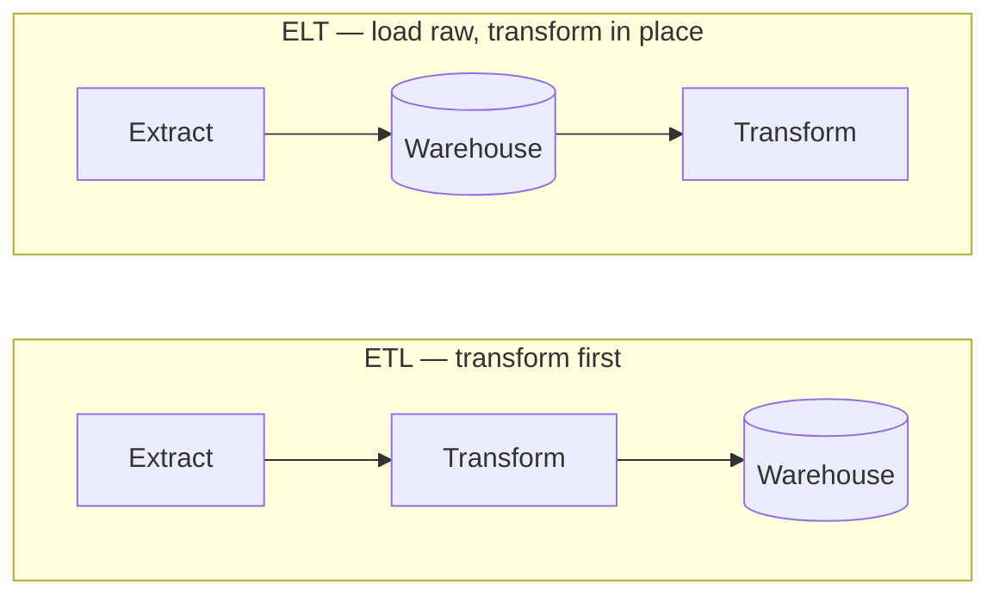

# Data Engineering

Getting data from where it's produced to where it's useful — reliably and repeatably. [Introduction to Data](introduction_to_data.md) covered what importing is and the simple→complex strategy ladder; this page covers the patterns and tools you build pipelines from.

## ETL vs ELT

The same three steps, in a different order:

**ETL** cleans data before loading — the classic approach when storage and compute were expensive. **ELT** loads raw data and transforms it inside the warehouse — the modern default, since cloud warehouses make compute cheap and keep the raw data available for reprocessing.

## Where Data Lands

| Store | Schema | Holds | Best for |
|---|---|---|---|
| **Warehouse** | on write (structured) | cleaned, modeled data | BI, SQL analytics |
| **Lake** | on read (any format) | raw everything | cheap storage, ML, exploration |
| **Lakehouse** | hybrid | raw + curated, ACID tables | one platform for both |

Examples: Snowflake / BigQuery / Redshift (warehouse), S3 / HDFS (lake), Delta / Iceberg (lakehouse).

## Batch vs Streaming

- **Batch** — process scheduled chunks (nightly, hourly). Simple, cheap, the right default.
- **Streaming** — process events continuously as they arrive, for low latency. Built on message queues and stream processors — see [Architecture](../../software/basics/architecture.md).

Start with batch; add streaming only when latency genuinely demands it.

## Orchestration

A pipeline is a **DAG** (directed acyclic graph) of tasks with dependencies, schedules, and retries. Orchestrators — **Airflow, Dagster, Prefect** — run the DAG, handle failures, and show you what ran when.

## File Formats

| Format | Layout | Best for |
|---|---|---|
| **CSV / JSON** | row-based, text | interchange, small data, readability |
| **Parquet / ORC** | columnar, compressed | analytics — scan a few columns over many rows |
| **Avro** | row-based, binary | streaming, schema evolution |

## Rule of Thumb

- **Make loads idempotent and incremental** — rerunning a pipeline must not duplicate or corrupt data.
- **Validate at ingestion** — catch bad data at the door, not three dashboards downstream.
- **Track lineage** — know where every table came from. Garbage in, garbage out (see [Introduction to Data](introduction_to_data.md)).
