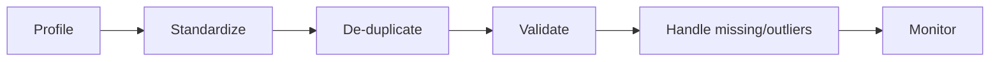

# Data Quality & Cleansing

**Quality** measures whether data is fit for its intended use; **cleansing** is the corrective work that raises it. [Introduction to Data](introduction_to_data.md) listed five quality dimensions and "garbage in, garbage out"; this page turns that into something you can measure and act on. Related: [Data Engineering](data_engineering.md) on validating at ingestion.

## What It Is

Quality is scored across dimensions — the six DAMA dimensions are the common baseline:

| Dimension | Question | Example failure |
|---|---|---|
| **Accuracy** | Does it match reality? | wrong birth date |
| **Completeness** | Are required values present? | null email |
| **Consistency** | Does it agree across systems? | two totals that disagree |
| **Validity** | Does it fit format/rules? | `"31/13/2026"` |
| **Uniqueness** | No unintended duplicates? | same customer twice |
| **Timeliness** | Is it current enough? | yesterday's price |

## The Cleansing Workflow

- **Profile first** — measure the defects before fixing anything; you can't improve what you haven't quantified.
- **Standardize** — one format for dates, units, casing, categories.
- **De-duplicate** — match and merge records for the same real-world entity.
- **Handle missing values** — impute, flag, or drop; document which and why.
- **Handle outliers** — investigate before deleting; an outlier is sometimes the signal.

## Frameworks That Apply

- **DAMA-DMBOK data-quality dimensions** — the vocabulary above; the industry reference.
- **Six Sigma DMAIC** (Define-Measure-Analyze-Improve-Control) — a process discipline for driving defect rates down and keeping them there.
- **Data contracts** — schema + quality expectations agreed between producer and consumer, enforced in the pipeline.
- **Tools** — Great Expectations, dbt tests, Soda, and Deequ codify checks; OpenRefine and Talend for interactive cleansing.

## Golden Lesson

**Fix quality at the source, not downstream.** Cleaning the same defect in every dashboard is a losing game — push the fix as close to where the data is created as possible, and make the checks automated and continuous. Clean-once-then-monitor beats clean-forever-everywhere.

## Learn More

- [Tidy Data — Hadley Wickham (PDF)](https://vita.had.co.nz/papers/tidy-data.pdf) — the classic paper on structuring data so it's analysis-ready.
- [Great Expectations](https://greatexpectations.io/) — declarative data-quality checks with auto-generated documentation.
- [dbt data tests](https://docs.getdbt.com/docs/build/data-tests) — quality assertions that run inside your transformation pipeline.
- [DAMA International — Body of Knowledge](https://www.dama.org/cpages/body-of-knowledge) — the source of the six quality dimensions.
