# Architecture patterns

## System-Level Architecture Patterns

System-level architecture patterns define how entire systems, services, and components are organized and communicate with each other. These patterns address concerns like scalability, reliability, maintainability, and distributed system challenges.

### 1. Event-Driven Architecture

**Overview**: Components communicate through events rather than direct calls. Events represent something that happened in the system.

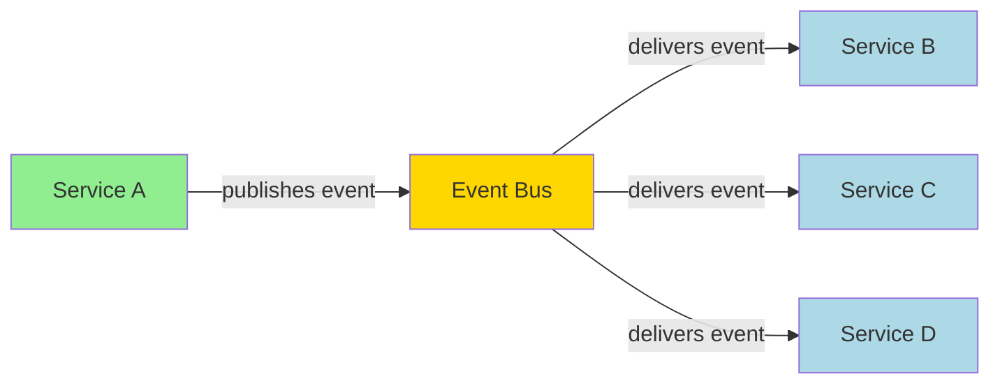

**Key Components**:
- **Event Producers**: Generate and publish events
- **Event Consumers**: Subscribe to and process events
- **Event Bus/Broker**: Routes events between producers and consumers
- **Event Store**: Optionally persists events for replay

**When to Use**:
- Real-time systems requiring immediate responses
- Microservices that need loose coupling
- Systems with complex workflows
- Applications requiring audit trails

**Pros**:
- Loose coupling between components
- High scalability and responsiveness
- Easy to add new consumers
- Natural audit trail

**Cons**:
- Complex debugging (async flow)
- Event ordering challenges
- Potential for event storms

### 2. Microservices Architecture

**Overview**: Application is decomposed into small, independent services that communicate over well-defined APIs.

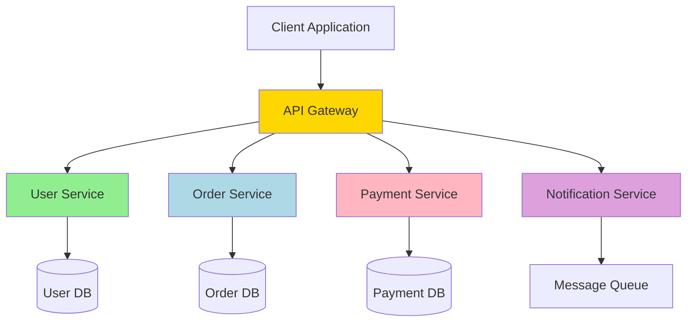

**Key Characteristics**:
- **Single Responsibility**: Each service owns a specific business capability
- **Decentralized**: Independent deployment and scaling
- **Technology Agnostic**: Services can use different tech stacks
- **Fault Tolerant**: Failure in one service doesn't crash the system

**When to Use**:
- Large, complex applications
- Multiple development teams
- Different scaling requirements per feature
- Need for rapid, independent deployments

**Pros**:
- Independent scaling and deployment
- Technology diversity
- Team autonomy
- Fault isolation

**Cons**:
- Operational complexity
- Network latency overhead
- Data consistency challenges
- Testing complexity

### 3. Monolithic Architecture

**Overview**: All components of an application are packaged and deployed as a single unit.

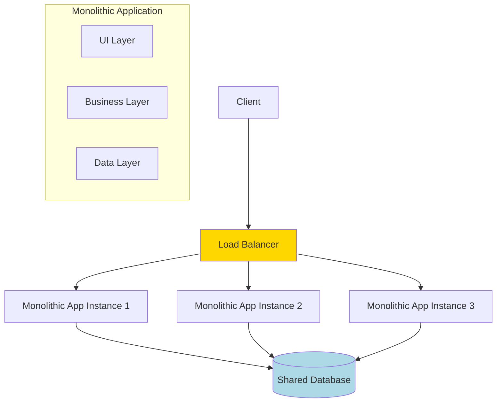

**When to Use**:
- Small to medium applications
- Simple business logic
- Limited team size
- Rapid prototyping

**Pros**:
- Simple deployment and testing
- Easy debugging
- Better performance (no network calls)
- Simpler development initially

**Cons**:
- Difficult to scale specific components
- Technology lock-in
- Large codebase becomes unwieldy
- Deployment of small changes affects entire system

### 4. Service-Oriented Architecture (SOA)

**Overview**: Services communicate through well-defined interfaces and protocols, typically with enterprise service bus.

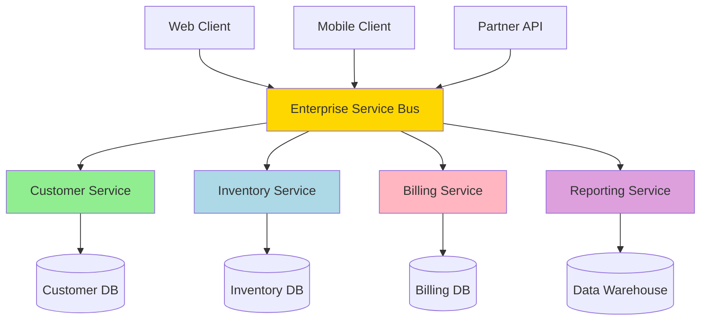

**Key Principles**:
- **Service Contracts**: Well-defined interfaces
- **Service Autonomy**: Services control their own logic
- **Service Reusability**: Services can be reused across applications
- **Service Composability**: Services can be combined to create new functionality

**When to Use**:
- Enterprise environments
- Legacy system integration
- Need for service reuse across multiple applications
- Governance and compliance requirements

### 5. Client-Server Architecture

**Overview**: Clients request services from servers, which process requests and return responses.

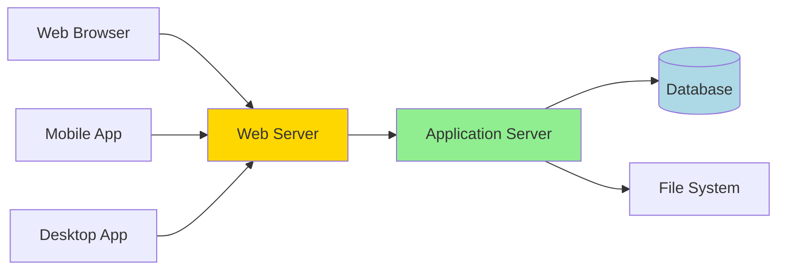

**Variants**:
- **2-Tier**: Client directly communicates with database
- **3-Tier**: Client → Application Server → Database
- **N-Tier**: Multiple intermediate layers

**When to Use**:
- Traditional web applications
- Database-driven applications
- Need for centralized data management

### 6. Peer-to-Peer (P2P) Architecture

**Overview**: Nodes act as both clients and servers, sharing resources directly with each other.

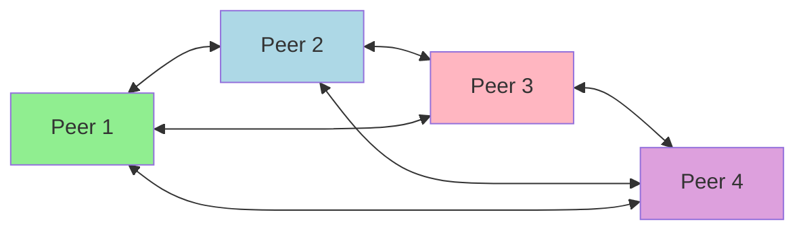

**When to Use**:
- File sharing systems
- Blockchain networks
- Distributed computing
- Systems requiring high availability without central points of failure

**Pros**:
- No single point of failure
- Highly scalable
- Cost-effective (no central infrastructure)

**Cons**:
- Security challenges
- Difficult to maintain consistency
- Network complexity

### 7. Pipe and Filter Architecture

**Overview**: Data flows through a series of processing stages (filters) connected by pipes.

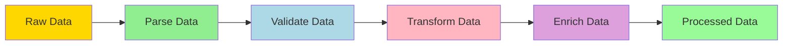

**When to Use**:
- Data processing pipelines
- Stream processing
- Batch processing systems
- ETL (Extract, Transform, Load) operations

**Pros**:
- Easy to understand and modify
- Reusable filters
- Parallel processing possible
- Good for batch processing

**Cons**:
- Not suitable for interactive systems
- Overhead of data transformation between filters

### 8. Serverless Architecture

**Overview**: Application logic runs in stateless compute containers managed by cloud providers.

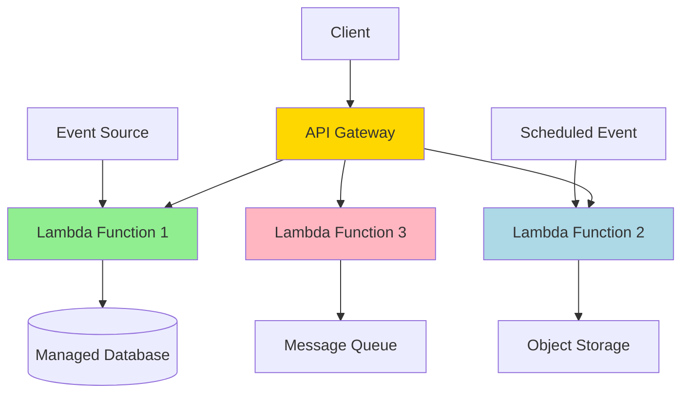

**When to Use**:
- Event-driven applications
- Unpredictable or sporadic traffic
- Rapid prototyping
- Cost optimization for low-traffic applications

**Pros**:
- No server management
- Automatic scaling
- Pay-per-use pricing
- Fast deployment

**Cons**:
- Vendor lock-in
- Cold start latency
- Limited execution time
- Debugging challenges

### 9. Architecture Pattern Comparison

| Pattern | Scalability | Complexity | Cost | Best For |
|---------|-------------|------------|------|----------|
| **Monolithic** | Limited | Low | Low | Small apps, prototypes |
| **Microservices** | High | High | High | Large, complex systems |
| **SOA** | Medium | Medium | Medium | Enterprise integration |
| **Event-Driven** | High | Medium | Medium | Real-time systems |
| **Client-Server** | Medium | Low | Low | Traditional web apps |
| **P2P** | High | High | Low | Distributed systems |
| **Serverless** | Auto | Low | Variable | Event-driven, sporadic load |

### Choosing the Right Pattern

**Consider These Factors**:

1. **Team Size & Expertise**
   - Small teams: Monolithic or Client-Server
   - Large teams: Microservices or SOA

2. **System Complexity**
   - Simple: Monolithic
   - Complex: Microservices or Event-Driven

3. **Scalability Requirements**
   - Low: Monolithic
   - High: Microservices, Event-Driven, or Serverless

4. **Performance Requirements**
   - Low latency: Monolithic
   - High throughput: Event-Driven or Microservices

5. **Budget Constraints**
   - Limited: Monolithic or Serverless
   - High: Microservices or SOA

## Application-level UI patterns

What distinguishes MVC, MVP, MVVM, MVVM-C, and VIPER architecture patterns from each other?

These architecture patterns are among the most commonly used in app development, whether on iOS or Android platforms. Developers have introduced them to overcome the limitations of earlier patterns. So, how do they differ?

- MVC, the oldest pattern, dates back almost 50 years

- Every pattern has a "view" (V) responsible for displaying content and receiving user input

- Most patterns include a "model" (M) to manage business data

- "Controller," "presenter," and "view-model" are translators that mediate between the view and the model ("entity" in the VIPER pattern)

- These translators can be quite complex to write, so various patterns have been proposed to make them more maintainable

### 1. MVC (Model View Controller)

The Model-View-Controller pattern separates an application into three interconnected components.

**Components:**
- **Model**: Manages data and business logic
- **View**: Handles the user interface and presentation
- **Controller**: Mediates between Model and View, handles user input

### 2. MVP (Model View Presenter)

The Model-View-Presenter pattern is similar to MVC but with a different flow of communication.

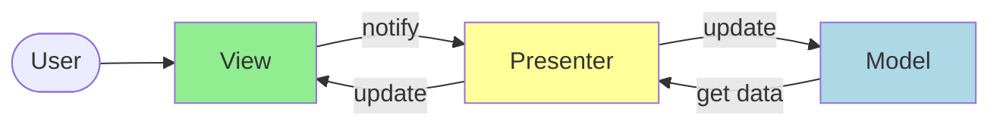

**Components:**
- **Model**: Manages data and business logic
- **View**: Handles the user interface (passive)
- **Presenter**: Contains presentation logic, mediates between View and Model

### 3. MVVM (Model View View-Model)

The Model-View-ViewModel pattern uses data binding to connect the View and ViewModel.

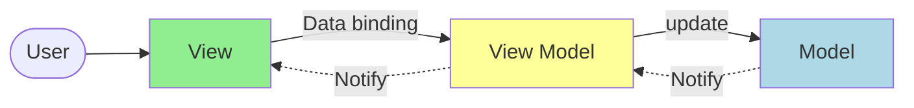

**Components:**
- **Model**: Manages data and business logic
- **View**: Handles the user interface with data binding
- **ViewModel**: Exposes data and commands for the View, handles presentation logic

### 4. MVVM-C (Model View View-Model Coordinator)

MVVM-C extends MVVM by adding a Coordinator to handle navigation and flow control.

**Components:**
- **Model**: Manages data and business logic
- **View**: Handles the user interface with data binding
- **ViewModel**: Exposes data and commands for the View
- **Coordinator**: Manages navigation and application flow

### 5. VIPER (View Interactor Presenter Entity Router)

VIPER is a more complex pattern that separates concerns into five distinct components.

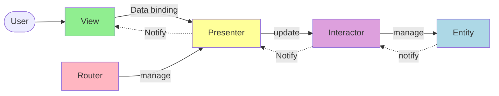

**Components:**
- **View**: Handles the user interface
- **Interactor**: Contains business logic
- **Presenter**: Handles presentation logic and formatting
- **Entity**: Basic data models
- **Router**: Handles navigation and module assembly

### Pattern Comparison

| Pattern | Complexity | Testability | Separation of Concerns | Best Use Case |
|---------|------------|-------------|----------------------|---------------|
| MVC | Low | Medium | Good | Simple applications |
| MVP | Medium | High | Very Good | Applications requiring high testability |
| MVVM | Medium | High | Very Good | Applications with complex UI binding |
| MVVM-C | High | High | Excellent | Large applications with complex navigation |
| VIPER | Very High | Excellent | Excellent | Enterprise applications with complex business logic |
