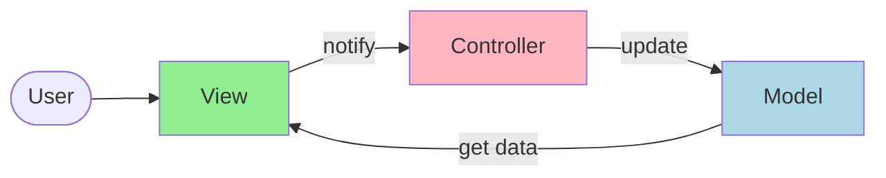
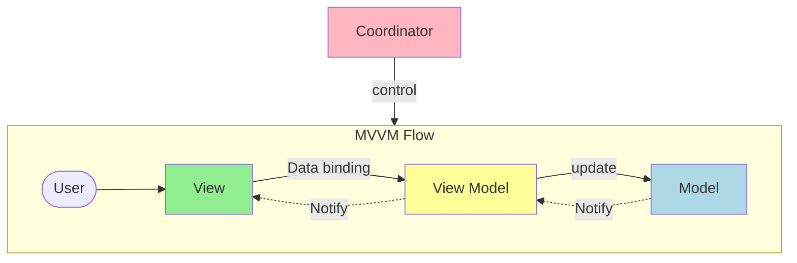

# Architecture Patterns

What distinguishes MVC, MVP, MVVM, MVVM-C, and VIPER architecture patterns from each other?

These architecture patterns are among the most commonly used in app development, whether on iOS or Android platforms. Developers have introduced them to overcome the limitations of earlier patterns. So, how do they differ?

- MVC, the oldest pattern, dates back almost 50 years

- Every pattern has a "view" (V) responsible for displaying content and receiving user input

- Most patterns include a "model" (M) to manage business data

- "Controller," "presenter," and "view-model" are translators that mediate between the view and the model ("entity" in the VIPER pattern)

- These translators can be quite complex to write, so various patterns have been proposed to make them more maintainable

## MVC (Model View Controller)

The Model-View-Controller pattern separates an application into three interconnected components.

**Components:**
- **Model**: Manages data and business logic
- **View**: Handles the user interface and presentation
- **Controller**: Mediates between Model and View, handles user input

## MVP (Model View Presenter)

The Model-View-Presenter pattern is similar to MVC but with a different flow of communication.

**Components:**
- **Model**: Manages data and business logic
- **View**: Handles the user interface (passive)
- **Presenter**: Contains presentation logic, mediates between View and Model

## MVVM (Model View View-Model)

The Model-View-ViewModel pattern uses data binding to connect the View and ViewModel.

**Components:**
- **Model**: Manages data and business logic
- **View**: Handles the user interface with data binding
- **ViewModel**: Exposes data and commands for the View, handles presentation logic

## MVVM-C (Model View View-Model Coordinator)

MVVM-C extends MVVM by adding a Coordinator to handle navigation and flow control.

**Components:**
- **Model**: Manages data and business logic
- **View**: Handles the user interface with data binding
- **ViewModel**: Exposes data and commands for the View
- **Coordinator**: Manages navigation and application flow

## VIPER (View Interactor Presenter Entity Router)

VIPER is a more complex pattern that separates concerns into five distinct components.

**Components:**
- **View**: Handles the user interface
- **Interactor**: Contains business logic
- **Presenter**: Handles presentation logic and formatting
- **Entity**: Basic data models
- **Router**: Handles navigation and module assembly

## Pattern Comparison

| Pattern | Complexity | Testability | Separation of Concerns | Best Use Case |
|---------|------------|-------------|----------------------|---------------|
| MVC | Low | Medium | Good | Simple applications |
| MVP | Medium | High | Very Good | Applications requiring high testability |
| MVVM | Medium | High | Very Good | Applications with complex UI binding |
| MVVM-C | High | High | Excellent | Large applications with complex navigation |
| VIPER | Very High | Excellent | Excellent | Enterprise applications with complex business logic |
