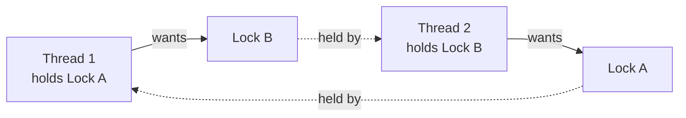

# Concurrency & Parallelism

**Concurrency** is *dealing with* many things at once (how you structure the work). **Parallelism** is *doing* many things at once (executing them simultaneously). You can have either without the other — an async server is concurrent on one core; a number-crunching job is parallel without much concurrency.

## Units of Execution

| Unit | Memory | Switch cost | Good for |
|---|---|---|---|
| **Process** | isolated | high | isolation, CPU parallelism, fault containment |
| **Thread** | shared with siblings | medium | shared-memory work (where the runtime allows) |
| **Async task / coroutine** | shared, one thread | very low | high-concurrency I/O (thousands of sockets) |

Match the tool to the bottleneck:

| Workload | Limited by | Use |
|---|---|---|
| **I/O-bound** | waiting on network / disk | async, or threads |
| **CPU-bound** | computation | multiprocessing, or more machines |

> **Python note:** the GIL lets only one thread run Python bytecode at a time, so threads don't speed up CPU-bound work — use `multiprocessing` for that, and threads or `asyncio` for I/O.

## The Core Problem: Shared Mutable State

When two flows touch the same data, order matters. This is a **race condition**:

```python
counter = 0

def increment():      # NOT atomic: read → +1 → write
    global counter
    counter += 1      # two threads can interleave and lose an update
```

Fix it by serializing access (a lock) — or, better, by not sharing mutable state at all.

## Primitives & Models

- **Lock / mutex** — only one holder at a time. **Semaphore** — at most N holders. **Atomic** — an operation that can't be interrupted.
- **Models:** *shared memory + locks* (threads), *event loop* (async, cooperative), *separate memory* (multiprocessing), *message passing* (actors, channels — share by communicating, not by sharing).

## Hazards

| Hazard | What happens |
|---|---|
| **Race condition** | result depends on timing; lost updates, corrupt state |
| **Deadlock** | each party waits forever for a resource the other holds |
| **Livelock** | parties keep reacting but make no progress |
| **Starvation** | one party never gets the resource it needs |

A deadlock needs a **circular wait** — break the cycle and it can't happen:



## Rule of Thumb

- **Don't share mutable state.** Prefer immutability and message passing.
- **If you must share, protect every access with the same lock** — and always acquire multiple locks in the **same order** to avoid the cycle above.
- **Keep critical sections tiny.** Hold locks for as short a time as possible.
- At the system level this becomes message queues and stateless services — see [Architecture](architecture.md); for failures across services, see [Error Handling](error_handling.md).
