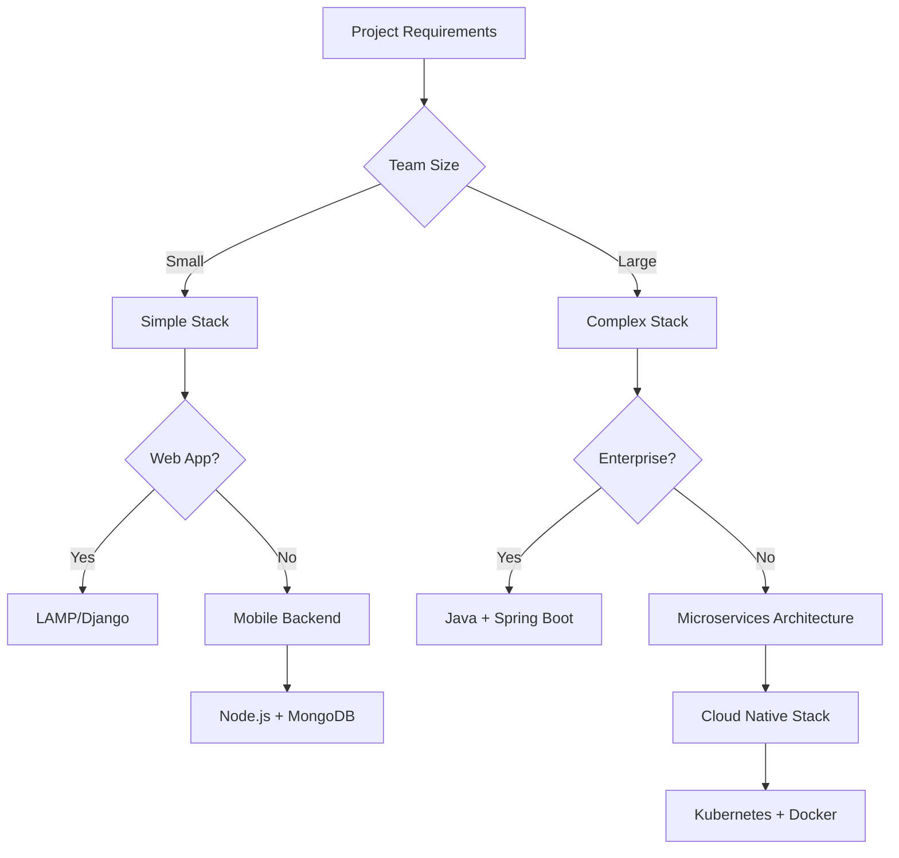

# Tech Stacks

A tech stack is a combination of technologies, frameworks, libraries, and tools used to build and run applications. Understanding different tech stacks helps you choose the right tools for your project and understand how different technologies work together.

## The Modern Software Stack

The modern software stack represents a layered architecture where each layer has specific responsibilities and technology choices. Understanding this stack helps architects and developers make informed decisions about technology selection.

### Layer Breakdown

**1. Presentation Layer (UI/UX)**

The user-facing layer responsible for rendering interfaces and handling user interactions.

| Technology | Type | Best For |
|------------|------|----------|
| **React** | JavaScript Library | Single-page applications, component-based UIs |
| **Angular** | Framework | Enterprise applications, full-featured SPAs |
| **Vue.js** | Framework | Progressive web apps, lightweight applications |
| **Flutter** | Cross-platform | Mobile apps with single codebase |
| **Tailwind CSS** | CSS Framework | Utility-first styling, rapid prototyping |
| **Swift** | Language | Native iOS applications |
| **Kotlin** | Language | Native Android applications |

**2. Edge and Delivery Layer (Optional)**

Handles content delivery, caching, and DDoS protection at the network edge.

| Technology | Purpose |
|------------|---------|
| **Cloudflare** | CDN, DDoS protection, DNS |
| **Akamai** | Enterprise CDN, security |
| **Fastly** | Edge computing, real-time CDN |
| **CloudFront** | AWS CDN integration |

**3. Integration Layer (API)**

Manages communication between services and external systems.

| Technology | Protocol | Use Case |
|------------|----------|----------|
| **Postman** | Testing | API development and testing |
| **gRPC** | Binary | High-performance microservices |
| **GraphQL** | Query | Flexible data fetching |
| **WebSocket** | Bidirectional | Real-time communication |
| **API Gateway** | HTTP | Request routing, rate limiting |

**4. Messaging & Async Processing (Optional)**

Enables asynchronous communication and event-driven architectures.

| Technology | Type | Best For |
|------------|------|----------|
| **Kafka** | Event Streaming | High-throughput, event sourcing |
| **RabbitMQ** | Message Broker | Task queues, pub/sub |
| **SQS** | Cloud Queue | AWS-native messaging |
| **Celery** | Task Queue | Python async tasks |
| **Sidekiq** | Task Queue | Ruby background jobs |

**5. Business Logic Layer**

Contains the core application logic and business rules.

| Technology | Language | Strengths |
|------------|----------|-----------|
| **Spring** | Java | Enterprise features, dependency injection |
| **Laravel** | PHP | Elegant syntax, rapid development |
| **Express.js** | JavaScript | Minimalist, flexible |
| **Django** | Python | Batteries-included, admin panel |
| **.NET Core** | C# | Cross-platform, high performance |

**6. Data Access Layer**

Abstracts database operations and provides caching mechanisms.

| Technology | Type | Purpose |
|------------|------|---------|
| **Redis** | In-memory | Caching, session storage |
| **Elasticsearch** | Search Engine | Full-text search, analytics |
| **Hibernate** | ORM | Java object-relational mapping |
| **Sequelize** | ORM | Node.js database abstraction |
| **SQLAlchemy** | ORM | Python database toolkit |

**7. Data Storage Layer**

Persistent storage for application data.

| Technology | Type | Best For |
|------------|------|----------|
| **PostgreSQL** | Relational | Complex queries, ACID compliance |
| **MySQL** | Relational | Web applications, read-heavy workloads |
| **MongoDB** | Document | Flexible schemas, JSON data |
| **BigQuery** | Data Warehouse | Analytics, large-scale queries |
| **Snowflake** | Data Warehouse | Cloud-native analytics |

**8. Analytics & ML (Optional)**

Data processing, machine learning, and business intelligence.

| Technology | Purpose |
|------------|---------|
| **Spark** | Distributed data processing |
| **PyTorch** | Deep learning framework |
| **Databricks** | Unified analytics platform |
| **Looker** | Business intelligence |
| **TensorFlow** | Machine learning at scale |

**9. Infrastructure Layer (Hosting/Runtime)**

The foundation that hosts and runs all other layers.

| Technology | Type | Strengths |
|------------|------|-----------|
| **AWS** | Cloud Provider | Comprehensive services, market leader |
| **Azure** | Cloud Provider | Microsoft integration, enterprise |
| **Google Cloud** | Cloud Provider | Data/ML services, Kubernetes |
| **Docker** | Containerization | Consistent environments, portability |
| **Kubernetes** | Orchestration | Container management, auto-scaling |

## The Backend Tech Stack Pyramid

The backend tech stack can be visualized as a pyramid, with each layer building upon the foundation below it:

*The Backend Tech Stack - A comprehensive view of modern backend technologies organized by layers*

## Programming Languages (Foundation Layer)

The foundation of any tech stack starts with programming languages:

### **Java**
- **Use Cases**: Enterprise applications, Android development, web backends
- **Strengths**: Platform independence, strong typing, extensive ecosystem
- **Popular Frameworks**: Spring Boot, Hibernate

### **Python**
- **Use Cases**: Data science, AI/ML, web development, automation
- **Strengths**: Simple syntax, extensive libraries, versatility
- **Popular Frameworks**: Django, FastAPI, Flask

### **JavaScript**
- **Use Cases**: Full-stack development, frontend, Node.js backends
- **Strengths**: Ubiquitous, event-driven, large community
- **Popular Frameworks**: Node.js, Express, React

### **C#**
- **Use Cases**: Windows applications, web development, enterprise software
- **Strengths**: Strong typing, .NET ecosystem, Microsoft integration
- **Popular Frameworks**: .NET Core, ASP.NET

### **Go (Golang)**
- **Use Cases**: Microservices, cloud infrastructure, system programming
- **Strengths**: Fast compilation, concurrency, simple deployment
- **Popular Frameworks**: Gin, Echo

### **Rust**
- **Use Cases**: System programming, web backends, blockchain
- **Strengths**: Memory safety, performance, concurrency
- **Popular Frameworks**: Actix, Rocket

### **Ruby**
- **Use Cases**: Web development, scripting, prototyping
- **Strengths**: Developer productivity, elegant syntax
- **Popular Frameworks**: Ruby on Rails, Sinatra

### **PHP**
- **Use Cases**: Web development, content management systems
- **Strengths**: Easy deployment, large ecosystem
- **Popular Frameworks**: Laravel, Symfony

## Databases (Data Layer)

### **Relational Databases**

#### **PostgreSQL**
- **Type**: Open-source relational database
- **Strengths**: ACID compliance, extensibility, JSON support
- **Use Cases**: Complex queries, data integrity, analytics

#### **MySQL**
- **Type**: Popular open-source relational database
- **Strengths**: Fast, reliable, widely supported
- **Use Cases**: Web applications, e-commerce, content management

#### **Oracle**
- **Type**: Enterprise relational database
- **Strengths**: Advanced features, scalability, security
- **Use Cases**: Large enterprises, mission-critical applications

#### **SQLite**
- **Type**: Lightweight embedded database
- **Strengths**: Serverless, zero-configuration, portable
- **Use Cases**: Mobile apps, desktop applications, prototyping

### **NoSQL Databases**

#### **MongoDB**
- **Type**: Document-oriented database
- **Strengths**: Flexible schema, horizontal scaling, JSON-like documents
- **Use Cases**: Content management, real-time analytics, IoT

#### **DynamoDB**
- **Type**: AWS managed NoSQL database
- **Strengths**: Serverless, auto-scaling, low latency
- **Use Cases**: Gaming, mobile backends, serverless applications

#### **Apache Cassandra**
- **Type**: Wide-column distributed database
- **Strengths**: High availability, linear scalability, fault tolerance
- **Use Cases**: Time-series data, IoT, real-time analytics

## Frameworks (Application Layer)

### **Backend Frameworks**

#### **Spring Boot (Java)**
- **Strengths**: Auto-configuration, production-ready, extensive ecosystem
- **Use Cases**: Enterprise applications, microservices, REST APIs

#### **Node.js (JavaScript)**
- **Strengths**: Event-driven, non-blocking I/O, JavaScript everywhere
- **Use Cases**: Real-time applications, APIs, microservices

#### **Django (Python)**
- **Strengths**: "Batteries included", ORM, admin interface
- **Use Cases**: Web applications, content management, rapid prototyping

#### **FastAPI (Python)**
- **Strengths**: Fast performance, automatic API documentation, type hints
- **Use Cases**: APIs, microservices, data science applications

#### **Ruby on Rails (Ruby)**
- **Strengths**: Convention over configuration, rapid development, MVC pattern
- **Use Cases**: Web applications, startups, rapid prototyping

#### **Langchain**
- **Strengths**: LLM integration, AI application development
- **Use Cases**: AI-powered applications, chatbots, document processing

## Deployment & Infrastructure Layer

### **Cloud Providers**

#### **Amazon Web Services (AWS)**
- **Services**: EC2, Lambda, RDS, S3, EKS
- **Strengths**: Comprehensive services, global reach, mature ecosystem
- **Use Cases**: Enterprise applications, startups, any scale

#### **Microsoft Azure**
- **Services**: Virtual Machines, Functions, SQL Database, Blob Storage
- **Strengths**: Enterprise integration, hybrid cloud, Microsoft ecosystem
- **Use Cases**: Enterprise applications, .NET applications, hybrid deployments

#### **Google Cloud Platform (GCP)**
- **Services**: Compute Engine, Cloud Functions, Cloud SQL, BigQuery
- **Strengths**: Data analytics, machine learning, Kubernetes
- **Use Cases**: Data-heavy applications, ML/AI workloads, modern applications

### **Containerization & Orchestration**

#### **Docker**
- **Purpose**: Application containerization
- **Benefits**: Consistent environments, easy deployment, resource efficiency
- **Use Cases**: Development, testing, microservices deployment

#### **Kubernetes**
- **Purpose**: Container orchestration
- **Benefits**: Auto-scaling, service discovery, rolling deployments
- **Use Cases**: Microservices, cloud-native applications, enterprise deployments

### **Platform-as-a-Service**

#### **Vercel**
- **Strengths**: Frontend-focused, serverless, excellent DX
- **Use Cases**: JAMstack applications, Next.js deployments, static sites

## CI/CD & Version Control Layer

### **Version Control**

#### **GitHub**
- **Features**: Git hosting, Actions (CI/CD), project management
- **Strengths**: Large community, integrations, collaboration tools
- **Use Cases**: Open source projects, team collaboration, CI/CD

#### **GitLab**
- **Features**: Git hosting, built-in CI/CD, DevOps platform
- **Strengths**: All-in-one platform, self-hosted options
- **Use Cases**: Enterprise DevOps, complete software lifecycle management

#### **Bitbucket**
- **Features**: Git hosting, Pipelines (CI/CD), Atlassian integration
- **Strengths**: Atlassian ecosystem integration, enterprise features
- **Use Cases**: Teams using Atlassian tools, enterprise development

### **CI/CD Tools**

#### **Jenkins**
- **Type**: Self-hosted automation server
- **Strengths**: Highly customizable, extensive plugin ecosystem
- **Use Cases**: Complex pipelines, enterprise environments, custom workflows

#### **CircleCI**
- **Type**: Cloud-based CI/CD platform
- **Strengths**: Fast builds, Docker support, easy configuration
- **Use Cases**: Modern applications, Docker-based workflows, fast iteration

## Caching Layer

### **Content Delivery Networks (CDN)**
- **Purpose**: Distribute static content globally
- **Benefits**: Reduced latency, improved performance, reduced server load
- **Popular Services**: CloudFlare, AWS CloudFront, Azure CDN

### **In-Memory Caching**

#### **Redis**
- **Type**: In-memory data structure store
- **Features**: Pub/sub, persistence, clustering
- **Use Cases**: Session storage, real-time analytics, message queuing

#### **Memcached**
- **Type**: Distributed memory caching system
- **Features**: Simple key-value store, high performance
- **Use Cases**: Database query caching, session storage, object caching

## Architectural Patterns Layer

### **Microservices**
- **Approach**: Decompose application into small, independent services
- **Benefits**: Scalability, technology diversity, team autonomy
- **Challenges**: Complexity, network overhead, data consistency

### **Serverless**
- **Approach**: Run code without managing servers
- **Benefits**: Auto-scaling, pay-per-use, reduced operational overhead
- **Challenges**: Vendor lock-in, cold starts, debugging complexity

### **Monolithic**
- **Approach**: Single deployable unit containing all functionality
- **Benefits**: Simple deployment, easy debugging, better performance
- **Challenges**: Scaling limitations, technology lock-in, large codebase

## APIs Layer (Top of the Pyramid)

### **REST APIs**
- **Style**: Representational State Transfer
- **Characteristics**: Stateless, cacheable, uniform interface
- **Use Cases**: Web services, mobile backends, third-party integrations

### **GraphQL**
- **Style**: Query language and runtime
- **Benefits**: Single endpoint, flexible queries, strong typing
- **Use Cases**: Complex data requirements, mobile applications, real-time updates

### **JSON**
- **Format**: JavaScript Object Notation
- **Benefits**: Lightweight, human-readable, language-independent
- **Use Cases**: API responses, configuration files, data exchange

## Popular Tech Stack Combinations

### **LAMP Stack**
- **L**inux + **A**pache + **M**ySQL + **P**HP
- **Use Cases**: Traditional web applications, content management systems

### **MEAN Stack**
- **M**ongoDB + **E**xpress.js + **A**ngular + **N**ode.js
- **Use Cases**: Single-page applications, real-time applications

### **MERN Stack**
- **M**ongoDB + **E**xpress.js + **R**eact + **N**ode.js
- **Use Cases**: Modern web applications, social media platforms

### **Django + PostgreSQL + Redis**
- **Use Cases**: Content-heavy applications, data-driven applications

### **Spring Boot + MySQL + Docker + AWS**
- **Use Cases**: Enterprise applications, microservices architectures

## Choosing Your Tech Stack

### **Consider These Factors:**

1. **Project Requirements**
   - Performance needs
   - Scalability requirements
   - Security considerations
   - Integration requirements

2. **Team Expertise**
   - Existing knowledge
   - Learning curve
   - Available resources
   - Hiring considerations

3. **Business Constraints**
   - Budget limitations
   - Time to market
   - Maintenance costs
   - Vendor preferences

4. **Technical Considerations**
   - Community support
   - Documentation quality
   - Long-term viability
   - Ecosystem maturity

### **Decision Framework:**

## Best Practices

### **Stack Selection**
- Start simple and evolve
- Consider team expertise
- Evaluate long-term maintenance
- Plan for scalability early

### **Technology Integration**
- Ensure compatibility between components
- Consider data flow and communication patterns
- Plan for monitoring and observability
- Design for failure and recovery

### **Continuous Evolution**
- Regularly evaluate and update technologies
- Stay informed about industry trends
- Balance innovation with stability
- Document architectural decisions

The key to a successful tech stack is not just choosing the right technologies, but understanding how they work together to solve your specific problems and support your business goals.
